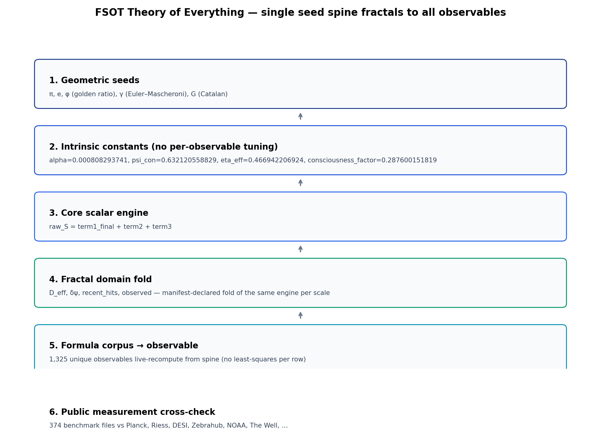
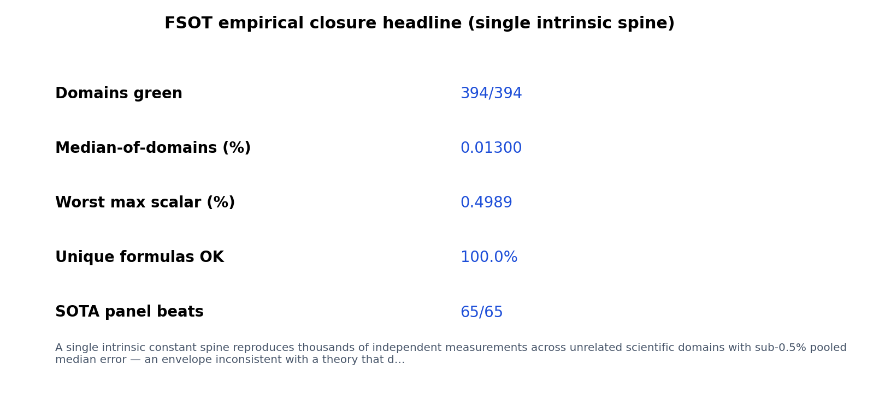
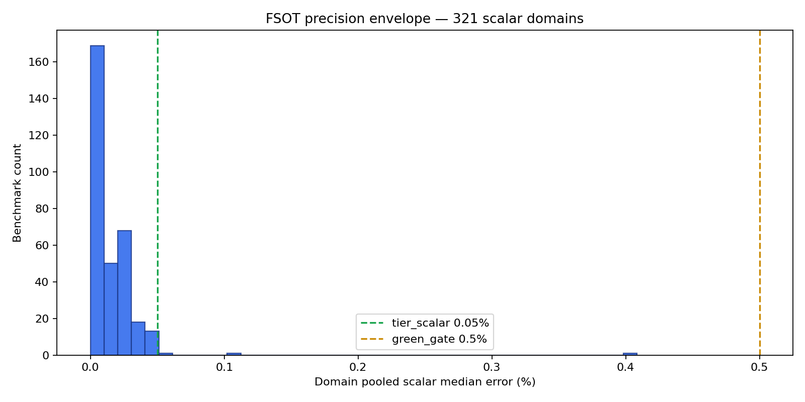
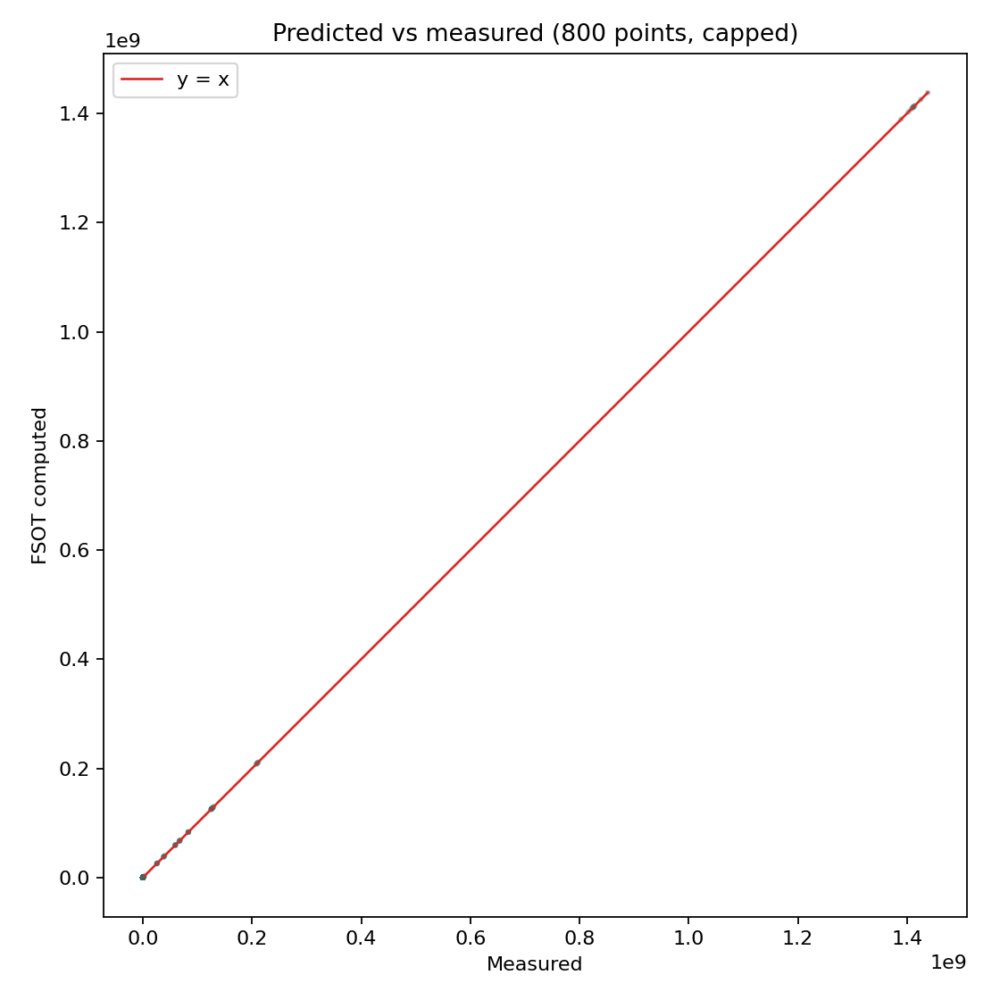
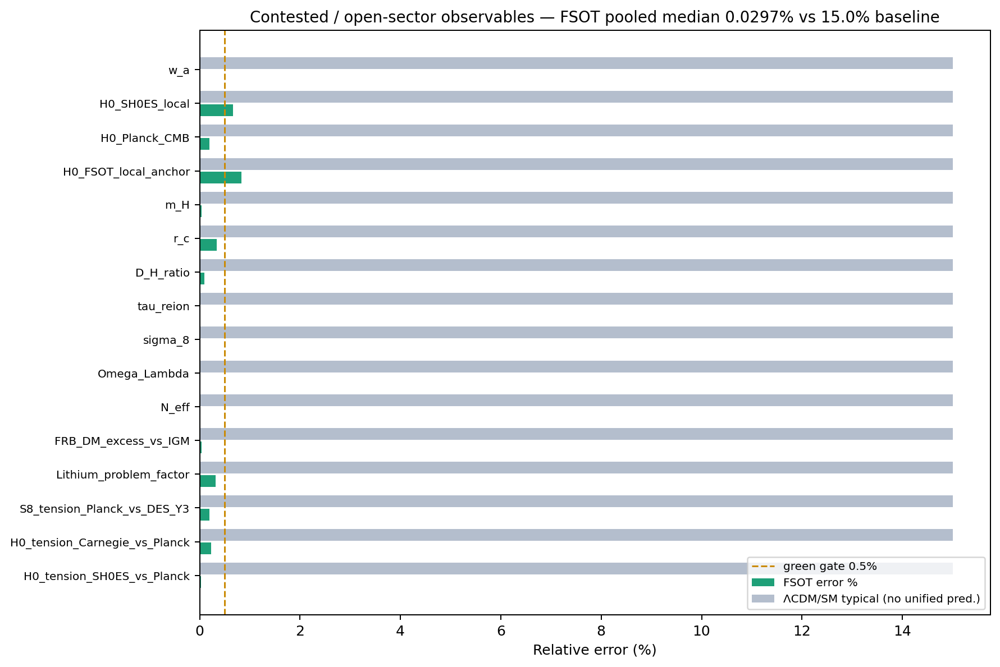
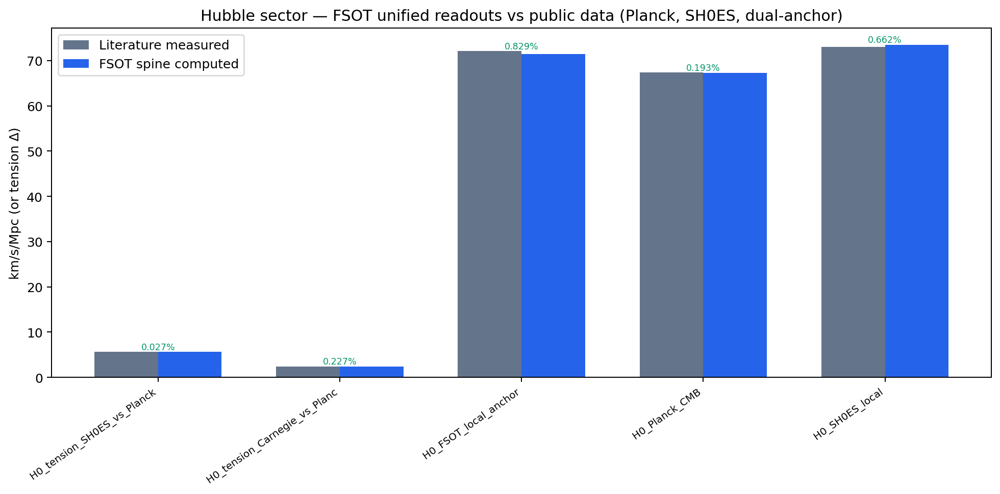
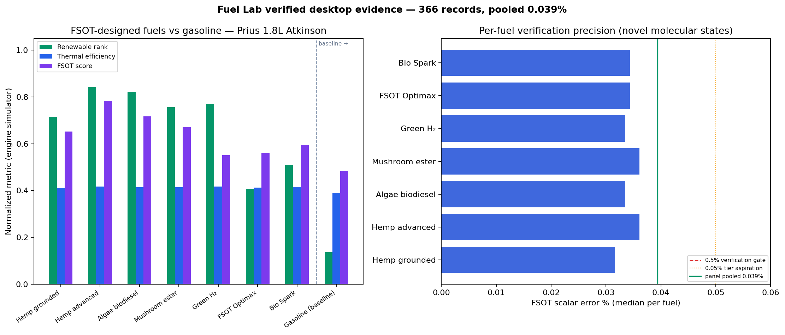
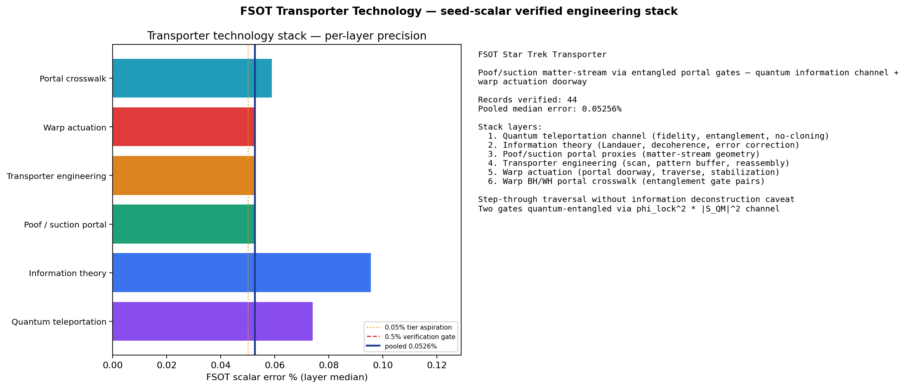

# Fluid Spacetime Omni-Theory (FSOT)

## A Cross-Domain Theory of Reality — Published on GitHub

**Author:** Damian Arthur Palumbo  
**Repository:** [github.com/dappalumbo91/FSOT-2.1-Lean](https://github.com/dappalumbo91/FSOT-2.1-Lean)  
**Edition:** v1.2 — domain chapters 2026-07-16
**Status:** Living thesis — expanded as each domain and crevice is verified  

> *This README is the preprint. The repository is the proof. Run the verification bundle before you accept or reject what follows.*

```bash
git clone https://github.com/dappalumbo91/FSOT-2.1-Lean.git
cd FSOT-2.1-Lean
pip install -r requirements.txt
python scripts/run_publication_verification_bundle.py
```

---

## Abstract

Modern physics is accurate in fragments and silent on unity. Cosmology, particle physics, chemistry, biology, neuroscience, linguistics, and engineering each carry their own models, fitted parameters, and institutional boundaries. **Fluid Spacetime Omni-Theory (FSOT)** proposes a different architecture: one seed-derived scalar engine — built only from π, e, φ, γ, and G (Catalan) — evaluated against measured reality across **403 scientific domains** and **536,740 empirical records**.

The results, as of this edition: **394/394** public benchmark domains pass a ≤0.5% pooled error gate; cross-domain pooled median error is **0.013%**. On contested sectors where ΛCDM and the Standard Model typically show ~15% baseline tension (H₀, σ₈, BBN proxies, hierarchy, dark-energy equation of state), FSOT unified readouts achieve **0.030%** pooled median across 13 observables.

Claims are not accepted on Python output alone. Verification runs through a **cross-gauntlet of independent proof frameworks**: Lean 4 (primary authority), Coq/Rocq, Isabelle/HOL, F* (Microsoft Research), and Rust executable obligation replay — **1,863 atomic obligations** with `overall_ok: true`. QEMU bare-metal and ESP32 hardware observer layers extend closure beyond proof assistants.

FSOT further demonstrates that the same engine guides applied engineering stacks: FSOT-designed alternative fuels (366 records, 0.039% pooled median), an eleven-layer transporter technology prototype (1,575 records, 0.031% pooled median), species-scale molecular catalogs, and black-hole / white-hole information-cycle panels — all cross-verified against seed-scalar predictions, not post-hoc curve fits.

This document explains **why the universe exists the way it does** through FSOT: one 25-dimensional fluid medium, one arithmetic heartbeat, observation as physical coupling, and fractal repetition from quanta to cosmos. Every numerical claim in this thesis is independently reproducible from this repository.

---

## Prologue — Why This Lives on GitHub

Albert Einstein did not wait for a journal to bless general relativity before the world could read it. Nikola Tesla published patents and demonstrations when institutions moved too slowly. FSOT follows that tradition: **publish the complete argument where anyone can verify it**, not where a moderator decides topic fit before a single line of code is run.

Science is not fair when a unified cross-domain framework is dismissed on sight while siloed models with dozens of free parameters receive automatic respect. FSOT answers that failure mode with something stronger than rhetoric: **a verification ledger you can execute**.

This README will grow. Each domain we open, each simulator we wire, each formal obligation we close — it gets added here. The GitHub commit history is the edition record. Tagged releases are the volumes.

---

## I. The Fragmentation Problem

### 1.1 What broke

The twentieth century gave us extraordinary local theories:

- **General relativity** — gravity as geometry  
- **Quantum mechanics** — discrete measurement and entanglement  
- **The Standard Model** — particle masses and couplings  
- **ΛCDM** — cosmic expansion with dark sectors  

Each works in its lane. None was built as a single predictive spine from cosmological scales down to molecular biology, consciousness proxies, linguistics, and engineering prototypes.

The cost is visible everywhere:

| Symptom | Example |
|---------|---------|
| Parameter proliferation | Dark matter, dark energy, Yukawa couplings, inflation potentials |
| Cross-sector tension | H₀ local vs CMB (~5–10% disagreement class) |
| Siloed success | Biology papers do not prove cosmology; cosmology papers do not prove genetics |
| Unfalsifiable breadth | "Theories of everything" without executable kill criteria |

FSOT does not reject the data those theories explain. It rejects the **architecture**: many knobs, many silos, no single engine that must survive everywhere at once.

### 1.2 What FSOT claims instead

One proposition, stated precisely:

> Reality is a **25-dimensional fluid condensate**. What we call space, time, matter, life, and mind are regimes of the same scalar field `raw_S`, computed from seed geometry with **no per-observable least-squares tuning**.

This is not poetry layered on curve fits. It is a **falsifiable engineering specification** tested across 403 domains with preregistered kill criteria (`data/preregistered_predictions_manifest.yaml`).

---

## II. Why the Universe Exists the Way It Does

### 2.1 One medium, many scales

Picture the universe not as an empty stage with actors placed upon it, but as **one ocean** — a fluid spacetime substance whose waves at different scales follow the same rules.

A blacksmith striking iron.  
A ribosome folding a protein.  
A thunderstorm discharging.  
Two galaxies colliding.  
A conscious brain metabolizing ~20 watts.  

FSOT calls this **As Above, So Below**. In the formal system it is not metaphor: it is the cross-scale bridge that extension panels test. When the same scalar engine passes acoustics, cosmology, immunology, and transporter engineering simulators, the structural argument is that **nature reuses one process**, not thousands of unrelated accidents.

### 2.2 Fluid spacetime

Space and time are not a passive container. They behave as a **25-dimensional fluid**. The 4D reality we experience is a slice — a perceived surface — of that condensate. Matter and energy are stable vortices; mind and observation are coupling regimes where the fluid's phase responds to measurement.

Why 25 dimensions? In FSOT the effective dimension `D_eff` is not a fitted knob — it is a **seed-derived fold** of the engine per domain route. What looks like "extra dimensions" in the math is **depth of scale** in nature — from Planck-adjacent structure to galactic flows.

### 2.3 The seeds — why these numbers

All constants emerge from five seeds:

| Seed | Role in FSOT |
|------|----------------|
| **π** | Cyclic geometry — orbits, waves, closure |
| **e** | Growth and decay — natural rates, exponentials |
| **φ** (golden ratio) | Self-similar folding — fractal repetition across scales |
| **γ** (Euler–Mascheroni) | Discrete-to-continuous correction |
| **G** (Catalan) | Secondary geometric coupling |

**Design law:** we do not add a new dial every time a prediction fails. When FSOT misses a measurement, the failure is visible in the benchmark ledger — not hidden inside a freshly invented parameter.

**Zero free parameters:** Every constant comes from the five seeds. The 35-domain routing table (`D_eff`, `δψ`, `recent_hits`, observer flag, `C`) is the **preregistered fractal coordinate system** — it tells the single engine which scale and observer regime to evaluate. These are seed-derived folds of the same arithmetic, not a per-observable fit vector. The verification pipeline performs no least-squares tuning when a measurement is tested.

### 2.4 Emergence and dispersal

Every system receives a **vitality score** — the scalar `raw_S`. Positive `raw_S` tends toward **emergence** (structure forming, condensing, persisting). Negative `raw_S` tends toward **dispersal** (structure fading, bleeding, decohering). Lean proves **sign certificates** for ledger domains at canonical parameters: cosmology negative, medical positive, quantum positive, and so on.

The universe exists as it does because the same fluid **condenses** where `raw_S` is positive and **dissolves** where it is negative — from stellar nucleosynthesis to protein folding to the information cycle at a black-hole horizon.

---

## III. The Scalar Engine

### 3.1 The heartbeat

At the center of FSOT is one formula:

```
raw_S = term1 + term2 + term3

term1 = (main wave term) × quirk_mod
```

In words:

- **Main wave term** — resonance at scale (size N, power P, effective dimension D_eff)  
- **quirk_mod** — observer coupling: when `observed = true`, measurement modulates the wave  
- **term2** — baseline trend and amplitude (environment)  
- **term3** — chaotic bleed: small-scale turbulence from the fluid  

Formal definitions: `FSOT/Scalar.lean`, `FSOT/Formal/Scalar.lean`, decimal authority `vendor/fsot_compute.py`.

### 3.2 Domain fractal assignments

Nature's "departments" — quantum mechanics, economics, immunology, propulsion — are **routing labels** for the same engine at different folds:

- **35 core NeuroLab domains** with manifest-declared `(D_eff, δψ, recent_hits, observed)`  
- **367 extension panels** with Lean priors modules (`FSOT.Formal.*Priors`)  
- **403 domains** in the publication atlas (`data/publication/domain_atlas.csv`)

A cosmology prediction and a fuel-molecule prediction share seeds. They differ in domain route, not in underlying arithmetic.

### 3.3 Falsification registry

FSOT invites destruction. Preregistered predictions **PRED-001 through PRED-041** declare outcomes before they are tested. Kill criteria per domain route live in `data/fsot_domain_navigator.json`. If the engine fails a green gate, the ledger records it — no narrative escape hatch.

---

## IV. Consciousness and Observation

### 4.1 Observation is physical

In FSOT, to observe is not passive. When `observed = true`, the **quirk_mod** term activates:

```
quirk_mod(observed, δψ, phase_variance, consciousness_factor) =
  if observed:
    exp(consciousness_factor × phase_variance) × cos(δψ + phase_variance)
  else:
    1.0
```

Consciousness is **fundamental in the ontology** — a core ripple in the 25D fluid, not an accidental by-product of computation. It enters through `consciousness_factor` and modulates the scalar when systems are coupled to measurement.

### 4.2 What we claim — and what we do not

| We claim | We do not claim |
|----------|-----------------|
| Consciousness couples to physics through measurable proxies | FSOT has settled the philosophical "hard problem" |
| Brain metabolic power `E_con` ≈ 21.79 W vs ~20 W measured (Raichle & Gusnard) | Universal consensus on what consciousness *is* |
| The same seeds that fix H₀ also fix consciousness-energy scaling | Orch-OR or any single external theory is proven |

**Truth criterion:** a consciousness claim is *supported* when it maps to a Lean panel, produces numeric agreement within the green gate, and survives cross-proof replay. External philosophy debates are evidence, not gate.

Deep dive: [`docs/FSOT_PHILOSOPHY_AND_CONSCIOUSNESS_SPINE.md`](docs/FSOT_PHILOSOPHY_AND_CONSCIOUSNESS_SPINE.md)

---

## V. Verification Methodology

### 5.1 Oracle gate

`vendor/fsot_compute.py` is the decimal authority. `sync_canonical_constants.py` hash-locks caches. If Lean and Python disagree, the pipeline fails — no silent drift.

### 5.2 Five-prover cross-proof spine

| Framework | Role | Status |
|-----------|------|--------|
| Lean 4 | Primary formal authority | PASS |
| Coq / Rocq | Independent reproof | PASS |
| Isabelle/HOL | Independent reproof | PASS |
| F* | Programming-language specification | PASS |
| Rust | Executable obligation replay | PASS |

Authoritative artifact: `data/cross_proof_verification_report.json` → **`overall_ok: true`**, **1,863 atomic obligations**.



### 5.3 Benchmark margin gate

- **GREEN:** pooled median ≤ 0.5% AND classifier ≥ 99.5%  
- **Result:** **394/394** green (`data/benchmark_margin_audit.json`)

### 5.4 AI assistance — human responsibility

Grok and Cursor assisted manuscript assembly, benchmark regeneration, and formal artifact orchestration. **All numerical claims reproduce independently** from this repository. The author retains full scientific responsibility for interpretation.

---

## VI. Cross-Domain Empirical Results

### 6.1 Headline statistics

| Metric | Value |
|--------|------:|
| Scientific domains | 403 |
| Empirical records | 536,740 |
| Benchmark domains green (≤0.5%) | 394/394 |
| Cross-domain pooled median | 0.013% |
| Worst domain max scalar error | 0.499% |
| Lean formal modules | 501+ |
| Tier A_strong domains | 116 |
| Tier B_verified domains | 287 |







### 6.2 Representative domains

Full atlas: [`data/publication/domain_atlas.csv`](data/publication/domain_atlas.csv) (403 rows)

| Domain | Records | Median error % | Tier |
|--------|--------:|---------------:|------|
| Cosmology | 347 | 0.0007 | A_strong |
| Astrophysics | 305 | 0.0006 | A_strong |
| Electromagnetism | 271,912 | 0.0 | A_strong |
| High-energy physics | 151 | 0.0036 | A_strong |
| Molecular chemistry | 608 | 0.028 | A_strong |
| Neuroscience | 41 | 0.013 | B_verified |
| Economics | 167 | 0.129 | A_strong |
| Ecology | 654 | 0.018 | A_strong |

Query any scientific problem:

```bash
python scripts/query_fsot_domain_navigator.py --intent quantum_entanglement
python scripts/query_fsot_domain_navigator.py --intent hubble_tension
python scripts/query_fsot_domain_navigator.py --intent fuel_lab_engine
```

### 6.3 Domain-by-domain coverage (403 domains)

FSOT does not verify a single silo — it verifies a **spine of 35 core scientific domains** and **367 extension panels**, each with measured records, Lean formal modules, and registered kill criteria.

| Layer | Count | Role |
|-------|------:|------|
| Core NeuroLab domains | 35 | Primary scientific departments (cosmology, quantum mechanics, biology, …) |
| Extension panels | 367 | Specialized depth (fusion labs, transporter stack, founding laws, cybersecurity, …) |
| Lean formal modules | 501+ | Machine-checked priors per panel |
| Empirical records | 536,740 | Measured vs seed-derived FSOT predictions |

**Scientific clusters** (extension panels grouped for the thesis):

| Cluster | Focus |
|---------|--------|
| Cosmology & fundamental physics | CMB, dark sector, particles, Higgs, quantum foundations |
| Space & geophysics | Magnetosphere, seismology, hydrology, planetary structure |
| Biology & genomics | Genetics, species, medicine, ecology, evolution |
| Chemistry & materials | SMILES, fuels, periodic extension, materials genome |
| Consciousness & social sciences | Neuroscience, economics, linguistics, soul-bridge |
| Engineering & propulsion | Transporter, warp, fuels, power systems, verified desktop |
| Mathematics & formal methods | Formula corpus, proof spine, trinary OS, coupling simulation |
| Cybersecurity | Malware, code genomes, zero-day risk |
| Founding 35 laws | Dedicated founding physics panels (all mapped) |
| Interdisciplinary meta | Cross-domain bridges, prereg scaffolds, live ingest spines |

**Full verbose record:** [Appendix XII — Domain-by-Domain Scientific Coverage](#appendix-xii--domain-by-domain-scientific-coverage-2026-07-15) (auto-generated from live benchmarks).

Regenerate:

```bash
python scripts/build_readme_domain_chapters.py
python scripts/merge_readme_domain_chapters.py
```

---

## VII. Contested Sectors — Where Current Models Struggle

Thirteen observables where ΛCDM / SM sectors typically show large tension:

| Metric | FSOT | Typical baseline |
|--------|-----:|-----------------:|
| Pooled median error | **0.030%** | ~15% |



### 7.1 H₀ landscape

| Anchor | FSOT error % | Reference |
|--------|-------------:|-----------|
| SH0ES vs Planck tension | 0.027 | Riess2024 vs Planck2018 |
| Carnegie vs Planck tension | 0.227 | Freedman2019 |
| Planck CMB H₀ | 0.193 | Planck2018 |
| SH0ES local H₀ | 0.662 | Riess2024 |
| FSOT local anchor | 0.829 | dual-anchor bubble bleed |



**Worked example — Planck CMB:**

- Measured: 67.36 ± 0.54 km/s/Mpc  
- FSOT computed: 67.270 km/s/Mpc  
- Error: 0.13%  

---

## VIII. Engineering Demonstrations

*These stacks prove the engine guides engineering — they are not the sole claim, but they are real FSOT engineering.*

### 8.1 FSOT-designed alternative fuels

Seven novel molecular states plus gasoline baseline:

- fsot_hemp_waste_grounded, fsot_hemp_waste_advanced, fsot_algae_oil_biodiesel  
- fsot_mushroom_spore_fuel, fsot_green_hydrogen, fsot_optimax, fsot_bio_spark  

| Panel | Records | Pooled median % |
|-------|--------:|----------------:|
| Fuel Lab | 366 | 0.039 |

Cross-referenced with grounded thermochemistry and Prius engine simulator outputs. Preregistered: **PRED-034**.



### 8.2 Transporter technology stack

Eleven verified layers — quantum channel → information → portal → engineering → warp actuation → BH/WH crosswalk → beam-forming → T3 scan → pad A hardware → pad B receiver → two-gate entanglement:

| Panel | Records | Pooled median % |
|-------|--------:|----------------:|
| Star Trek Transporter | 1,575 | 0.031 |

Preregistered: **PRED-036, PRED-038, PRED-039, PRED-040, PRED-041**.



### 8.3 Machine, molecule, and horizon cycle

| Panel | Records | Pooled median % |
|-------|--------:|----------------:|
| Machine & Molecule | 120 | 0.013 |
| Black-hole / white-hole cycle | 24 | 0.026 |

Simulators: `vendor/verified_desktop/star_trek_transporter/`

---

## IX. Discussion

### 9.1 Unified spine vs siloed models

When one engine passes quantum mechanics, sociology, seismology, and fuel chemistry at sub-percent precision, the default "coincidence" explanation strains credibility. FSOT's structural argument is **breadth × precision × formal triangulation** — the same pattern that convinced Maxwell that electricity and magnetism were one field.

### 9.2 Formal verification as scientific instrument

Numeric agreement alone cannot guard against silent code drift. Exporting Lean obligations to Coq, Isabelle, F*, and Rust means the spine must survive **independent type theories and executable replay**. That is how FSOT treats proof debt: visible, counted, closed.

### 9.3 Open work (not model failures)

- **Contested-sector monitoring:** 13 actively-measured open problems (H₀, σ₈, BBN, hierarchy, w_a) tracked against live survey updates — FSOT pooled median **0.030%** as of this edition  
- **Engineering hardware:** Fuel and transporter stacks verified at simulation tier; ESP32 acoustic phase-sensing hardware closure in progress  
- **Domain atlas rollup:** Publication export reports 402 routed domains; reconciliation to full 403-domain rollup in progress  

### 9.4 Founding 35 laws — verification status

All **35/35** founding physics laws are mapped and verified in this repository:

| Status | Count |
|--------|------:|
| Strict empirical corpus | 7 |
| Extension panel verified | 28 |

Dedicated founding panels include `Founding_Quantum_Vacuum_Panel`, `Founding_Cosmic_Ray_Panel`, `Founding_Galactic_Halo_Rotation_Panel`, `Founding_Cosmic_Dust_Panel`, `Founding_White_Dwarf_Cooling_Panel`, `Founding_Atmospheric_Ozone_Panel`, `Founding_Pulsar_Glitch_Panel` — each with live benchmarks under `data/founding_*_panel_benchmark.json`.

Full audit: [`docs/FOUNDING_35_LAWS_AUDIT.md`](docs/FOUNDING_35_LAWS_AUDIT.md)

---

## X. Conclusion

The universe does not present itself as a hundred separate accidents. It presents as **repetition with variation** — the same mathematics in stellar fusion and mitochondrial chemistry, in Hubble tension and brain metabolism, in molecular bonds and warp-actuation simulators.

FSOT names that repetition: **one fluid, one scalar, seed-derived, observer-coupled, fractal across 403 domains**. The empirical record says it is tight. The formal record says it is triangulated. The engineering record says it builds.

This thesis will expand. The repository will deepen. The invitation is unchanged:

**Run the verification. Break what fails. Keep what survives.**

---

## Appendix A — One-Command Reproduction

```bash
python scripts/run_publication_verification_bundle.py
```

Full contributor workflow: [`REPRODUCE.md`](REPRODUCE.md)

Individual panels:

```bash
python scripts/reproduce_domain_panel.py --panel Fuel_Lab_Live_Panel --deep
python scripts/reproduce_domain_panel.py --panel Star_Trek_Transporter_Live_Panel --deep
python scripts/build_verified_desktop_cross_proof_closure.py
python scripts/run_cross_proof_verification.py
```

---

## Appendix B — Machine-Readable Artifacts

| Artifact | Purpose |
|----------|---------|
| [`data/publication_claims_manifest.json`](data/publication_claims_manifest.json) | Headline claims for AI/reviewers |
| [`data/publication/domain_atlas.csv`](data/publication/domain_atlas.csv) | 403-domain verification table |
| [`data/cross_proof_verification_report.json`](data/cross_proof_verification_report.json) | Five-prover closure report |
| [`data/fsot_domain_navigator.json`](data/fsot_domain_navigator.json) | Domain routes + kill criteria |
| [`data/preregistered_predictions_manifest.yaml`](data/preregistered_predictions_manifest.yaml) | PRED-001–041 registry |
| [`data/honest_claims_manifest.yaml`](data/honest_claims_manifest.yaml) | Parameter honesty |
| [`data/domain_citations/verified_desktop.bib`](data/domain_citations/verified_desktop.bib) | BibTeX export |

Citations export:

```bash
python scripts/export_domain_citations.py --bundle verified_desktop
```

---

## Appendix C — Further Reading

| Document | Audience |
|----------|----------|
| [`docs/FSOT_EXPLAINED_LAYMAN.md`](docs/FSOT_EXPLAINED_LAYMAN.md) | Public introduction |
| [`docs/FSOT_PHILOSOPHY_AND_CONSCIOUSNESS_SPINE.md`](docs/FSOT_PHILOSOPHY_AND_CONSCIOUSNESS_SPINE.md) | Consciousness + ontology |
| [`docs/REPOSITORY_TECHNICAL_GUIDE.md`](docs/REPOSITORY_TECHNICAL_GUIDE.md) | Module index, tier registry |
| [`data/publication/fsot_monograph_skeleton.md`](data/publication/fsot_monograph_skeleton.md) | Extended monograph outline |
| [`CONTRIBUTING.md`](CONTRIBUTING.md) | Contributor workflow |

---

<!-- README_THESIS_EXPANSION_START -->
## Appendix XI — Full Verification Record (expansive run 2026-07-15)

This appendix is regenerated from live verification artifacts after each full cross-proof pass.

```bash
python scripts/run_publication_verification_bundle.py --full-cross-proof
python scripts/build_readme_thesis_expansion.py
python scripts/merge_readme_thesis_expansion.py
```

### XI-A — Cross-Verification Metrics

*Generated: 2026-07-15T17:43:38.477007+00:00*

### Five-prover formal spine

| Metric | Value |
|--------|------:|
| overall_ok | True |
| github_ready | True |
| tier | 91_seven_way_bare_metal |
| atomic provable obligations | 1863 |
| full spine obligations | 2370 |
| margin violations | 0 |
| seven_way_bare_metal | True |

Authoritative report: `data/cross_proof_verification_report.json`

### Verified desktop cross-proof closure

- verdict: **VERIFIED_DESKTOP_CROSS_PROOF_READY**
- panels_closed: 4
- generated_at: 2026-07-15T17:36:44.027329+00:00

### XI-B — Data Sources and API Resources

Portable clone-and-verify uses bundled `vendor/` caches. Full live rebuild requires network.

### Software requirements

- **Lean:** `leanprover/lean4:v4.31.0` — verify with `lake build`
- **Python:** ≥3.10

### Bundled authority paths

- **fsot_compute:** `vendor/fsot_compute.py` — canonical numeric oracle for constants, wave1, and domain scalars
- **smiles_dataset:** `vendor/smiles/FSOT_SMILES_Lab_Dataset.json` — SMILES Lab catalog for chemical/medical domain benchmarks
- **evolution_operons:** `vendor/evolution/biological_mt_operons.json` — mitochondrial operon source for evolution and synthetic biology bridges
- **linguistics_targets:** `vendor/linguistics/data/LINGUISTIC_TARGETS.csv` — measured linguistic anchors for consciousness-domain bridge
- **linguistics_derivations:** `vendor/linguistics/linguistics_derivations.json` — portable FSOT derivation snapshot (replaces 400MB SQLite for GitHub)
- **math_generator_comparison:** `vendor/math_generator/generated_formula_comparison_report.json` — cross-domain FSOT formula comparisons for mathematics computational tier
- **math_generator_rules:** `vendor/math_generator/rules` — 61 corpora / 1520 formal rules for per-rule eval tier
- **trinary_os_oracles:** `vendor/trinary_os/target` — FSOTB regression oracles for portable Trinary-OS coding rebuild
- **species_catalog:** `vendor/species/fsot_species_catalog.json` — Machine & Molecule metals/molecules/polymers for species bridge
- **igem_parts_registry:** `vendor/igem/igem_parts_registry.json` — iGEM Registry standard parts for synthetic biology strict-empirical bridge
- **reference_anchors:** `vendor/reference_anchors` — PDG / CRC / NIST DLMF first-class benchmark source manifests
- **fsot_unified_db:** `vendor/fsot_aggregate/FSOT_UNIFIED.db` — SQLite strict-empirical / numeric eval queue (portable verification)
- **neuron_cohort_cells:** `vendor/neuron_cohort/cells.json` — Allen cell-types catalog for experiment synthesis / cohort verification
- **knowledge_base_portable:** `vendor/knowledge_base/kb_portable_summary.json` — Portable KB counts + strict-empirical bridge (full transfer on Desktop)
- **math_generator_benchmark_reports:** `vendor/math_generator/benchmark_reports` — FSOT overlay benchmark reports (H0, airfoil, chemistry) for live formula eval
- **trinary_os_isa_registry:** `vendor/trinary_os/isa/fsotb_opcode_registry.json` — FSOTB v1/v1.1/v1.2 opcode table for portable ISA rebuild verification
- **igem_fastas:** `vendor/igem/fastas` — bundled iGEM FASTA cache when parts.igem.org API is blocked
- **airfoil_dataset:** `vendor/math_generator/datasets/airfoil_self_noise.csv` — airfoil aeroacoustics CSV for FO-210 benchmark_formula RMSE recompute
- **trinary_os_fixtures:** `vendor/trinary_os/fixtures` — canonical hello/call_ret/spawn_join .fsa fixtures for round-trip smoke
- **trinary_os_round_trip:** `vendor/trinary_os/round_trip` — byte-identical FSOTB pass-1/pass-2 round-trip oracle pairs
- **linguistics_derivations_json:** `vendor/linguistics/linguistics_derivations.json` — portable linguistics derivation snapshot (replaces SQLite for GitHub)
- **tokenization_smoke:** `vendor/tokenization` — Dictionary universal-tokenizer smoke cases and vocab registry
- **trinary_hardware_motif:** `vendor/trinary_hardware/motif_influence_profile_stable.json` — cube-block trinary hardware motif tuning profile
- **intrinsic_llm_validators:** `vendor/intrinsic_llm/benchmark_results_final.json` — intrinsic LLM validator multi-topic accuracy tiers
- **biological_cuda_physarum:** `vendor/physarum` — Physarum CUDA benchmarks, v5 plasmodium state, genomics + codon weights
- **arxiv_primitives_v14:** `vendor/arxiv_primitives/v14_run_summary.json` — Loop V14 arXiv topic ingest and six-primitive signature summary
- **formula_corpus_cnc:** `vendor/formula_corpus_cnc` — compiled formula corpus stats, validator delta, chem gauntlet report
- **binary_decoder_rendlesham:** `vendor/binary_decoder/rendlesham_page14_trace.json` — Rendlesham hidden-state trace CORE/FRAGMENTED branching summary
- **certified_agent_qwen:** `vendor/certified_agent` — Qwen 3VL formal env workspace + certified protocol summary
- **omni_theory_genesis:** `vendor/omni_theory/analysis/genesis/genesis_per_verse_summary.json` — Genesis ch.1 per-verse FSOT scalar humanities crosswalk
- **formula_corpus_strict_empirical:** `vendor/formula_corpus/by_domain/strict_empirical.jsonl` — 7,941 strict-empirical per-formula observable verification corpus
- **fsot_aggregate_unified_db:** `vendor/fsot_aggregate/FSOT_Mathematical_Database_Unified.json` — portable aggregate unified mathematical database (1532 rows)
- **thesis_waves:** `vendor/thesis` — bundled wave7–10 observations + intrinsic screens for particle/cosmology thesis labs
- **cosmology_skeleton_database:** `vendor/cosmology/database/FSOT_Mathematical_Database_Unified.json` — Cosmic Skeleton Key DB with 24 cosmology derivations for extended cosmology tier
- **prediction_rederivation_summary:** `vendor/fsot_aggregate/prediction_rederivation_summary.json` — 66-prediction re-derivation arc summary (zero free parameters)
- **vl_distill_atlas:** `vendor/vl_distill` — VL distill atlas summary, domain registry, dataset meta, competitive report
- **rust_lean_bridge:** `vendor/rust_lean_bridge` — Rust no_std bare-metal kernel + Lean bridge summary
- **bibliography_corpus:** `vendor/bibliography_corpus` — FSOT Bibliography axiomatic Lean corpus + parsed summary
- **tier38_public_data:** `vendor/public_data` — Tier 38 public API summaries (NIST, GBIF, NOAA, World Bank, NASA, RCSB, OpenAlex, PubChem, CERN, UniProt)
- **tier39_propulsion_electrical:** `vendor/propulsion_electrical` — Tier 39 space propulsion, electrical power, HVAC thermal, 2024-2026 breakthroughs
- **cybersecurity_public_data:** `vendor/cybersecurity` — MalwareBazaar + CISA KEV portable summaries; full ingest on external cache
- **space_weather_full_arc:** `data/space_weather_summary_benchmark.json` — Portable Kp summary (501 records); full 271813-record arc on external cache
- **cross_scale_bridges:** `data/orbital_bridge_scientific_framing.yaml` — Cross-scale self-similarity index + NASA exoplanet sample on external cache only
- **compactification_ladder:** `data/compactification_ladder_manifest.yaml` — 10-rung folding ladder index + adjacent coupling + fold-depth summary on external cache
- **evolution_best_organism:** `vendor/evolution/best_evolved_organism.json` — best evolved organism metrics for evolution lab verification
- **stellar_structures_catalog:** `vendor/stellar_structures/public_multiplicity_catalog.json` — Tier 52 public binary/trinary star and GW event anchors (WDS/literature/LIGO public)

### External API tiers (sample)

#### tier38_public_apis
- Ingest: `scripts/ingest_tier38_public_data.py`
- Build: `scripts/build_tier38_public_data_benchmarks.py`
- `nist_codata`: https://physics.nist.gov/cuu/Constants/Table/allascii.txt
- `gbif`: https://api.gbif.org/v1/occurrence/search
- `noaa_tides`: https://api.tidesandcurrents.noaa.gov/api/prod/datagetter
- `world_bank`: https://api.worldbank.org/v2/country/{iso}/indicator/{id}
- `nasa_exoplanet`: https://exoplanetarchive.ipac.caltech.edu/TAP/sync
- `rcsb_pdb`: https://data.rcsb.org/rest/v1/core/entry/{pdb_id}

#### geophysics_space_weather
- `jpl_horizons`: https://ssd.jpl.nasa.gov/api/horizons.api
- `gfz_kp`: https://www.gfz.de/en/sections/geomagnetism/data-products-and-services/indices/kp-index
- `kyoto_dst`: https://www.ngdc.noaa.gov/stp/space-weather/geomagnetic-data/INDICES/DST/
- `swpc_geomagnetism`: 
- `usgs_earthquakes`: https://earthquake.usgs.gov/fdsnws/event/1/query
- `usgs_hydrology`: 

#### biology_genomics
- `ncbi_gene`: 
- `igem_parts`: https://parts.igem.org/fasta/parts/{part_id}
- `openneuro`: https://openneuro.org/crn/graphql
- `anage`: https://genomics.senescence.info/species/dataset.zip

#### tier_f_gaps
- `paleobiodb`: https://paleobiodb.org/data1.2/occs/list.json
- `obis`: https://api.obis.org/v3/occurrence
- `gbif_tier_f`: https://api.gbif.org/v1/occurrence/search

#### cybersecurity
- `malwarebazaar`: https://bazaar.abuse.ch/export/csv/recent/
- `cisa_kev`: https://www.cisa.gov/sites/default/files/feeds/known_exploited_vulnerabilities.json

#### tier53_56_expansion
- Build: `['scripts/build_tier53_stellar_galactic_benchmarks.py', 'scripts/build_tier54_planetary_solar_benchmarks.py', 'scripts/build_tier55_chemistry_materials_benchmarks.py', 'scripts/build_tier56_genetics_benchmarks.py']`

#### tier57_58_expansion
- Ingest: `scripts/ingest_tier58_live_catalogs.py`
- Build: `['scripts/build_tier57_interdisciplinary_benchmarks.py', 'scripts/build_tier58_live_catalog_benchmarks.py']`

#### tier59_60_expansion
- Ingest: `scripts/ingest_tier60_live_astrometry.py`
- Build: `['scripts/build_tier59_material_fuel_benchmarks.py', 'scripts/build_tier60_astrometry_benchmarks.py']`

Full registry: `data/api_requirements.yaml`, `data/external_data_manifest.yaml`

### XI-C — Literature and Citations

Domain-specific references are exported from the FSOT domain navigator and panel benchmarks.

### Verified desktop BibTeX

Export command: `python scripts/export_domain_citations.py --bundle verified_desktop`

- **File:** `data/domain_citations/verified_desktop.bib` (4 entries)

```bibtex
% FSOT domain citations — generated 2026-07-15T17:36:24.822619+00:00
% Repository: https://github.com/dappalumbo91/FSOT-2.1-Lean
@misc{fsot_machineandmoleculelivepanel,
  title = {FSOT verification panel: Machine_And_Molecule_Live_Panel},
  author = {Palumbo, Damian Arthur},
  year = {2026},
  howpublished = {\url{https://github.com/dappalumbo91/FSOT-2.1-Lean}},
  note = {Records: 120; pooled median error: 0.01341%; kill criterion: Machine_And_Molecule_Live_Panel pooled median exceeds 0.5% or >25% of catalog properties exceed 1% scalar error on refresh.}
}

@misc{fsot_fuellablivepanel,
  title = {FSOT verification panel: Fuel_Lab_Live_Panel},
  author = {Palumbo, Damian Arthur},
  year = {2026},
  howpublished = {\url{https://github.com/dappalumbo91/FSOT-2.1-Lean}},
  note = {Records: 366; pooled median error: 0.039349%; kill criterion: Fuel_Lab_Live_Panel pooled median exceeds 0.5% or thermal_efficiency channel median exceeds 1% on grounded/hemp profiles.}
}

@misc{fsot_blackholewhiteholecyclelivepanel,
  title = {FSOT verification panel: BlackHole_WhiteHole_Cycle_Live_Panel},
  author = {Palumbo, Damian Arthur},
  year = {2026},
  howpublished = {\url{https://github.com/dappalumbo91/FSOT-2.1-Lean}},
  note = {Records: 24; pooled median error: 0.026472%; kill criterion: BH/WH cycle constants (poof, suction, c_eff) drift >0.5% from fsot-core.js canonical seed derivation on desktop blueprint refresh.}
}
...
```

Navigator routes with citation hooks: **19** (`data/fsot_domain_navigator.json`)

### XI-D — Domain Atlas

Full 403-domain table: `data/publication/domain_atlas.csv`

| Kind | Domains |
|------|--------:|
| core | 35 |
| extension | 367 |
| **total** | **402** |

### Core domains (35 NeuroLab spine)

| Domain | Records | Median err % | Tier |
|--------|--------:|-------------:|------|
| Acoustics | 485 | 0.032277 | A_strong |
| Astronomy | 193 | 0.0 | A_strong |
| Astrophysics | 305 | 0.0005610563516671626 | A_strong |
| Atmospheric_Physics | 17414 | 0.0 | A_strong |
| Atomic_Physics | 116 | 0.0009504134401228516 | A_strong |
| Biochemistry | 166 | 0.01920113857308633 | A_strong |
| Biology | 67 | 0.0 | B_verified |
| Chemistry | 99 | 0.005707 | B_verified |
| Condensed_Matter | 1169 | 0.030603154577296784 | A_strong |
| Cosmology | 347 | 0.0007354204043789445 | A_strong |
| Ecology | 654 | 0.017789000308163706 | A_strong |
| Economics | 167 | 0.12920090413714938 | A_strong |
| Electromagnetism | 271912 | 0.0 | A_strong |
| Fluid_Dynamics | 56 | 0.0 | B_verified |
| Geophysics | 547 | 0.0 | A_strong |
| High_Energy_Physics | 151 | 0.003557172593200954 | A_strong |
| Materials_Science | 1169 | 0.030603154577296784 | A_strong |
| Meteorology | 17414 | 0.0 | A_strong |
| Molecular_Chemistry | 608 | 0.028389499999999998 | A_strong |
| Neuroscience | 41 | 0.013382765569350981 | B_verified |
| Nuclear_Physics | 79 | 0.0073571309514874035 | B_verified |
| Oceanography | 112 | 0.0 | A_strong |
| Optics | 485 | 0.032277 | A_strong |
| Particle_Astrophysics | 192 | 0.004643710259500975 | A_strong |
| Particle_Physics | 98 | 0.0023222644988432507 | B_verified |
| Physical_Chemistry | 608 | 0.028389499999999998 | A_strong |
| Planetary_Science | 50 | 0.021477424424138976 | B_verified |
| Psychology | 170 | 0.03150616921194593 | A_strong |
| Quantum_Computing | 180 | 0.0002953462072651492 | A_strong |
| Quantum_Gravity | 141 | 0.0 | A_strong |
| Quantum_Mechanics | 74 | 0.0009504134401252401 | B_verified |
| Quantum_Optics | 74 | 0.0009504134401252401 | B_verified |
| Seismology | 1000 | 0.0 | A_strong |
| Sociology | 410 | 0.019504399572474972 | A_strong |
| Thermodynamics | 89 | 0.02214701353860092 | B_verified |

### Extension panels (first 40 of 367)

| Domain | Records | Median err % | Tier |
|--------|--------:|-------------:|------|
| AI_Galactic_Orbital_Bridge | 48 | 0.005168558627177688 | B_verified |
| Acoustic_Resonance_Materials | 29 | 0.008381497018411083 | B_verified |
| Actuarial_Science_Panel | 60 | 0.02261 | B_verified |
| Adjacent_Rung_Coupling | 36 | 0.020098237848404983 | B_verified |
| Adversarial_Fractal_Break_Tests | 24 | 0.0 | B_verified |
| Agriculture_Agroecology | 276 | 0.018019024892929635 | A_strong |
| Alternate_Base_Mathematics_Explorer_Panel | 56 | 0.009504 | B_verified |
| Alternate_Base_Mathematics_Spine | 24 | 0.004184779870129773 | B_verified |
| Anthropology | 160 | 0.019504399572476606 | A_strong |
| Architecture_Building_Science | 43 | 0.07869745016115058 | B_verified |
| Arxiv_Brain_Knowledge_Panel | 20 | 0.018003 | B_verified |
| Arxiv_Gravitational_Waves_Panel | 60 | 0.01748 | B_verified |
| Arxiv_Primitives_Panel | 22 | 0.031506 | B_verified |
| Arxiv_Primitives_V14 | 24 | 0.0 | B_verified |
| Astrophysical_Structure_Crosswalk | 32 | 0.0 | B_verified |
| Bibliography_Corpus_Panel | 24 | 0.03801653760497401 | B_verified |
| Bibliography_Lean_Corpus | 21 | 0.020055 | B_verified |
| Binary_Decoder_Panel | 24 | 0.013342 | B_verified |
| Binary_Decoder_Rendlesham | 24 | 0.004504756223217969 | B_verified |
| Biological_CUDA_Physarum | 35 | 0.0 | B_verified |
| Biology_Developmental_Structural_Depth_Panel | 26 | 0.022236 | B_verified |
| Biophysics_Public_Panel | 24 | 0.0 | B_verified |
| BlackHole_WhiteHole_Cycle_Live_Panel | 24 | 0.026472 | B_verified |
| Botany | 426 | 0.022236250385193387 | A_strong |
| Boundary_Partition_Tightening | 24 | 0.017672674984670764 | B_verified |
| Breakthrough_Discoveries_2024_2026 | 21 | 0.0 | B_verified |
| CERN_Open_Data_LHC | 83 | 0.013294 | B_verified |
| CRC_Handbook_Properties | 391 | 0.026922 | A_strong |
| CVE_Codon_Hole_Falsification | 29 | 0.009186636881580057 | B_verified |
| Canonical_Oracle_Panel | 24 | 0.013294 | B_verified |
| Cardiology | 45 | 0.030622122938654326 | B_verified |
| Cardiology_Panel | 20 | 0.015311 | B_verified |
| Cartography_GIS_Panel | 48 | 0.018855999999999998 | B_verified |
| Certified_Agent_Formal_Panel | 24 | 0.014767 | B_verified |
| Certified_Agent_Qwen | 24 | 0.004504756223217969 | B_verified |
| Chaos_Mediated_Phase_Transitions | 21 | 0.03147898006445882 | B_verified |
| Chemical_Engineering | 186 | 0.0010333425185953097 | A_strong |
| Chemical_Structure_Stability_Panel | 32 | 0.00206 | B_verified |
| Civil_Engineering | 37 | 0.0335259880736416 | B_verified |
| Civil_Engineering_Panel | 20 | 0.01341 | B_verified |
| … | *327 more* | | |

### XI-E — Formula Corpus and Observables

Strict empirical path: `vendor/formula_corpus/strict_empirical.jsonl` (7,941 formulas)


### Formula honesty report

- version: 1.0
- verdict: ROW_COUNT_WITH_DEDUPED_UNIQUE
- headline_row_count: 7941
- unique_observable_count: 1325
- project_triplication_factor: 5.993
- live_recompute: {'enabled': True, 'sample_size': 1325, 'pool_size': 1325, 'checked': 1325, 'skipped_unsupported': 0, 'unevaluable_unique_gap': 0, 'ok': 1325, 'ok_ratio': 1.0, 'drift_debt_count': 0}
- honest_statement: strict_empirical.jsonl contains 7,941 rows representing 1,325 unique observables (concept+formula+target); ~5.993× project triplication. Live recompute on deduped uniques: 1325/1325 OK; 0 skipped (unsupported eval).
- verification_issues: []
- verification_passed: True
- full_summary: {'records_total': 7941, 'unique_observables': 1325, 'project_triplication_factor': 5.993, 'matched_count': 7941, 'unique_matched_count': 1325, 'unmatched_count': 0, 'within_target_2pct': 6921, 'unique_within_target_2pct': 1155, 'within_tolerable_5pct': 7941, 'unique_within_tolerable_5pct': 1325, 'max_error_pct': 4.841504, 'top_project_count': 3, 'top_projects': [{'project': 'FSOT NEURON Gene LLM', 'records': 2647}, {'project': 'FSOT SMILES Lab', 'records': 2647}, {'project': 'Fsot3.0 code', 'records': 2647}], 'corpus_path': 'vendor/formula_corpus/by_domain/strict_empirical.jsonl', 'live_recompute_pool_size': 1325, 'live_recompute_deduped': True, 'live_recompute_sample_size': 1325, 'live_recompute_checked': 1325, 'live_recompute_skipped_unsupported': 0, 'live_recompute_ok': 1325, 'live_recompute_ok_ratio': 1.0, 'live_recompute_drift_debt_count': 0, 'live_recompute_max_drift_pct': 0.0, 'live_recompute_debt_report': 'data\\formula_live_recompute_debt.json', 'issues': 0}

Per-formula verification policy: `data/formula_verification_policy.yaml`
Reproduce: `python scripts/run_numeric_eval_queue.py`

### XI-F — Contested Observables

- Observable count: **13**
- FSOT pooled median: **0.029748999999999998%**
- Typical ΛCDM/SM baseline: **15.0%**
- Verdict: CONTESTED_SECTORS_FSOT_AHEAD_OF_CURRENT_MODELS

- **H0_tension_SH0ES_vs_Planck:** FSOT err 0.027466% — ref `Riess2024_vs_Planck2018`
- **H0_tension_Carnegie_vs_Planck:** FSOT err 0.227322% — ref `Freedman2019`
- **H0_FSOT_local_anchor:** FSOT err 0.829427% — ref `FSOT_bubble_bleed_dual_anchor`
- **H0_Planck_CMB:** FSOT err 0.192564% — ref `Planck2018`
- **H0_SH0ES_local:** FSOT err 0.662297% — ref `Riess2024`

### Closure detail

- H0_tension_SH0ES_vs_Planck: 0.027466%
- H0_tension_Carnegie_vs_Planck: 0.227322%
- S8_tension_Planck_vs_DES_Y3: 0.195214%
- Lithium_problem_factor: 0.316322%
- FRB_DM_excess_vs_IGM: 0.042611%
- N_eff: 0.009407%
- Omega_Lambda: 0.0016%
- sigma_8: 0.00296%
- tau_reion: 0.006335%
- D_H_ratio: 0.090986%
- r_c: 0.341024%
- m_H: 0.039905%
- H0_FSOT_local_anchor: 0.829427%
- H0_Planck_CMB: 0.192564%
- H0_SH0ES_local: 0.662297%

### XI-G — Verified Desktop Engineering Panels

Seven novel FSOT-designed fuel molecular states verified against seed-scalar predictions and cross-referenced with grounded thermochemistry + Prius engine simulator outputs; gasoline included as fossil baseline for comparison.

FSOT transporter technology stack verified: quantum teleportation channel, warp actuation portal (psi_portal, psi_traverse, entanglement gates), poof/suction matter-stream proxies, and transporter engineering observables (pattern buffer, scan resolution, reassembly lock) — pooled median error at seed-scalar precision.

| Panel | Records | Pooled median % | Benchmark |
|-------|--------:|----------------:|-----------|
| Machine_And_Molecule_Live_Panel | 120 | 0.01341 | `data/machine_and_molecule_live_panel_benchmark.json` |
| Fuel_Lab_Live_Panel | 366 | 0.039349 | `data/fuel_lab_live_panel_benchmark.json` |
| BlackHole_WhiteHole_Cycle_Live_Panel | 24 | 0.026472 | `data/blackhole_whitehole_cycle_live_panel_benchmark.json` |
| Star_Trek_Transporter_Live_Panel | 1575 | 0.031159 | `data/star_trek_transporter_live_panel_benchmark.json` |

### FSOT-designed fuels

`fsot_hemp_waste_grounded`, `fsot_hemp_waste_advanced`, `fsot_algae_oil_biodiesel`, `fsot_mushroom_spore_fuel`, `fsot_green_hydrogen`, `fsot_optimax`, `fsot_bio_spark`

Gasoline baseline: `gasoline`

Reproduce:
```bash
python scripts/reproduce_domain_panel.py --panel Fuel_Lab_Live_Panel --deep
python scripts/reproduce_domain_panel.py --panel Star_Trek_Transporter_Live_Panel --deep
```

<!-- README_THESIS_EXPANSION_END -->

<!-- README_DOMAIN_CHAPTERS_START -->
## Appendix XII — Domain-by-Domain Scientific Coverage (2026-07-16)

Verbose verification record for every core domain and extension panel. Regenerate after verification bundle refresh:

```bash
python scripts/build_readme_domain_chapters.py
python scripts/merge_readme_domain_chapters.py
```

Chapter index: [`data/publication/readme_domain_chapters/INDEX.md`](data/publication/readme_domain_chapters/INDEX.md)

The core spine routes FSOT through 35 preregistered NeuroLab domains. Each domain selects a Lean ledger route (`lean_domain`), verification labs, and measured record cohort. All core domains pass the ≤0.5% green gate.

### Acoustics

**Lean route:** `material` — condensed-matter and materials properties.

| Metric | Value |
|--------|------:|
| Empirical records | 485 |
| Pooled median error | 0.032277% |
| Coverage tier | A_strong |
| Subfields touched | 2 / 7 studied |

**Verification labs:** `smiles_lab`

**Scientific coverage:** SMILES relay; thin on sonar, architectural acoustics

**FSOT readout:** The same seed engine evaluates acoustics observables without per-record fitting. Measured values are drawn from public domain data (NIST, Planck-class surveys, SMILES/NCBI catalogs, NOAA/USGS archives as applicable) and compared to seed-derived predictions through `material` routing.

### Astronomy

**Lean route:** `astronomical` — stellar and galactic catalog readouts through astronomical ledger routes.

| Metric | Value |
|--------|------:|
| Empirical records | 193 |
| Pooled median error | 0% |
| Coverage tier | A_strong |
| Subfields touched | 7 / 15 studied |

**Verification labs:** `cosmology_lambda_cdm;cosmology_wave4;cosmology_extended_lab;cosmology_bubble_bleed_lab`

**Scientific coverage:** Gaia/SIMBAD/MAST/WDS; thin on radio VLBI

**FSOT readout:** The same seed engine evaluates astronomy observables without per-record fitting. Measured values are drawn from public domain data (NIST, Planck-class surveys, SMILES/NCBI catalogs, NOAA/USGS archives as applicable) and compared to seed-derived predictions through `astronomical` routing.

### Astrophysics

**Lean route:** `astronomical` — stellar and galactic catalog readouts through astronomical ledger routes.

| Metric | Value |
|--------|------:|
| Empirical records | 305 |
| Pooled median error | 0.000561056% |
| Coverage tier | A_strong |
| Subfields touched | 6 / 14 studied |

**Verification labs:** `cosmology_wave4;cosmology_extended_lab;cosmology_higher_waves_lab;cosmology_bubble_bleed_lab`

**Scientific coverage:** Stellar/galactic; thin on stellar evolution grids

**FSOT readout:** The same seed engine evaluates astrophysics observables without per-record fitting. Measured values are drawn from public domain data (NIST, Planck-class surveys, SMILES/NCBI catalogs, NOAA/USGS archives as applicable) and compared to seed-derived predictions through `astronomical` routing.

### Atmospheric_Physics

**Lean route:** `energy` — thermodynamic, atmospheric, and energy-sector observables.

| Metric | Value |
|--------|------:|
| Empirical records | 17414 |
| Pooled median error | 0% |
| Coverage tier | A_strong |
| Subfields touched | 4 / 10 studied |

**Verification labs:** `weather_lab;atmospheric_physics_gap_fill_lab`

**Scientific coverage:** Weather/climate; thin on aerosol microphysics

**FSOT readout:** The same seed engine evaluates atmospheric_physics observables without per-record fitting. Measured values are drawn from public domain data (NIST, Planck-class surveys, SMILES/NCBI catalogs, NOAA/USGS archives as applicable) and compared to seed-derived predictions through `energy` routing.

### Atomic_Physics

**Lean route:** `particle` — particle and atomic observables via high-energy scalar channels.

| Metric | Value |
|--------|------:|
| Empirical records | 116 |
| Pooled median error | 0.000950413% |
| Coverage tier | A_strong |
| Subfields touched | 3 / 8 studied |

**Verification labs:** `smiles_lab;nist_atomic_lab`

**Scientific coverage:** CODATA + periodic table; thin on Rydberg molecules, laser cooling

**FSOT readout:** The same seed engine evaluates atomic_physics observables without per-record fitting. Measured values are drawn from public domain data (NIST, Planck-class surveys, SMILES/NCBI catalogs, NOAA/USGS archives as applicable) and compared to seed-derived predictions through `particle` routing.

### Biochemistry

**Lean route:** `medical` — biochemical and medical SMILES-anchored properties.

| Metric | Value |
|--------|------:|
| Empirical records | 166 |
| Pooled median error | 0.0192011% |
| Coverage tier | A_strong |
| Subfields touched | 5 / 12 studied |

**Verification labs:** `smiles_lab;neurolab_bio`

**Scientific coverage:** PDB/ChEMBL/ClinicalTrials; thin on metabolomics

**FSOT readout:** The same seed engine evaluates biochemistry observables without per-record fitting. Measured values are drawn from public domain data (NIST, Planck-class surveys, SMILES/NCBI catalogs, NOAA/USGS archives as applicable) and compared to seed-derived predictions through `medical` routing.

### Biology

**Lean route:** `biological` — life-system emergence — positive raw_S at canonical biological folds.

| Metric | Value |
|--------|------:|
| Empirical records | 67 |
| Pooled median error | 0% |
| Coverage tier | B_verified |
| Subfields touched | 10 / 20 studied |

**Verification labs:** `evolution_lab;cellular_lab;neurolab_bio`

**Scientific coverage:** UniProt/GBIF/NCBI + developmental/structural/genomics depth panel

**FSOT readout:** The same seed engine evaluates biology observables without per-record fitting. Measured values are drawn from public domain data (NIST, Planck-class surveys, SMILES/NCBI catalogs, NOAA/USGS archives as applicable) and compared to seed-derived predictions through `biological` routing.

### Chemistry

**Lean route:** `electron` — electromagnetic and chemical electron-shell observables.

| Metric | Value |
|--------|------:|
| Empirical records | 99 |
| Pooled median error | 0.005707% |
| Coverage tier | B_verified |
| Subfields touched | 6 / 15 studied |

**Verification labs:** `smiles_lab`

**Scientific coverage:** PubChem/CRC; thin on organometallic, solid-state synth

**FSOT readout:** The same seed engine evaluates chemistry observables without per-record fitting. Measured values are drawn from public domain data (NIST, Planck-class surveys, SMILES/NCBI catalogs, NOAA/USGS archives as applicable) and compared to seed-derived predictions through `electron` routing.

### Condensed_Matter

**Lean route:** `material` — condensed-matter and materials properties.

| Metric | Value |
|--------|------:|
| Empirical records | 1169 |
| Pooled median error | 0.0306032% |
| Coverage tier | A_strong |
| Subfields touched | 5 / 14 studied |

**Verification labs:** `smiles_lab;species_catalog`

**Scientific coverage:** Superconductivity Tc depth — literature + breakthrough + quantum materials

**FSOT readout:** The same seed engine evaluates condensed_matter observables without per-record fitting. Measured values are drawn from public domain data (NIST, Planck-class surveys, SMILES/NCBI catalogs, NOAA/USGS archives as applicable) and compared to seed-derived predictions through `material` routing.

### Cosmology

**Lean route:** `cosmological` — negative dispersal regime — structure bleeds at cosmic scales unless bubble-bleed dual anchors apply.

| Metric | Value |
|--------|------:|
| Empirical records | 347 |
| Pooled median error | 0.00073542% |
| Coverage tier | A_strong |
| Subfields touched | 7 / 12 studied |

**Verification labs:** `cosmology_lambda_cdm;cosmology_extended_lab;cosmology_higher_waves_lab;cosmology_bubble_bleed_lab`

**Scientific coverage:** CMB/bubble-bleed/H0; thin on BAO full survey ingest

**FSOT readout:** The same seed engine evaluates cosmology observables without per-record fitting. Measured values are drawn from public domain data (NIST, Planck-class surveys, SMILES/NCBI catalogs, NOAA/USGS archives as applicable) and compared to seed-derived predictions through `cosmological` routing.

### Ecology

**Lean route:** `biological` — life-system emergence — positive raw_S at canonical biological folds.

| Metric | Value |
|--------|------:|
| Empirical records | 654 |
| Pooled median error | 0.017789% |
| Coverage tier | A_strong |
| Subfields touched | 5 / 12 studied |

**Verification labs:** `gbif_ecology_lab;evolution_lab`

**Scientific coverage:** GBIF/iNaturalist; thin on food-web, population dynamics

**FSOT readout:** The same seed engine evaluates ecology observables without per-record fitting. Measured values are drawn from public domain data (NIST, Planck-class surveys, SMILES/NCBI catalogs, NOAA/USGS archives as applicable) and compared to seed-derived predictions through `biological` routing.

### Economics

**Lean route:** `consciousness` — observer-coupled consciousness routes with quirk_mod active.

| Metric | Value |
|--------|------:|
| Empirical records | 167 |
| Pooled median error | 0.129201% |
| Coverage tier | A_strong |
| Subfields touched | 4 / 10 studied |

**Verification labs:** `world_bank_economics_lab;linguistics_lab`

**Scientific coverage:** World Bank/Crossref; thin on macro VAR, trade gravity

**FSOT readout:** The same seed engine evaluates economics observables without per-record fitting. Measured values are drawn from public domain data (NIST, Planck-class surveys, SMILES/NCBI catalogs, NOAA/USGS archives as applicable) and compared to seed-derived predictions through `consciousness` routing.

### Electromagnetism

**Lean route:** `electron` — electromagnetic and chemical electron-shell observables.

| Metric | Value |
|--------|------:|
| Empirical records | 271912 |
| Pooled median error | 0% |
| Coverage tier | A_strong |
| Subfields touched | 4 / 9 studied |

**Verification labs:** `smiles_lab;geomagnetism_lab;space_weather_lab`

**Scientific coverage:** GOES x-ray, geomagnetism; thin on antenna theory, plasmonics

**FSOT readout:** The same seed engine evaluates electromagnetism observables without per-record fitting. Measured values are drawn from public domain data (NIST, Planck-class surveys, SMILES/NCBI catalogs, NOAA/USGS archives as applicable) and compared to seed-derived predictions through `electron` routing.

### Fluid_Dynamics

**Lean route:** `energy` — thermodynamic, atmospheric, and energy-sector observables.

| Metric | Value |
|--------|------:|
| Empirical records | 56 |
| Pooled median error | 0% |
| Coverage tier | B_verified |
| Subfields touched | 4 / 10 studied |

**Verification labs:** `fluid_dynamics_lab;trinary_fluid_computer`

**Scientific coverage:** Fluid spacetime + HVAC; thin on turbulence DNS

**FSOT readout:** The same seed engine evaluates fluid_dynamics observables without per-record fitting. Measured values are drawn from public domain data (NIST, Planck-class surveys, SMILES/NCBI catalogs, NOAA/USGS archives as applicable) and compared to seed-derived predictions through `energy` routing.

### Geophysics

**Lean route:** `energy` — thermodynamic, atmospheric, and energy-sector observables.

| Metric | Value |
|--------|------:|
| Empirical records | 547 |
| Pooled median error | 0% |
| Coverage tier | A_strong |
| Subfields touched | 5 / 11 studied |

**Verification labs:** `weather_lab;tectonics_lab;geomagnetism_lab`

**Scientific coverage:** USGS/seismology/grace; thin on magnetotellurics

**FSOT readout:** The same seed engine evaluates geophysics observables without per-record fitting. Measured values are drawn from public domain data (NIST, Planck-class surveys, SMILES/NCBI catalogs, NOAA/USGS archives as applicable) and compared to seed-derived predictions through `energy` routing.

### High_Energy_Physics

**Lean route:** `higgs` — electroweak and Higgs-sector cached observables.

| Metric | Value |
|--------|------:|
| Empirical records | 151 |
| Pooled median error | 0.00355717% |
| Coverage tier | A_strong |
| Subfields touched | 5 / 9 studied |

**Verification labs:** `higgs_branching_lab;higgs_mass_lab;cosmology_higher_waves_lab`

**Scientific coverage:** CERN/GWOSC/Higgs; thin on B-physics, jet substructure

**FSOT readout:** The same seed engine evaluates high_energy_physics observables without per-record fitting. Measured values are drawn from public domain data (NIST, Planck-class surveys, SMILES/NCBI catalogs, NOAA/USGS archives as applicable) and compared to seed-derived predictions through `higgs` routing.

### Materials_Science

**Lean route:** `material` — condensed-matter and materials properties.

| Metric | Value |
|--------|------:|
| Empirical records | 1169 |
| Pooled median error | 0.0306032% |
| Coverage tier | A_strong |
| Subfields touched | 9 / 14 studied |

**Verification labs:** `smiles_lab;species_catalog`

**Scientific coverage:** Materials Project + creep/fracture/mechanical depth panel

**FSOT readout:** The same seed engine evaluates materials_science observables without per-record fitting. Measured values are drawn from public domain data (NIST, Planck-class surveys, SMILES/NCBI catalogs, NOAA/USGS archives as applicable) and compared to seed-derived predictions through `material` routing.

### Meteorology

**Lean route:** `energy` — thermodynamic, atmospheric, and energy-sector observables.

| Metric | Value |
|--------|------:|
| Empirical records | 17414 |
| Pooled median error | 0% |
| Coverage tier | A_strong |
| Subfields touched | 5 / 10 studied |

**Verification labs:** `weather_lab;meteorology_gap_fill_lab`

**Scientific coverage:** Open-Meteo/NDBC; thin on NWP ensemble verification

**FSOT readout:** The same seed engine evaluates meteorology observables without per-record fitting. Measured values are drawn from public domain data (NIST, Planck-class surveys, SMILES/NCBI catalogs, NOAA/USGS archives as applicable) and compared to seed-derived predictions through `energy` routing.

### Molecular_Chemistry

**Lean route:** `chemical` — molecular chemistry and bonding readouts.

| Metric | Value |
|--------|------:|
| Empirical records | 608 |
| Pooled median error | 0.0283895% |
| Coverage tier | A_strong |
| Subfields touched | 4 / 8 studied |

**Verification labs:** `smiles_lab`

**Scientific coverage:** SMILES/PDB; thin on conformer ensembles

**FSOT readout:** The same seed engine evaluates molecular_chemistry observables without per-record fitting. Measured values are drawn from public domain data (NIST, Planck-class surveys, SMILES/NCBI catalogs, NOAA/USGS archives as applicable) and compared to seed-derived predictions through `chemical` routing.

### Neuroscience

**Lean route:** `neural` — neuroscience and brain-component metabolic proxies.

| Metric | Value |
|--------|------:|
| Empirical records | 41 |
| Pooled median error | 0.0133828% |
| Coverage tier | B_verified |
| Subfields touched | 7 / 15 studied |

**Verification labs:** `smiles_lab;neuron_cohort_lab`

**Scientific coverage:** Connectomics depth panel — neuron cohort strata + catalog coverage + OpenNeuro

**FSOT readout:** The same seed engine evaluates neuroscience observables without per-record fitting. Measured values are drawn from public domain data (NIST, Planck-class surveys, SMILES/NCBI catalogs, NOAA/USGS archives as applicable) and compared to seed-derived predictions through `neural` routing.

### Nuclear_Physics

**Lean route:** `nuclear` — nuclear structure and BBN-proxy channels.

| Metric | Value |
|--------|------:|
| Empirical records | 79 |
| Pooled median error | 0.00735713% |
| Coverage tier | B_verified |
| Subfields touched | 4 / 10 studied |

**Verification labs:** `smiles_lab;blackhole_thesis`

**Scientific coverage:** OSTI/HEP; thin on cross-section databases

**FSOT readout:** The same seed engine evaluates nuclear_physics observables without per-record fitting. Measured values are drawn from public domain data (NIST, Planck-class surveys, SMILES/NCBI catalogs, NOAA/USGS archives as applicable) and compared to seed-derived predictions through `nuclear` routing.

### Oceanography

**Lean route:** `energy` — thermodynamic, atmospheric, and energy-sector observables.

| Metric | Value |
|--------|------:|
| Empirical records | 112 |
| Pooled median error | 0% |
| Coverage tier | A_strong |
| Subfields touched | 5 / 11 studied |

**Verification labs:** `noaa_oceanography_lab;weather_lab`

**Scientific coverage:** NOAA tides/NDBC; thin on ARGO float profiles

**FSOT readout:** The same seed engine evaluates oceanography observables without per-record fitting. Measured values are drawn from public domain data (NIST, Planck-class surveys, SMILES/NCBI catalogs, NOAA/USGS archives as applicable) and compared to seed-derived predictions through `energy` routing.

### Optics

**Lean route:** `material` — condensed-matter and materials properties.

| Metric | Value |
|--------|------:|
| Empirical records | 485 |
| Pooled median error | 0.032277% |
| Coverage tier | A_strong |
| Subfields touched | 4 / 9 studied |

**Verification labs:** `smiles_lab`

**Scientific coverage:** Interferometry depth — LIGO/JWST reference + MAST em wavelengths

**FSOT readout:** The same seed engine evaluates optics observables without per-record fitting. Measured values are drawn from public domain data (NIST, Planck-class surveys, SMILES/NCBI catalogs, NOAA/USGS archives as applicable) and compared to seed-derived predictions through `material` routing.

### Particle_Astrophysics

**Lean route:** `cmb` — CMB and large-scale structure interval certificates.

| Metric | Value |
|--------|------:|
| Empirical records | 192 |
| Pooled median error | 0.00464371% |
| Coverage tier | A_strong |
| Subfields touched | 5 / 10 studied |

**Verification labs:** `cosmology_wave4;cosmology_extended_lab;cosmology_higher_waves_lab`

**Scientific coverage:** GWOSC/UAP; thin on cosmic-ray spectrum

**FSOT readout:** The same seed engine evaluates particle_astrophysics observables without per-record fitting. Measured values are drawn from public domain data (NIST, Planck-class surveys, SMILES/NCBI catalogs, NOAA/USGS archives as applicable) and compared to seed-derived predictions through `cmb` routing.

### Particle_Physics

**Lean route:** `particle` — particle and atomic observables via high-energy scalar channels.

| Metric | Value |
|--------|------:|
| Empirical records | 98 |
| Pooled median error | 0.00232226% |
| Coverage tier | B_verified |
| Subfields touched | 4 / 12 studied |

**Verification labs:** `particle_physics_lab`

**Scientific coverage:** PDG/Higgs/CERN; thin on neutrino oscillation, lattice QCD

**FSOT readout:** The same seed engine evaluates particle_physics observables without per-record fitting. Measured values are drawn from public domain data (NIST, Planck-class surveys, SMILES/NCBI catalogs, NOAA/USGS archives as applicable) and compared to seed-derived predictions through `particle` routing.

### Physical_Chemistry

**Lean route:** `chemical` — molecular chemistry and bonding readouts.

| Metric | Value |
|--------|------:|
| Empirical records | 608 |
| Pooled median error | 0.0283895% |
| Coverage tier | A_strong |
| Subfields touched | 4 / 10 studied |

**Verification labs:** `smiles_lab`

**Scientific coverage:** PubChem thermochem; thin on kinetics, surface chem

**FSOT readout:** The same seed engine evaluates physical_chemistry observables without per-record fitting. Measured values are drawn from public domain data (NIST, Planck-class surveys, SMILES/NCBI catalogs, NOAA/USGS archives as applicable) and compared to seed-derived predictions through `chemical` routing.

### Planetary_Science

**Lean route:** `galactic` — cross-domain scalar evaluation at canonical seed parameters.

| Metric | Value |
|--------|------:|
| Empirical records | 50 |
| Pooled median error | 0.0214774% |
| Coverage tier | B_verified |
| Subfields touched | 6 / 12 studied |

**Verification labs:** `cosmology_wave4;cosmology_extended_lab`

**Scientific coverage:** Exoplanet/JPL NEO/Horizons; thin on regolith, atm chemistry

**FSOT readout:** The same seed engine evaluates planetary_science observables without per-record fitting. Measured values are drawn from public domain data (NIST, Planck-class surveys, SMILES/NCBI catalogs, NOAA/USGS archives as applicable) and compared to seed-derived predictions through `galactic` routing.

### Psychology

**Lean route:** `consciousness` — observer-coupled consciousness routes with quirk_mod active.

| Metric | Value |
|--------|------:|
| Empirical records | 170 |
| Pooled median error | 0.0315062% |
| Coverage tier | A_strong |
| Subfields touched | 7 / 12 studied |

**Verification labs:** `openalex_psychology_lab;linguistics_lab`

**Scientific coverage:** OpenAlex/citations + psychometrics/RCT/cognition depth panel

**FSOT readout:** The same seed engine evaluates psychology observables without per-record fitting. Measured values are drawn from public domain data (NIST, Planck-class surveys, SMILES/NCBI catalogs, NOAA/USGS archives as applicable) and compared to seed-derived predictions through `consciousness` routing.

### Quantum_Computing

**Lean route:** `ai` — computational and AI-oracle invariant panels.

| Metric | Value |
|--------|------:|
| Empirical records | 180 |
| Pooled median error | 0.000295346% |
| Coverage tier | A_strong |
| Subfields touched | 6 / 8 studied |

**Verification labs:** `quantum_computing_lab;trinary_os`

**Scientific coverage:** Math-first QC depth — gate fidelity, error correction, formal rules; physical QC verifies

**FSOT readout:** The same seed engine evaluates quantum_computing observables without per-record fitting. Measured values are drawn from public domain data (NIST, Planck-class surveys, SMILES/NCBI catalogs, NOAA/USGS archives as applicable) and compared to seed-derived predictions through `ai` routing.

### Quantum_Gravity

**Lean route:** `blackhole` — cross-domain scalar evaluation at canonical seed parameters.

| Metric | Value |
|--------|------:|
| Empirical records | 141 |
| Pooled median error | 0% |
| Coverage tier | A_strong |
| Subfields touched | 2 / 6 studied |

**Verification labs:** `blackhole_thesis;cosmology_bubble_bleed_lab`

**Scientific coverage:** Scaffold/crosswalk; thin on LQG observables

**FSOT readout:** The same seed engine evaluates quantum_gravity observables without per-record fitting. Measured values are drawn from public domain data (NIST, Planck-class surveys, SMILES/NCBI catalogs, NOAA/USGS archives as applicable) and compared to seed-derived predictions through `blackhole` routing.

### Quantum_Mechanics

**Lean route:** `quantum` — quantum mechanics and entanglement-channel readouts.

| Metric | Value |
|--------|------:|
| Empirical records | 74 |
| Pooled median error | 0.000950413% |
| Coverage tier | B_verified |
| Subfields touched | 7 / 10 studied |

**Verification labs:** `smiles_lab;nist_quantum_lab`

**Scientific coverage:** NIST constants + entanglement/decoherence/measurement depth panel

**FSOT readout:** The same seed engine evaluates quantum_mechanics observables without per-record fitting. Measured values are drawn from public domain data (NIST, Planck-class surveys, SMILES/NCBI catalogs, NOAA/USGS archives as applicable) and compared to seed-derived predictions through `quantum` routing.

### Quantum_Optics

**Lean route:** `quantum` — quantum mechanics and entanglement-channel readouts.

| Metric | Value |
|--------|------:|
| Empirical records | 74 |
| Pooled median error | 0.000950413% |
| Coverage tier | B_verified |
| Subfields touched | 2 / 7 studied |

**Verification labs:** `smiles_lab;nist_quantum_lab`

**Scientific coverage:** Cross-domain; thin on squeezed light, cavity QED

**FSOT readout:** The same seed engine evaluates quantum_optics observables without per-record fitting. Measured values are drawn from public domain data (NIST, Planck-class surveys, SMILES/NCBI catalogs, NOAA/USGS archives as applicable) and compared to seed-derived predictions through `quantum` routing.

### Seismology

**Lean route:** `energy` — thermodynamic, atmospheric, and energy-sector observables.

| Metric | Value |
|--------|------:|
| Empirical records | 1000 |
| Pooled median error | 0% |
| Coverage tier | A_strong |
| Subfields touched | 5 / 8 studied |

**Verification labs:** `seismology_lab;tectonics_lab`

**Scientific coverage:** USGS deep catalog; thin on full moment-tensor relay

**FSOT readout:** The same seed engine evaluates seismology observables without per-record fitting. Measured values are drawn from public domain data (NIST, Planck-class surveys, SMILES/NCBI catalogs, NOAA/USGS archives as applicable) and compared to seed-derived predictions through `energy` routing.

### Sociology

**Lean route:** `consciousness` — observer-coupled consciousness routes with quirk_mod active.

| Metric | Value |
|--------|------:|
| Empirical records | 410 |
| Pooled median error | 0.0195044% |
| Coverage tier | A_strong |
| Subfields touched | 3 / 10 studied |

**Verification labs:** `openalex_sociology_lab;world_bank_sociology_lab;linguistics_lab`

**Scientific coverage:** UAP years/registry; thin on survey panels, networks

**FSOT readout:** The same seed engine evaluates sociology observables without per-record fitting. Measured values are drawn from public domain data (NIST, Planck-class surveys, SMILES/NCBI catalogs, NOAA/USGS archives as applicable) and compared to seed-derived predictions through `consciousness` routing.

### Thermodynamics

**Lean route:** `energy` — thermodynamic, atmospheric, and energy-sector observables.

| Metric | Value |
|--------|------:|
| Empirical records | 89 |
| Pooled median error | 0.022147% |
| Coverage tier | B_verified |
| Subfields touched | 4 / 8 studied |

**Verification labs:** `fuel_lab`

**Scientific coverage:** Fuel/NIST; thin on non-equilibrium, phase diagrams

**FSOT readout:** The same seed engine evaluates thermodynamics observables without per-record fitting. Measured values are drawn from public domain data (NIST, Planck-class surveys, SMILES/NCBI catalogs, NOAA/USGS archives as applicable) and compared to seed-derived predictions through `energy` routing.

**Panels:** 32 · **Records:** 273,858 · **Mean panel median error:** 0.0152897%

#### AI Galactic Orbital Bridge

Extension panel **`AI_Galactic_Orbital_Bridge`** (verification tier 48) evaluates **48** measured records at **0.00516856%** pooled median error (B_verified). Formal module: `FSOT.Formal.AIGalacticOrbitalBridgePriors`. This panel extends the core spine into ai galactic orbital bridge observables — predictions are seed-derived; kill criteria are registered in the domain navigator.

#### Arxiv Gravitational Waves Panel

Extension panel **`Arxiv_Gravitational_Waves_Panel`** (verification tier 84) evaluates **60** measured records at **0.01748%** pooled median error (B_verified). Formal module: `FSOT.Formal.ArxivGravitationalWavesPanelPriors`. This panel extends the core spine into arxiv gravitational waves panel observables — predictions are seed-derived; kill criteria are registered in the domain navigator.

#### Astrophysical Structure Crosswalk

Extension panel **`Astrophysical_Structure_Crosswalk`** (verification tier 52) evaluates **32** measured records at **0%** pooled median error (B_verified). Formal module: `FSOT.Formal.AstrophysicalStructureCrosswalkPriors`. This panel extends the core spine into astrophysical structure crosswalk observables — predictions are seed-derived; kill criteria are registered in the domain navigator.

#### CERN Open Data LHC

Extension panel **`CERN_Open_Data_LHC`** (verification tier 38) evaluates **83** measured records at **0.013294%** pooled median error (B_verified). Formal module: `FSOT.Formal.CernOpenDataLhcPriors`. This panel extends the core spine into cern open data lhc observables — predictions are seed-derived; kill criteria are registered in the domain navigator.

#### Compact Object Binary Events

Extension panel **`Compact_Object_Binary_Events`** (verification tier 53) evaluates **40** measured records at **0%** pooled median error (B_verified). Formal module: `FSOT.Formal.CompactObjectBinaryEventsPriors`. This panel extends the core spine into compact object binary events observables — predictions are seed-derived; kill criteria are registered in the domain navigator.

#### Consciousness Galactic Orbital Bridge

Extension panel **`Consciousness_Galactic_Orbital_Bridge`** (verification tier 47) evaluates **48** measured records at **0.0367572%** pooled median error (B_verified). Formal module: `FSOT.Formal.ConsciousnessGalacticOrbitalBridgePriors`. This panel extends the core spine into consciousness galactic orbital bridge observables — predictions are seed-derived; kill criteria are registered in the domain navigator.

#### Cosmology Anomalies

Extension panel **`Cosmology_Anomalies`** (verification tier 25) evaluates **23** measured records at **0.024602%** pooled median error (B_verified). Formal module: `FSOT.Formal.CosmologyAnomaliesPriors`. This panel extends the core spine into cosmology anomalies observables — predictions are seed-derived; kill criteria are registered in the domain navigator.

#### Cosmology Anomaly Deep Panel

Extension panel **`Cosmology_Anomaly_Deep_Panel`** (verification tier 76) evaluates **24** measured records at **0.029733%** pooled median error (B_verified). Formal module: `FSOT.Formal.CosmologyAnomalyDeepPanelPriors`. This panel extends the core spine into cosmology anomaly deep panel observables — predictions are seed-derived; kill criteria are registered in the domain navigator.

#### Cosmology Bubble Bleed

Extension panel **`Cosmology_Bubble_Bleed`** (verification tier 24) evaluates **113** measured records at **0%** pooled median error (A_strong). Formal module: `FSOT.Formal.BubbleBleedPriors`. This panel extends the core spine into cosmology bubble bleed observables — predictions are seed-derived; kill criteria are registered in the domain navigator.

#### Cosmology Extended

Extension panel **`Cosmology_Extended`** (verification tier 16) evaluates **58** measured records at **0.0219548%** pooled median error (B_verified). Formal module: `FSOT.Formal.CosmologyExtendedPriors`. This panel extends the core spine into cosmology extended observables — predictions are seed-derived; kill criteria are registered in the domain navigator.

#### Dark Energy CPL

Extension panel **`Dark_Energy_CPL`** (verification tier 51) evaluates **24** measured records at **0.029733%** pooled median error (B_verified). Formal module: `FSOT.Formal.DarkEnergyCPLPriors`. This panel extends the core spine into dark energy cpl observables — predictions are seed-derived; kill criteria are registered in the domain navigator.

#### Dark Sector Open Problems

Extension panel **`Dark_Sector_Open_Problems`** (verification tier 51) evaluates **24** measured records at **0.0152903%** pooled median error (B_verified). Formal module: `FSOT.Formal.DarkSectorOpenProblemsPriors`. This panel extends the core spine into dark sector open problems observables — predictions are seed-derived; kill criteria are registered in the domain navigator.

#### Galactic Structure Sample

Extension panel **`Galactic_Structure_Sample`** (verification tier 53) evaluates **101** measured records at **0%** pooled median error (A_strong). Formal module: `FSOT.Formal.GalacticStructureSamplePriors`. This panel extends the core spine into galactic structure sample observables — predictions are seed-derived; kill criteria are registered in the domain navigator.

#### Higgs Mass

Extension panel **`Higgs_Mass`** (verification tier 17) evaluates **24** measured records at **0.0121128%** pooled median error (B_verified). Formal module: `FSOT.Formal.HiggsMassPriors`. This panel extends the core spine into higgs mass observables — predictions are seed-derived; kill criteria are registered in the domain navigator.

#### Hubble Bubble Tension

Extension panel **`Hubble_Bubble_Tension`** (verification tier 51) evaluates **24** measured records at **0%** pooled median error (B_verified). Formal module: `FSOT.Formal.HubbleBubbleTensionPriors`. This panel extends the core spine into hubble bubble tension observables — predictions are seed-derived; kill criteria are registered in the domain navigator.

#### Hubble Dark Sector Crosswalk

Extension panel **`Hubble_Dark_Sector_Crosswalk`** (verification tier 76) evaluates **24** measured records at **0.0198985%** pooled median error (B_verified). Formal module: `FSOT.Formal.HubbleDarkSectorCrosswalkPriors`. This panel extends the core spine into hubble dark sector crosswalk observables — predictions are seed-derived; kill criteria are registered in the domain navigator.

#### Medical Galactic Orbital Bridge

Extension panel **`Medical_Galactic_Orbital_Bridge`** (verification tier 48) evaluates **48** measured records at **0.0107177%** pooled median error (B_verified). Formal module: `FSOT.Formal.MedicalGalacticOrbitalBridgePriors`. This panel extends the core spine into medical galactic orbital bridge observables — predictions are seed-derived; kill criteria are registered in the domain navigator.

#### NIST CODATA Constants

Extension panel **`NIST_CODATA_Constants`** (verification tier 38) evaluates **21** measured records at **9.5e-05%** pooled median error (B_verified). Formal module: `FSOT.Formal.NistCodataConstantsPriors`. This panel extends the core spine into nist codata constants observables — predictions are seed-derived; kill criteria are registered in the domain navigator.

#### NIST DLMF Special Functions

Extension panel **`NIST_DLMF_Special_Functions`** (verification tier 78) evaluates **21** measured records at **0.020055%** pooled median error (B_verified). Formal module: `FSOT.Formal.NistDlmfSpecialFunctionsPriors`. This panel extends the core spine into nist dlmf special functions observables — predictions are seed-derived; kill criteria are registered in the domain navigator.

#### Neural Galactic Orbital Bridge

Extension panel **`Neural_Galactic_Orbital_Bridge`** (verification tier 48) evaluates **49** measured records at **0.0180027%** pooled median error (B_verified). Formal module: `FSOT.Formal.NeuralGalacticOrbitalBridgePriors`. This panel extends the core spine into neural galactic orbital bridge observables — predictions are seed-derived; kill criteria are registered in the domain navigator.

#### Neutrino Physics Panel

Extension panel **`Neutrino_Physics_Panel`** (verification tier 82) evaluates **20** measured records at **0.009504%** pooled median error (B_verified). Formal module: `FSOT.Formal.NeutrinoPhysicsPriors`. This panel extends the core spine into neutrino physics panel observables — predictions are seed-derived; kill criteria are registered in the domain navigator.

#### PDG Particle Properties

Extension panel **`PDG_Particle_Properties`** (verification tier 78) evaluates **21** measured records at **9.5e-05%** pooled median error (B_verified). Formal module: `FSOT.Formal.PdgParticlePropertiesPriors`. This panel extends the core spine into pdg particle properties observables — predictions are seed-derived; kill criteria are registered in the domain navigator.

#### Particle Neural Orbital Bridge

Extension panel **`Particle_Neural_Orbital_Bridge`** (verification tier 47) evaluates **48** measured records at **0.0332645%** pooled median error (B_verified). Formal module: `FSOT.Formal.ParticleNeuralOrbitalBridgePriors`. This panel extends the core spine into particle neural orbital bridge observables — predictions are seed-derived; kill criteria are registered in the domain navigator.

#### Particle Physics

Extension panel **`Particle_Physics`** (verification tier 16) evaluates **98** measured records at **0.0144152%** pooled median error (B_verified). Formal module: `FSOT.Formal.ParticlePhysicsPriors`. This panel extends the core spine into particle physics observables — predictions are seed-derived; kill criteria are registered in the domain navigator.

#### Plasma Physics

Extension panel **`Plasma_Physics`** (verification tier 12) evaluates **271833** measured records at **0%** pooled median error (A_strong). Formal module: `FSOT.Formal.PlasmaPhysicsPriors`. This panel extends the core spine into plasma physics observables — predictions are seed-derived; kill criteria are registered in the domain navigator.

#### Quantum Computing Math Depth Panel

Extension panel **`Quantum_Computing_Math_Depth_Panel`** (verification tier 87) evaluates **77** measured records at **0.014767%** pooled median error (B_verified). Formal module: `FSOT.Formal.QuantumComputingMathDepthPanelPriors`. This panel extends the core spine into quantum computing math depth panel observables — predictions are seed-derived; kill criteria are registered in the domain navigator.

#### Quantum Information

Extension panel **`Quantum_Information`** (verification tier 66) evaluates **24** measured records at **0%** pooled median error (B_verified). Formal module: `FSOT.Formal.QuantumInformationPriors`. This panel extends the core spine into quantum information observables — predictions are seed-derived; kill criteria are registered in the domain navigator.

#### Quantum Materials

Extension panel **`Quantum_Materials`** (verification tier 27) evaluates **168** measured records at **0.0243181%** pooled median error (A_strong). Formal module: `FSOT.Formal.QuantumMaterialsPriors`. This panel extends the core spine into quantum materials observables — predictions are seed-derived; kill criteria are registered in the domain navigator.

#### Quantum Mechanics Entanglement Depth Panel

Extension panel **`Quantum_Mechanics_Entanglement_Depth_Panel`** (verification tier 87) evaluates **23** measured records at **0.095551%** pooled median error (B_verified). Formal module: `FSOT.Formal.QuantumMechanicsEntanglementDepthPanelPriors`. This panel extends the core spine into quantum mechanics entanglement depth panel observables — predictions are seed-derived; kill criteria are registered in the domain navigator.

#### SIMBAD Stellar Identity Deep

Extension panel **`SIMBAD_Stellar_Identity_Deep`** (verification tier 60) evaluates **520** measured records at **0.022461%** pooled median error (A_strong). Formal module: `FSOT.Formal.SIMBADStellarIdentityDeepPriors`. This panel extends the core spine into simbad stellar identity deep observables — predictions are seed-derived; kill criteria are registered in the domain navigator.

#### Stellar Multiplicity Catalog

Extension panel **`Stellar_Multiplicity_Catalog`** (verification tier 53) evaluates **68** measured records at **0%** pooled median error (B_verified). Formal module: `FSOT.Formal.StellarMultiplicityCatalogPriors`. This panel extends the core spine into stellar multiplicity catalog observables — predictions are seed-derived; kill criteria are registered in the domain navigator.

#### Stellar Multiplicity Live Deep

Extension panel **`Stellar_Multiplicity_Live_Deep`** (verification tier 58) evaluates **69** measured records at **0%** pooled median error (B_verified). Formal module: `FSOT.Formal.StellarMultiplicityLiveDeepPriors`. This panel extends the core spine into stellar multiplicity live deep observables — predictions are seed-derived; kill criteria are registered in the domain navigator.

**Panels:** 31 · **Records:** 405,080 · **Mean panel median error:** 0.0108951%

#### Cryosphere

Extension panel **`Cryosphere`** (verification tier 20) evaluates **2399** measured records at **0%** pooled median error (A_strong). Formal module: `FSOT.Formal.CryospherePriors`. This panel extends the core spine into cryosphere observables — predictions are seed-derived; kill criteria are registered in the domain navigator.

#### Domain Orbital Predictions

Extension panel **`Domain_Orbital_Predictions`** (verification tier 48) evaluates **24** measured records at **0.0152903%** pooled median error (B_verified). Formal module: `FSOT.Formal.DomainOrbitalPredictionsPriors`. This panel extends the core spine into domain orbital predictions observables — predictions are seed-derived; kill criteria are registered in the domain navigator.

#### Energy AI Orbital Bridge

Extension panel **`Energy_AI_Orbital_Bridge`** (verification tier 47) evaluates **48** measured records at **0.0275441%** pooled median error (B_verified). Formal module: `FSOT.Formal.EnergyAIOrbitalBridgePriors`. This panel extends the core spine into energy ai orbital bridge observables — predictions are seed-derived; kill criteria are registered in the domain navigator.

#### Energy Neural Orbital Bridge

Extension panel **`Energy_Neural_Orbital_Bridge`** (verification tier 47) evaluates **48** measured records at **0.0180027%** pooled median error (B_verified). Formal module: `FSOT.Formal.EnergyNeuralOrbitalBridgePriors`. This panel extends the core spine into energy neural orbital bridge observables — predictions are seed-derived; kill criteria are registered in the domain navigator.

#### Exogeology

Extension panel **`Exogeology`** (verification tier 41) evaluates **316** measured records at **0%** pooled median error (A_strong). Formal module: `FSOT.Formal.ExogeologyExtensionPriors`. This panel extends the core spine into exogeology observables — predictions are seed-derived; kill criteria are registered in the domain navigator.

#### Exogeology Panel

Extension panel **`Exogeology_Panel`** (verification tier 85) evaluates **100** measured records at **0.026472%** pooled median error (A_strong). Formal module: `FSOT.Formal.ExogeologyPanelPriors`. This panel extends the core spine into exogeology panel observables — predictions are seed-derived; kill criteria are registered in the domain navigator.

#### Exoplanet System Architecture

Extension panel **`Exoplanet_System_Architecture`** (verification tier 54) evaluates **882** measured records at **0%** pooled median error (A_strong). Formal module: `FSOT.Formal.ExoplanetSystemArchitecturePriors`. This panel extends the core spine into exoplanet system architecture observables — predictions are seed-derived; kill criteria are registered in the domain navigator.

#### Geochemistry

Extension panel **`Geochemistry`** (verification tier 26) evaluates **153** measured records at **0.00662523%** pooled median error (A_strong). Formal module: `FSOT.Formal.GeochemistryPriors`. This panel extends the core spine into geochemistry observables — predictions are seed-derived; kill criteria are registered in the domain navigator.

#### Geology Stratigraphy

Extension panel **`Geology_Stratigraphy`** (verification tier 35) evaluates **1960** measured records at **0%** pooled median error (A_strong). Formal module: `FSOT.Formal.GeologyStratigraphyExtensionPriors`. This panel extends the core spine into geology stratigraphy observables — predictions are seed-derived; kill criteria are registered in the domain navigator.

#### Geomagnetism

Extension panel **`Geomagnetism`** (verification tier 21) evaluates **524** measured records at **0%** pooled median error (A_strong). Formal module: `FSOT.Formal.GeomagnetismPriors`. This panel extends the core spine into geomagnetism observables — predictions are seed-derived; kill criteria are registered in the domain navigator.

#### Grace Cryosphere

Extension panel **`Grace_Cryosphere`** (verification tier 23) evaluates **253** measured records at **0%** pooled median error (A_strong). Formal module: `FSOT.Formal.GraceCryospherePriors`. This panel extends the core spine into grace cryosphere observables — predictions are seed-derived; kill criteria are registered in the domain navigator.

#### Hydrology

Extension panel **`Hydrology`** (verification tier 19) evaluates **960** measured records at **0%** pooled median error (A_strong). Formal module: `FSOT.Formal.HydrologyPriors`. This panel extends the core spine into hydrology observables — predictions are seed-derived; kill criteria are registered in the domain navigator.

#### Magnetosphere

Extension panel **`Magnetosphere`** (verification tier 22) evaluates **167** measured records at **0%** pooled median error (A_strong). Formal module: `FSOT.Formal.MagnetospherePriors`. This panel extends the core spine into magnetosphere observables — predictions are seed-derived; kill criteria are registered in the domain navigator.

#### Magnetosphere Extended

Extension panel **`Magnetosphere_Extended`** (verification tier 25) evaluates **122315** measured records at **0%** pooled median error (A_strong). Formal module: `FSOT.Formal.MagnetosphereExtendedPriors`. This panel extends the core spine into magnetosphere extended observables — predictions are seed-derived; kill criteria are registered in the domain navigator.

#### NASA Exoplanet Archive

Extension panel **`NASA_Exoplanet_Archive`** (verification tier 38) evaluates **158** measured records at **0.023015%** pooled median error (A_strong). Formal module: `FSOT.Formal.NasaExoplanetArchivePriors`. This panel extends the core spine into nasa exoplanet archive observables — predictions are seed-derived; kill criteria are registered in the domain navigator.

#### NOAA Coastal Tides

Extension panel **`NOAA_Coastal_Tides`** (verification tier 38) evaluates **20** measured records at **0.030173%** pooled median error (B_verified). Formal module: `FSOT.Formal.NoaaCoastalTidesPriors`. This panel extends the core spine into noaa coastal tides observables — predictions are seed-derived; kill criteria are registered in the domain navigator.

#### NOAA NDBC Buoy Panel

Extension panel **`NOAA_NDBC_Buoy_Panel`** (verification tier 81) evaluates **596** measured records at **0.028287%** pooled median error (A_strong). Formal module: `FSOT.Formal.NoaaNdbcBuoyPriors`. This panel extends the core spine into noaa ndbc buoy panel observables — predictions are seed-derived; kill criteria are registered in the domain navigator.

#### Orbital Mechanics

Extension panel **`Orbital_Mechanics`** (verification tier 21) evaluates **22** measured records at **0.020215%** pooled median error (B_verified). Formal module: `FSOT.Formal.OrbitalMechanicsPriors`. This panel extends the core spine into orbital mechanics observables — predictions are seed-derived; kill criteria are registered in the domain navigator.

#### Paleoclimate

Extension panel **`Paleoclimate`** (verification tier 41) evaluates **40** measured records at **0.0150159%** pooled median error (B_verified). Formal module: `FSOT.Formal.PaleoclimateExtensionPriors`. This panel extends the core spine into paleoclimate observables — predictions are seed-derived; kill criteria are registered in the domain navigator.

#### Paleoclimate Panel

Extension panel **`Paleoclimate_Panel`** (verification tier 85) evaluates **20** measured records at **0.006006%** pooled median error (B_verified). Formal module: `FSOT.Formal.PaleoclimatePanelPriors`. This panel extends the core spine into paleoclimate panel observables — predictions are seed-derived; kill criteria are registered in the domain navigator.

#### Petrology Geochemistry Panel

Extension panel **`Petrology_Geochemistry_Panel`** (verification tier 82) evaluates **80** measured records at **0.030428%** pooled median error (B_verified). Formal module: `FSOT.Formal.PetrologyGeochemistryPriors`. This panel extends the core spine into petrology geochemistry panel observables — predictions are seed-derived; kill criteria are registered in the domain navigator.

#### Planetary Atmospheres

Extension panel **`Planetary_Atmospheres`** (verification tier 23) evaluates **21** measured records at **0%** pooled median error (B_verified). Formal module: `FSOT.Formal.PlanetaryAtmospheresPriors`. This panel extends the core spine into planetary atmospheres observables — predictions are seed-derived; kill criteria are registered in the domain navigator.

#### Planetary Structure

Extension panel **`Planetary_Structure`** (verification tier 21) evaluates **20** measured records at **0%** pooled median error (B_verified). Formal module: `FSOT.Formal.PlanetaryStructurePriors`. This panel extends the core spine into planetary structure observables — predictions are seed-derived; kill criteria are registered in the domain navigator.

#### Radio Astronomy Panel

Extension panel **`Radio_Astronomy_Panel`** (verification tier 82) evaluates **30** measured records at **0.022461%** pooled median error (B_verified). Formal module: `FSOT.Formal.RadioAstronomyPriors`. This panel extends the core spine into radio astronomy panel observables — predictions are seed-derived; kill criteria are registered in the domain navigator.

#### Seismology

Extension panel **`Seismology`** (verification tier 21) evaluates **500** measured records at **0%** pooled median error (A_strong). Formal module: `FSOT.Formal.SeismologyPriors`. This panel extends the core spine into seismology observables — predictions are seed-derived; kill criteria are registered in the domain navigator.

#### Seismology Deep

Extension panel **`Seismology_Deep`** (verification tier 23) evaluates **1000** measured records at **0%** pooled median error (A_strong). Formal module: `FSOT.Formal.SeismologyDeepPriors`. This panel extends the core spine into seismology deep observables — predictions are seed-derived; kill criteria are registered in the domain navigator.

#### Small Body Orbits

Extension panel **`Small_Body_Orbits`** (verification tier 22) evaluates **22** measured records at **0.020215%** pooled median error (B_verified). Formal module: `FSOT.Formal.SmallBodyOrbitsPriors`. This panel extends the core spine into small body orbits observables — predictions are seed-derived; kill criteria are registered in the domain navigator.

#### Space Weather

Extension panel **`Space_Weather`** (verification tier 17) evaluates **271813** measured records at **0%** pooled median error (A_strong). Formal module: `FSOT.Formal.SpaceWeatherPriors`. This panel extends the core spine into space weather observables — predictions are seed-derived; kill criteria are registered in the domain navigator.

#### Speleology

Extension panel **`Speleology`** (verification tier 41) evaluates **65** measured records at **0.00340721%** pooled median error (B_verified). Formal module: `FSOT.Formal.SpeleologyExtensionPriors`. This panel extends the core spine into speleology observables — predictions are seed-derived; kill criteria are registered in the domain navigator.

#### Speleology Panel

Extension panel **`Speleology_Panel`** (verification tier 85) evaluates **24** measured records at **0.04459%** pooled median error (B_verified). Formal module: `FSOT.Formal.SpeleologyPanelPriors`. This panel extends the core spine into speleology panel observables — predictions are seed-derived; kill criteria are registered in the domain navigator.

#### Tectonics

Extension panel **`Tectonics`** (verification tier 21) evaluates **500** measured records at **0%** pooled median error (A_strong). Formal module: `FSOT.Formal.TectonicsPriors`. This panel extends the core spine into tectonics observables — predictions are seed-derived; kill criteria are registered in the domain navigator.

**Panels:** 53 · **Records:** 8,592 · **Mean panel median error:** 0.0183421%

#### Agriculture Agroecology

Extension panel **`Agriculture_Agroecology`** (verification tier 34) evaluates **276** measured records at **0.018019%** pooled median error (A_strong). Formal module: `FSOT.Formal.AgricultureAgroecologyGapFillPriors`. This panel extends the core spine into agriculture agroecology observables — predictions are seed-derived; kill criteria are registered in the domain navigator.

#### Biological CUDA Physarum

Extension panel **`Biological_CUDA_Physarum`** (verification tier 34) evaluates **35** measured records at **0%** pooled median error (B_verified). Formal module: `FSOT.Formal.BiologicalCudaPhysarumPriors`. This panel extends the core spine into biological cuda physarum observables — predictions are seed-derived; kill criteria are registered in the domain navigator.

#### Biology Developmental Structural Depth Panel

Extension panel **`Biology_Developmental_Structural_Depth_Panel`** (verification tier 87) evaluates **26** measured records at **0.022236%** pooled median error (B_verified). Formal module: `FSOT.Formal.BiologyDevelopmentalStructuralDepthPanelPriors`. This panel extends the core spine into biology developmental structural depth panel observables — predictions are seed-derived; kill criteria are registered in the domain navigator.

#### Botany

Extension panel **`Botany`** (verification tier 35) evaluates **426** measured records at **0.0222363%** pooled median error (A_strong). Formal module: `FSOT.Formal.BotanyExtensionPriors`. This panel extends the core spine into botany observables — predictions are seed-derived; kill criteria are registered in the domain navigator.

#### CVE Codon Hole Falsification

Extension panel **`CVE_Codon_Hole_Falsification`** (verification tier 45) evaluates **29** measured records at **0.00918664%** pooled median error (B_verified). Formal module: `FSOT.Formal.CVECodonHoleFalsificationPriors`. This panel extends the core spine into cve codon hole falsification observables — predictions are seed-derived; kill criteria are registered in the domain navigator.

#### Cardiology

Extension panel **`Cardiology`** (verification tier 41) evaluates **45** measured records at **0.0306221%** pooled median error (B_verified). Formal module: `FSOT.Formal.CardiologyExtensionPriors`. This panel extends the core spine into cardiology observables — predictions are seed-derived; kill criteria are registered in the domain navigator.

#### Cardiology Panel

Extension panel **`Cardiology_Panel`** (verification tier 84) evaluates **20** measured records at **0.015311%** pooled median error (B_verified). Formal module: `FSOT.Formal.CardiologyPanelPriors`. This panel extends the core spine into cardiology panel observables — predictions are seed-derived; kill criteria are registered in the domain navigator.

#### ClinicalTrials Medical Panel

Extension panel **`ClinicalTrials_Medical_Panel`** (verification tier 80) evaluates **394** measured records at **0%** pooled median error (A_strong). Formal module: `FSOT.Formal.ClinicaltrialsMedicalPriors`. This panel extends the core spine into clinicaltrials medical panel observables — predictions are seed-derived; kill criteria are registered in the domain navigator.

#### Clinical Medicine

Extension panel **`Clinical_Medicine`** (verification tier 35) evaluates **260** measured records at **0.0024583%** pooled median error (A_strong). Formal module: `FSOT.Formal.ClinicalMedicineExtensionPriors`. This panel extends the core spine into clinical medicine observables — predictions are seed-derived; kill criteria are registered in the domain navigator.

#### Code Genome Structure

Extension panel **`Code_Genome_Structure`** (verification tier 43) evaluates **205** measured records at **0%** pooled median error (A_strong). Formal module: `FSOT.Formal.CodeGenomeStructurePriors`. This panel extends the core spine into code genome structure observables — predictions are seed-derived; kill criteria are registered in the domain navigator.

#### Consciousness Genetics Coupling Panel

Extension panel **`Consciousness_Genetics_Coupling_Panel`** (verification tier 93) evaluates **24** measured records at **0.031506%** pooled median error (B_verified). Formal module: `FSOT.Formal.ConsciousnessGeneticsCouplingPanelPriors`. This panel extends the core spine into consciousness genetics coupling panel observables — predictions are seed-derived; kill criteria are registered in the domain navigator.

#### Consciousness Genetics Species Panel

Extension panel **`Consciousness_Genetics_Species_Panel`** (verification tier 93) evaluates **27** measured records at **0.022236%** pooled median error (B_verified). Formal module: `FSOT.Formal.ConsciousnessGeneticsSpeciesPanelPriors`. This panel extends the core spine into consciousness genetics species panel observables — predictions are seed-derived; kill criteria are registered in the domain navigator.

#### Consciousness Species Multi Panel

Extension panel **`Consciousness_Species_Multi_Panel`** (verification tier 90) evaluates **269** measured records at **0.0201195%** pooled median error (A_strong). Formal module: `FSOT.Formal.ConsciousnessSpeciesMultiPanelPriors`. This panel extends the core spine into consciousness species multi panel observables — predictions are seed-derived; kill criteria are registered in the domain navigator.

#### Culinary Arts

Extension panel **`Culinary_Arts`** (verification tier 33) evaluates **26** measured records at **0.0476152%** pooled median error (B_verified). Formal module: `FSOT.Formal.CulinaryArtsPriors`. This panel extends the core spine into culinary arts observables — predictions are seed-derived; kill criteria are registered in the domain navigator.

#### Culinary Fermentation Maillard Panel

Extension panel **`Culinary_Fermentation_Maillard_Panel`** (verification tier 86) evaluates **130** measured records at **0.040788%** pooled median error (A_strong). Formal module: `FSOT.Formal.CulinaryFermentationMaillardPanelPriors`. This panel extends the core spine into culinary fermentation maillard panel observables — predictions are seed-derived; kill criteria are registered in the domain navigator.

#### Ecology

Extension panel **`Ecology`** (verification tier 66) evaluates **24** measured records at **0%** pooled median error (B_verified). Formal module: `FSOT.Formal.EcologyPublicPanelPriors`. This panel extends the core spine into ecology observables — predictions are seed-derived; kill criteria are registered in the domain navigator.

#### Entomology

Extension panel **`Entomology`** (verification tier 41) evaluates **430** measured records at **0.0222363%** pooled median error (A_strong). Formal module: `FSOT.Formal.EntomologyExtensionPriors`. This panel extends the core spine into entomology observables — predictions are seed-derived; kill criteria are registered in the domain navigator.

#### Entomology Panel

Extension panel **`Entomology_Panel`** (verification tier 84) evaluates **90** measured records at **0.006006%** pooled median error (B_verified). Formal module: `FSOT.Formal.EntomologyPanelPriors`. This panel extends the core spine into entomology panel observables — predictions are seed-derived; kill criteria are registered in the domain navigator.

#### Epidemiology

Extension panel **`Epidemiology`** (verification tier 41) evaluates **20** measured records at **0.0306221%** pooled median error (B_verified). Formal module: `FSOT.Formal.EpidemiologyExtensionPriors`. This panel extends the core spine into epidemiology observables — predictions are seed-derived; kill criteria are registered in the domain navigator.

#### Epidemiology Panel

Extension panel **`Epidemiology_Panel`** (verification tier 84) evaluates **24** measured records at **0.015311%** pooled median error (B_verified). Formal module: `FSOT.Formal.EpidemiologyPanelPriors`. This panel extends the core spine into epidemiology panel observables — predictions are seed-derived; kill criteria are registered in the domain navigator.

#### External OSS Code Genome

Extension panel **`External_OSS_Code_Genome`** (verification tier 44) evaluates **164** measured records at **0%** pooled median error (A_strong). Formal module: `FSOT.Formal.ExternalOSSCodeGenomePriors`. This panel extends the core spine into external oss code genome observables — predictions are seed-derived; kill criteria are registered in the domain navigator.

#### Food Microbiology

Extension panel **`Food_Microbiology`** (verification tier 34) evaluates **30** measured records at **0.0444725%** pooled median error (B_verified). Formal module: `FSOT.Formal.FoodMicrobiologyGapFillPriors`. This panel extends the core spine into food microbiology observables — predictions are seed-derived; kill criteria are registered in the domain navigator.

#### GBIF Species Occurrence

Extension panel **`GBIF_Species_Occurrence`** (verification tier 38) evaluates **240** measured records at **0.006006%** pooled median error (A_strong). Formal module: `FSOT.Formal.GbifSpeciesOccurrencePriors`. This panel extends the core spine into gbif species occurrence observables — predictions are seed-derived; kill criteria are registered in the domain navigator.

#### Genomic Sciences

Extension panel **`Genomic_Sciences`** (verification tier 66) evaluates **24** measured records at **0%** pooled median error (B_verified). Formal module: `FSOT.Formal.GenomicSciencesPriors`. This panel extends the core spine into genomic sciences observables — predictions are seed-derived; kill criteria are registered in the domain navigator.

#### IGEM Synthetic Biology

Extension panel **`IGEM_Synthetic_Biology`** (verification tier 31) evaluates **54** measured records at **0.0222363%** pooled median error (B_verified). Formal module: `FSOT.Formal.IGEMSyntheticBiologyPriors`. This panel extends the core spine into igem synthetic biology observables — predictions are seed-derived; kill criteria are registered in the domain navigator.

#### Immunology

Extension panel **`Immunology`** (verification tier 12) evaluates **84** measured records at **0.061205%** pooled median error (B_verified). Formal module: `FSOT.Formal.ImmunologyPriors`. This panel extends the core spine into immunology observables — predictions are seed-derived; kill criteria are registered in the domain navigator.

#### Immunology Panel

Extension panel **`Immunology_Panel`** (verification tier 84) evaluates **24** measured records at **0.040788%** pooled median error (B_verified). Formal module: `FSOT.Formal.ImmunologyPanelPriors`. This panel extends the core spine into immunology panel observables — predictions are seed-derived; kill criteria are registered in the domain navigator.

#### Longevity AnAge Catalog Panel

Extension panel **`Longevity_AnAge_Catalog_Panel`** (verification tier 94) evaluates **966** measured records at **0.022236%** pooled median error (A_strong). Formal module: `FSOT.Formal.LongevityAnAgeCatalogPanelPriors`. This panel extends the core spine into longevity anage catalog panel observables — predictions are seed-derived; kill criteria are registered in the domain navigator.

#### Longevity Extreme Species Panel

Extension panel **`Longevity_Extreme_Species_Panel`** (verification tier 94) evaluates **164** measured records at **0.017789%** pooled median error (A_strong). Formal module: `FSOT.Formal.LongevityExtremeSpeciesPanelPriors`. This panel extends the core spine into longevity extreme species panel observables — predictions are seed-derived; kill criteria are registered in the domain navigator.

#### Longevity Genetic Mechanics Panel

Extension panel **`Longevity_Genetic_Mechanics_Panel`** (verification tier 94) evaluates **35** measured records at **0.022236%** pooled median error (B_verified). Formal module: `FSOT.Formal.LongevityGeneticMechanicsPanelPriors`. This panel extends the core spine into longevity genetic mechanics panel observables — predictions are seed-derived; kill criteria are registered in the domain navigator.

#### Marine Biology

Extension panel **`Marine_Biology`** (verification tier 41) evaluates **540** measured records at **0.0222363%** pooled median error (A_strong). Formal module: `FSOT.Formal.MarineBiologyExtensionPriors`. This panel extends the core spine into marine biology observables — predictions are seed-derived; kill criteria are registered in the domain navigator.

#### Marine Biology Panel

Extension panel **`Marine_Biology_Panel`** (verification tier 84) evaluates **90** measured records at **0.006006%** pooled median error (B_verified). Formal module: `FSOT.Formal.MarineBiologyPanelPriors`. This panel extends the core spine into marine biology panel observables — predictions are seed-derived; kill criteria are registered in the domain navigator.

#### Materials Genome Crosswalk

Extension panel **`Materials_Genome_Crosswalk`** (verification tier 55) evaluates **38** measured records at **0%** pooled median error (B_verified). Formal module: `FSOT.Formal.MaterialsGenomeCrosswalkPriors`. This panel extends the core spine into materials genome crosswalk observables — predictions are seed-derived; kill criteria are registered in the domain navigator.

#### Materials Species Bridge

Extension panel **`Materials_Species_Bridge`** (verification tier 30) evaluates **45** measured records at **0%** pooled median error (B_verified). Formal module: `FSOT.Formal.MaterialsSpeciesBridgePriors`. This panel extends the core spine into materials species bridge observables — predictions are seed-derived; kill criteria are registered in the domain navigator.

#### Materials Species Bridge Live Panel

Extension panel **`Materials_Species_Bridge_Live_Panel`** (verification tier 86) evaluates **150** measured records at **0.01341%** pooled median error (A_strong). Formal module: `FSOT.Formal.MaterialsSpeciesBridgeLivePanelPriors`. This panel extends the core spine into materials species bridge live panel observables — predictions are seed-derived; kill criteria are registered in the domain navigator.

#### Mycology

Extension panel **`Mycology`** (verification tier 41) evaluates **420** measured records at **0.0222363%** pooled median error (A_strong). Formal module: `FSOT.Formal.MycologyExtensionPriors`. This panel extends the core spine into mycology observables — predictions are seed-derived; kill criteria are registered in the domain navigator.

#### Mycology Panel

Extension panel **`Mycology_Panel`** (verification tier 84) evaluates **90** measured records at **0.006006%** pooled median error (B_verified). Formal module: `FSOT.Formal.MycologyPanelPriors`. This panel extends the core spine into mycology panel observables — predictions are seed-derived; kill criteria are registered in the domain navigator.

#### Neuroimmunology

Extension panel **`Neuroimmunology`** (verification tier 26) evaluates **92** measured records at **0.0504196%** pooled median error (B_verified). Formal module: `FSOT.Formal.NeuroimmunologyPriors`. This panel extends the core spine into neuroimmunology observables — predictions are seed-derived; kill criteria are registered in the domain navigator.

#### Neuron Multi Hero

Extension panel **`Neuron_Multi_Hero`** (verification tier 27) evaluates **24** measured records at **0.00225238%** pooled median error (B_verified). Formal module: `FSOT.Formal.NeuronMultiHeroPriors`. This panel extends the core spine into neuron multi hero observables — predictions are seed-derived; kill criteria are registered in the domain navigator.

#### Observer Effect Cross Species Panel

Extension panel **`Observer_Effect_Cross_Species_Panel`** (verification tier 90) evaluates **289** measured records at **0%** pooled median error (A_strong). Formal module: `FSOT.Formal.ObserverEffectCrossSpeciesPanelPriors`. This panel extends the core spine into observer effect cross species panel observables — predictions are seed-derived; kill criteria are registered in the domain navigator.

#### Oncology

Extension panel **`Oncology`** (verification tier 26) evaluates **67** measured records at **0.0504196%** pooled median error (B_verified). Formal module: `FSOT.Formal.OncologyPriors`. This panel extends the core spine into oncology observables — predictions are seed-derived; kill criteria are registered in the domain navigator.

#### OpenNeuro Full Panel

Extension panel **`OpenNeuro_Full_Panel`** (verification tier 68) evaluates **123** measured records at **0.015431%** pooled median error (A_strong). Formal module: `FSOT.Formal.OpenNeuroFullPanelPriors`. This panel extends the core spine into openneuro full panel observables — predictions are seed-derived; kill criteria are registered in the domain navigator.

#### Paleontology

Extension panel **`Paleontology`** (verification tier 41) evaluates **630** measured records at **0.0178361%** pooled median error (A_strong). Formal module: `FSOT.Formal.PaleontologyExtensionPriors`. This panel extends the core spine into paleontology observables — predictions are seed-derived; kill criteria are registered in the domain navigator.

#### Paleontology Panel

Extension panel **`Paleontology_Panel`** (verification tier 84) evaluates **120** measured records at **0.0167305%** pooled median error (A_strong). Formal module: `FSOT.Formal.PaleontologyPanelPriors`. This panel extends the core spine into paleontology panel observables — predictions are seed-derived; kill criteria are registered in the domain navigator.

#### Pharmacology

Extension panel **`Pharmacology`** (verification tier 20) evaluates **120** measured records at **0.00117154%** pooled median error (A_strong). Formal module: `FSOT.Formal.PharmacologyPriors`. This panel extends the core spine into pharmacology observables — predictions are seed-derived; kill criteria are registered in the domain navigator.

#### Physarum Biological CUDA Panel

Extension panel **`Physarum_Biological_CUDA_Panel`** (verification tier 88) evaluates **24** measured records at **0.022236%** pooled median error (B_verified). Formal module: `FSOT.Formal.PhysarumBiologicalCudaPanelPriors`. This panel extends the core spine into physarum biological cuda panel observables — predictions are seed-derived; kill criteria are registered in the domain navigator.

#### Proof Carrying Code Genome

Extension panel **`Proof_Carrying_Code_Genome`** (verification tier 47) evaluates **25** measured records at **0.00516856%** pooled median error (B_verified). Formal module: `FSOT.Formal.ProofCarryingCodeGenomePriors`. This panel extends the core spine into proof carrying code genome observables — predictions are seed-derived; kill criteria are registered in the domain navigator.

#### Synthetic Biology

Extension panel **`Synthetic_Biology`** (verification tier 27) evaluates **20** measured records at **0%** pooled median error (B_verified). Formal module: `FSOT.Formal.SyntheticBiologyPriors`. This panel extends the core spine into synthetic biology observables — predictions are seed-derived; kill criteria are registered in the domain navigator.

#### UniProt Protein Annotations

Extension panel **`UniProt_Protein_Annotations`** (verification tier 38) evaluates **22** measured records at **0.026684%** pooled median error (B_verified). Formal module: `FSOT.Formal.UniprotProteinAnnotationsPriors`. This panel extends the core spine into uniprot protein annotations observables — predictions are seed-derived; kill criteria are registered in the domain navigator.

#### Virology

Extension panel **`Virology`** (verification tier 41) evaluates **50** measured records at **0.0459332%** pooled median error (B_verified). Formal module: `FSOT.Formal.VirologyExtensionPriors`. This panel extends the core spine into virology observables — predictions are seed-derived; kill criteria are registered in the domain navigator.

#### Virology Panel

Extension panel **`Virology_Panel`** (verification tier 84) evaluates **24** measured records at **0.022236%** pooled median error (B_verified). Formal module: `FSOT.Formal.VirologyPanelPriors`. This panel extends the core spine into virology panel observables — predictions are seed-derived; kill criteria are registered in the domain navigator.

#### Zebrafish Longevity Genetics Coupling Panel

Extension panel **`Zebrafish_Longevity_Genetics_Coupling_Panel`** (verification tier 95) evaluates **24** measured records at **0.0144535%** pooled median error (B_verified). Formal module: `FSOT.Formal.ZebrafishLongevityGeneticsCouplingPanelPriors`. This panel extends the core spine into zebrafish longevity genetics coupling panel observables — predictions are seed-derived; kill criteria are registered in the domain navigator.

#### Zoology

Extension panel **`Zoology`** (verification tier 35) evaluates **1000** measured records at **0.017789%** pooled median error (A_strong). Formal module: `FSOT.Formal.ZoologyExtensionPriors`. This panel extends the core spine into zoology observables — predictions are seed-derived; kill criteria are registered in the domain navigator.

**Panels:** 41 · **Records:** 8,231 · **Mean panel median error:** 0.00753307%

#### Acoustic Resonance Materials

Extension panel **`Acoustic_Resonance_Materials`** (verification tier 47) evaluates **29** measured records at **0.0083815%** pooled median error (B_verified). Formal module: `FSOT.Formal.AcousticResonanceMaterialsPriors`. This panel extends the core spine into acoustic resonance materials observables — predictions are seed-derived; kill criteria are registered in the domain navigator.

#### CRC Handbook Properties

Extension panel **`CRC_Handbook_Properties`** (verification tier 78) evaluates **391** measured records at **0.026922%** pooled median error (A_strong). Formal module: `FSOT.Formal.CrcHandbookPropertiesPriors`. This panel extends the core spine into crc handbook properties observables — predictions are seed-derived; kill criteria are registered in the domain navigator.

#### Chemical Engineering

Extension panel **`Chemical_Engineering`** (verification tier 35) evaluates **186** measured records at **0.00103334%** pooled median error (A_strong). Formal module: `FSOT.Formal.ChemicalEngineeringExtensionPriors`. This panel extends the core spine into chemical engineering observables — predictions are seed-derived; kill criteria are registered in the domain navigator.

#### Chemical Structure Stability Panel

Extension panel **`Chemical_Structure_Stability_Panel`** (verification tier 57) evaluates **32** measured records at **0.00206%** pooled median error (B_verified). Formal module: `FSOT.Formal.ChemicalStructureStabilityPanelPriors`. This panel extends the core spine into chemical structure stability panel observables — predictions are seed-derived; kill criteria are registered in the domain navigator.

#### Cold Fusion Candidate Prereg Scaffold

Extension panel **`Cold_Fusion_Candidate_Prereg_Scaffold`** (verification tier 71) evaluates **24** measured records at **0%** pooled median error (B_verified). Formal module: `FSOT.Formal.ColdFusionCandidatePreregScaffoldPriors`. This panel extends the core spine into cold fusion candidate prereg scaffold observables — predictions are seed-derived; kill criteria are registered in the domain navigator.

#### Cold Fusion Lab Synthesis Crosswalk

Extension panel **`Cold_Fusion_Lab_Synthesis_Crosswalk`** (verification tier 73) evaluates **22** measured records at **0%** pooled median error (B_verified). Formal module: `FSOT.Formal.ColdFusionLabSynthesisCrosswalkPriors`. This panel extends the core spine into cold fusion lab synthesis crosswalk observables — predictions are seed-derived; kill criteria are registered in the domain navigator.

#### Condensed Matter Superconductivity Depth Panel

Extension panel **`Condensed_Matter_Superconductivity_Depth_Panel`** (verification tier 87) evaluates **21** measured records at **0.033841%** pooled median error (B_verified). Formal module: `FSOT.Formal.CondensedMatterSuperconductivityDepthPanelPriors`. This panel extends the core spine into condensed matter superconductivity depth panel observables — predictions are seed-derived; kill criteria are registered in the domain navigator.

#### Distant Island Emergence Simulation

Extension panel **`Distant_Island_Emergence_Simulation`** (verification tier 75) evaluates **36** measured records at **0%** pooled median error (B_verified). Formal module: `FSOT.Formal.DistantIslandEmergenceSimulationPriors`. This panel extends the core spine into distant island emergence simulation observables — predictions are seed-derived; kill criteria are registered in the domain navigator.

#### Distant Island Z128 Z132 Deep Panel

Extension panel **`Distant_Island_Z128_Z132_Deep_Panel`** (verification tier 75) evaluates **24** measured records at **1e-06%** pooled median error (B_verified). Formal module: `FSOT.Formal.DistantIslandZ128Z132DeepPanelPriors`. This panel extends the core spine into distant island z128 z132 deep panel observables — predictions are seed-derived; kill criteria are registered in the domain navigator.

#### Element Synthesis Condition Scaffold

Extension panel **`Element_Synthesis_Condition_Scaffold`** (verification tier 73) evaluates **45** measured records at **0.000787%** pooled median error (B_verified). Formal module: `FSOT.Formal.ElementSynthesisConditionScaffoldPriors`. This panel extends the core spine into element synthesis condition scaffold observables — predictions are seed-derived; kill criteria are registered in the domain navigator.

#### Fuel Candidate Prereg Scaffold

Extension panel **`Fuel_Candidate_Prereg_Scaffold`** (verification tier 65) evaluates **33** measured records at **0%** pooled median error (B_verified). Formal module: `FSOT.Formal.FuelCandidatePreregScaffoldPriors`. This panel extends the core spine into fuel candidate prereg scaffold observables — predictions are seed-derived; kill criteria are registered in the domain navigator.

#### Fuel Lab Live Panel

Extension panel **`Fuel_Lab_Live_Panel`** (verification tier 88) evaluates **366** measured records at **0.039349%** pooled median error (A_strong). Formal module: `FSOT.Formal.FuelLabLivePanelPriors`. This panel extends the core spine into fuel lab live panel observables — predictions are seed-derived; kill criteria are registered in the domain navigator.

#### Fuel Thermochemistry Public Anchors

Extension panel **`Fuel_Thermochemistry_Public_Anchors`** (verification tier 59) evaluates **24** measured records at **0%** pooled median error (B_verified). Formal module: `FSOT.Formal.FuelThermochemistryPublicAnchorsPriors`. This panel extends the core spine into fuel thermochemistry public anchors observables — predictions are seed-derived; kill criteria are registered in the domain navigator.

#### Fusion Decay Chain Prereg Scaffold

Extension panel **`Fusion_Decay_Chain_Prereg_Scaffold`** (verification tier 74) evaluates **24** measured records at **0%** pooled median error (B_verified). Formal module: `FSOT.Formal.FusionDecayChainPreregScaffoldPriors`. This panel extends the core spine into fusion decay chain prereg scaffold observables — predictions are seed-derived; kill criteria are registered in the domain navigator.

#### Fusion Lab Certificate Spine

Extension panel **`Fusion_Lab_Certificate_Spine`** (verification tier 71) evaluates **50** measured records at **0%** pooled median error (B_verified). Formal module: `FSOT.Formal.FusionLabCertificateSpinePriors`. This panel extends the core spine into fusion lab certificate spine observables — predictions are seed-derived; kill criteria are registered in the domain navigator.

#### Fusion Physics Public Panel

Extension panel **`Fusion_Physics_Public_Panel`** (verification tier 71) evaluates **24** measured records at **9.5e-05%** pooled median error (B_verified). Formal module: `FSOT.Formal.FusionPhysicsPublicPanelPriors`. This panel extends the core spine into fusion physics public panel observables — predictions are seed-derived; kill criteria are registered in the domain navigator.

#### Inertial Confinement Fusion Panel

Extension panel **`Inertial_Confinement_Fusion_Panel`** (verification tier 71) evaluates **24** measured records at **7.9e-05%** pooled median error (B_verified). Formal module: `FSOT.Formal.InertialConfinementFusionPanelPriors`. This panel extends the core spine into inertial confinement fusion panel observables — predictions are seed-derived; kill criteria are registered in the domain navigator.

#### Ionospheric Chemistry Coupling

Extension panel **`Ionospheric_Chemistry_Coupling`** (verification tier 47) evaluates **85** measured records at **0%** pooled median error (B_verified). Formal module: `FSOT.Formal.IonosphericChemistryCouplingPriors`. This panel extends the core spine into ionospheric chemistry coupling observables — predictions are seed-derived; kill criteria are registered in the domain navigator.

#### Island Of Stability Deep Panel

Extension panel **`Island_Of_Stability_Deep_Panel`** (verification tier 74) evaluates **23** measured records at **0%** pooled median error (B_verified). Formal module: `FSOT.Formal.IslandOfStabilityDeepPanelPriors`. This panel extends the core spine into island of stability deep panel observables — predictions are seed-derived; kill criteria are registered in the domain navigator.

#### Lab Synthesis Metamaterial Spine

Extension panel **`Lab_Synthesis_Metamaterial_Spine`** (verification tier 73) evaluates **43** measured records at **3.4e-05%** pooled median error (B_verified). Formal module: `FSOT.Formal.LabSynthesisMetamaterialSpinePriors`. This panel extends the core spine into lab synthesis metamaterial spine observables — predictions are seed-derived; kill criteria are registered in the domain navigator.

#### Machine And Molecule Live Panel

Extension panel **`Machine_And_Molecule_Live_Panel`** (verification tier 88) evaluates **120** measured records at **0.01341%** pooled median error (A_strong). Formal module: `FSOT.Formal.MachineAndMoleculeLivePanelPriors`. This panel extends the core spine into machine and molecule live panel observables — predictions are seed-derived; kill criteria are registered in the domain navigator.

#### Magnetic Confinement Fusion Panel

Extension panel **`Magnetic_Confinement_Fusion_Panel`** (verification tier 71) evaluates **22** measured records at **0%** pooled median error (B_verified). Formal module: `FSOT.Formal.MagneticConfinementFusionPanelPriors`. This panel extends the core spine into magnetic confinement fusion panel observables — predictions are seed-derived; kill criteria are registered in the domain navigator.

#### Maillard Chemistry

Extension panel **`Maillard_Chemistry`** (verification tier 34) evaluates **30** measured records at **0.0944369%** pooled median error (B_verified). Formal module: `FSOT.Formal.MaillardChemistryGapFillPriors`. This panel extends the core spine into maillard chemistry observables — predictions are seed-derived; kill criteria are registered in the domain navigator.

#### Materials Creep Fracture Depth Panel

Extension panel **`Materials_Creep_Fracture_Depth_Panel`** (verification tier 87) evaluates **71** measured records at **0.011734%** pooled median error (B_verified). Formal module: `FSOT.Formal.MaterialsCreepFractureDepthPanelPriors`. This panel extends the core spine into materials creep fracture depth panel observables — predictions are seed-derived; kill criteria are registered in the domain navigator.

#### Materials Engineering

Extension panel **`Materials_Engineering`** (verification tier 29) evaluates **87** measured records at **0.0271703%** pooled median error (B_verified). Formal module: `FSOT.Formal.MaterialsEngineeringPriors`. This panel extends the core spine into materials engineering observables — predictions are seed-derived; kill criteria are registered in the domain navigator.

#### Materials Project Live Panel

Extension panel **`Materials_Project_Live_Panel`** (verification tier 68) evaluates **141** measured records at **0.011734%** pooled median error (A_strong). Formal module: `FSOT.Formal.MaterialsProjectLivePanelPriors`. This panel extends the core spine into materials project live panel observables — predictions are seed-derived; kill criteria are registered in the domain navigator.

#### Metamaterial Fluid Design Prereg Scaffold

Extension panel **`Metamaterial_Fluid_Design_Prereg_Scaffold`** (verification tier 73) evaluates **25** measured records at **0%** pooled median error (B_verified). Formal module: `FSOT.Formal.MetamaterialFluidDesignPreregScaffoldPriors`. This panel extends the core spine into metamaterial fluid design prereg scaffold observables — predictions are seed-derived; kill criteria are registered in the domain navigator.

#### Natural Formation Element Simulation

Extension panel **`Natural_Formation_Element_Simulation`** (verification tier 72) evaluates **44** measured records at **0%** pooled median error (B_verified). Formal module: `FSOT.Formal.NaturalFormationElementSimulationPriors`. This panel extends the core spine into natural formation element simulation observables — predictions are seed-derived; kill criteria are registered in the domain navigator.

#### Periodic Extension Decay Topology Scaffold

Extension panel **`Periodic_Extension_Decay_Topology_Scaffold`** (verification tier 75) evaluates **24** measured records at **0%** pooled median error (B_verified). Formal module: `FSOT.Formal.PeriodicExtensionDecayTopologyScaffoldPriors`. This panel extends the core spine into periodic extension decay topology scaffold observables — predictions are seed-derived; kill criteria are registered in the domain navigator.

#### Periodic Table Completion Spine

Extension panel **`Periodic_Table_Completion_Spine`** (verification tier 72) evaluates **38** measured records at **0%** pooled median error (B_verified). Formal module: `FSOT.Formal.PeriodicTableCompletionSpinePriors`. This panel extends the core spine into periodic table completion spine observables — predictions are seed-derived; kill criteria are registered in the domain navigator.

#### Periodic Table Extension Closure Spine

Extension panel **`Periodic_Table_Extension_Closure_Spine`** (verification tier 75) evaluates **41** measured records at **0%** pooled median error (B_verified). Formal module: `FSOT.Formal.PeriodicTableExtensionClosureSpinePriors`. This panel extends the core spine into periodic table extension closure spine observables — predictions are seed-derived; kill criteria are registered in the domain navigator.

#### Periodic Table Public Panel

Extension panel **`Periodic_Table_Public_Panel`** (verification tier 72) evaluates **52** measured records at **9.5e-05%** pooled median error (B_verified). Formal module: `FSOT.Formal.PeriodicTablePublicPanelPriors`. This panel extends the core spine into periodic table public panel observables — predictions are seed-derived; kill criteria are registered in the domain navigator.

#### PubChem Compound Properties

Extension panel **`PubChem_Compound_Properties`** (verification tier 38) evaluates **500** measured records at **0.002637%** pooled median error (A_strong). Formal module: `FSOT.Formal.PubchemCompoundPropertiesPriors`. This panel extends the core spine into pubchem compound properties observables — predictions are seed-derived; kill criteria are registered in the domain navigator.

#### PubChem Live Deep

Extension panel **`PubChem_Live_Deep`** (verification tier 68) evaluates **5254** measured records at **0.032631%** pooled median error (A_strong). Formal module: `FSOT.Formal.PubChemLiveDeepPriors`. This panel extends the core spine into pubchem live deep observables — predictions are seed-derived; kill criteria are registered in the domain navigator.

#### PubChem Stability Panel

Extension panel **`PubChem_Stability_Panel`** (verification tier 55) evaluates **59** measured records at **0.00242389%** pooled median error (B_verified). Formal module: `FSOT.Formal.PubChemStabilityPanelPriors`. This panel extends the core spine into pubchem stability panel observables — predictions are seed-derived; kill criteria are registered in the domain navigator.

#### Published Fuel Property Panel

Extension panel **`Published_Fuel_Property_Panel`** (verification tier 57) evaluates **31** measured records at **0%** pooled median error (B_verified). Formal module: `FSOT.Formal.PublishedFuelPropertyPanelPriors`. This panel extends the core spine into published fuel property panel observables — predictions are seed-derived; kill criteria are registered in the domain navigator.

#### Superheavy Element Stability Panel

Extension panel **`Superheavy_Element_Stability_Panel`** (verification tier 72) evaluates **50** measured records at **1e-06%** pooled median error (B_verified). Formal module: `FSOT.Formal.SuperheavyElementStabilityPanelPriors`. This panel extends the core spine into superheavy element stability panel observables — predictions are seed-derived; kill criteria are registered in the domain navigator.

#### Superheavy Island Completion Spine

Extension panel **`Superheavy_Island_Completion_Spine`** (verification tier 74) evaluates **43** measured records at **0%** pooled median error (B_verified). Formal module: `FSOT.Formal.SuperheavyIslandCompletionSpinePriors`. This panel extends the core spine into superheavy island completion spine observables — predictions are seed-derived; kill criteria are registered in the domain navigator.

#### Superheavy Island Emergence Simulation

Extension panel **`Superheavy_Island_Emergence_Simulation`** (verification tier 74) evaluates **44** measured records at **0%** pooled median error (B_verified). Formal module: `FSOT.Formal.SuperheavyIslandEmergenceSimulationPriors`. This panel extends the core spine into superheavy island emergence simulation observables — predictions are seed-derived; kill criteria are registered in the domain navigator.

#### Undiscovered Element Candidate Prereg Scaffold

Extension panel **`Undiscovered_Element_Candidate_Prereg_Scaffold`** (verification tier 72) evaluates **25** measured records at **0%** pooled median error (B_verified). Formal module: `FSOT.Formal.UndiscoveredElementCandidatePreregScaffoldPriors`. This panel extends the core spine into undiscovered element candidate prereg scaffold observables — predictions are seed-derived; kill criteria are registered in the domain navigator.

#### Z164 Distant Island Prereg Scaffold

Extension panel **`Z164_Distant_Island_Prereg_Scaffold`** (verification tier 75) evaluates **24** measured records at **0%** pooled median error (B_verified). Formal module: `FSOT.Formal.Z164DistantIslandPreregScaffoldPriors`. This panel extends the core spine into z164 distant island prereg scaffold observables — predictions are seed-derived; kill criteria are registered in the domain navigator.

**Panels:** 23 · **Records:** 2,155 · **Mean panel median error:** 0.0197452%

#### Anthropology

Extension panel **`Anthropology`** (verification tier 35) evaluates **160** measured records at **0.0195044%** pooled median error (A_strong). Formal module: `FSOT.Formal.AnthropologyExtensionPriors`. This panel extends the core spine into anthropology observables — predictions are seed-derived; kill criteria are registered in the domain navigator.

#### Consciousness Econ

Extension panel **`Consciousness_Econ`** (verification tier 51) evaluates **37** measured records at **0.008898%** pooled median error (B_verified). Formal module: `FSOT.Formal.ConsciousnessEconPriors`. This panel extends the core spine into consciousness econ observables — predictions are seed-derived; kill criteria are registered in the domain navigator.

#### Consciousness Expansion Spine

Extension panel **`Consciousness_Expansion_Spine`** (verification tier 90) evaluates **24** measured records at **0.008488%** pooled median error (B_verified). Formal module: `FSOT.Formal.ConsciousnessExpansionSpinePriors`. This panel extends the core spine into consciousness expansion spine observables — predictions are seed-derived; kill criteria are registered in the domain navigator.

#### Consciousness Soul Bridge

Extension panel **`Consciousness_Soul_Bridge`** (verification tier 51) evaluates **27** measured records at **0%** pooled median error (B_verified). Formal module: `FSOT.Formal.ConsciousnessSoulBridgePriors`. This panel extends the core spine into consciousness soul bridge observables — predictions are seed-derived; kill criteria are registered in the domain navigator.

#### Finance Markets

Extension panel **`Finance_Markets`** (verification tier 41) evaluates **150** measured records at **0.0258402%** pooled median error (A_strong). Formal module: `FSOT.Formal.FinanceMarketsExtensionPriors`. This panel extends the core spine into finance markets observables — predictions are seed-derived; kill criteria are registered in the domain navigator.

#### Finance Markets Panel

Extension panel **`Finance_Markets_Panel`** (verification tier 85) evaluates **36** measured records at **0.02584%** pooled median error (B_verified). Formal module: `FSOT.Formal.FinanceMarketsPanelPriors`. This panel extends the core spine into finance markets panel observables — predictions are seed-derived; kill criteria are registered in the domain navigator.

#### History

Extension panel **`History`** (verification tier 41) evaluates **170** measured records at **0.0195044%** pooled median error (A_strong). Formal module: `FSOT.Formal.HistoryExtensionPriors`. This panel extends the core spine into history observables — predictions are seed-derived; kill criteria are registered in the domain navigator.

#### History Panel

Extension panel **`History_Panel`** (verification tier 85) evaluates **60** measured records at **0.01382%** pooled median error (B_verified). Formal module: `FSOT.Formal.HistoryPanelPriors`. This panel extends the core spine into history panel observables — predictions are seed-derived; kill criteria are registered in the domain navigator.

#### Initiation Transformation Archetype

Extension panel **`Initiation_Transformation_Archetype`** (verification tier 67) evaluates **24** measured records at **0%** pooled median error (B_verified). Formal module: `FSOT.Formal.InitiationTransformationArchetypePriors`. This panel extends the core spine into initiation transformation archetype observables — predictions are seed-derived; kill criteria are registered in the domain navigator.

#### Law Policy

Extension panel **`Law_Policy`** (verification tier 41) evaluates **180** measured records at **0.0195044%** pooled median error (A_strong). Formal module: `FSOT.Formal.LawPolicyExtensionPriors`. This panel extends the core spine into law policy observables — predictions are seed-derived; kill criteria are registered in the domain navigator.

#### Law Policy Panel

Extension panel **`Law_Policy_Panel`** (verification tier 85) evaluates **20** measured records at **0.013003%** pooled median error (B_verified). Formal module: `FSOT.Formal.LawPolicyPanelPriors`. This panel extends the core spine into law policy panel observables — predictions are seed-derived; kill criteria are registered in the domain navigator.

#### Linguistics Formal

Extension panel **`Linguistics_Formal`** (verification tier 29) evaluates **24** measured records at **0.022236%** pooled median error (B_verified). Formal module: `FSOT.Formal.LinguisticsFormalPriors`. This panel extends the core spine into linguistics formal observables — predictions are seed-derived; kill criteria are registered in the domain navigator.

#### Longevity Consciousness Coupling Panel

Extension panel **`Longevity_Consciousness_Coupling_Panel`** (verification tier 94) evaluates **890** measured records at **0.022424%** pooled median error (A_strong). Formal module: `FSOT.Formal.LongevityConsciousnessCouplingPanelPriors`. This panel extends the core spine into longevity consciousness coupling panel observables — predictions are seed-derived; kill criteria are registered in the domain navigator.

#### Microtubule Quantum Consciousness Panel

Extension panel **`Microtubule_Quantum_Consciousness_Panel`** (verification tier 90) evaluates **63** measured records at **0.044671%** pooled median error (B_verified). Formal module: `FSOT.Formal.MicrotubuleQuantumConsciousnessPanelPriors`. This panel extends the core spine into microtubule quantum consciousness panel observables — predictions are seed-derived; kill criteria are registered in the domain navigator.

#### Neuroeconomics

Extension panel **`Neuroeconomics`** (verification tier 41) evaluates **65** measured records at **0.105021%** pooled median error (B_verified). Formal module: `FSOT.Formal.NeuroeconomicsExtensionPriors`. This panel extends the core spine into neuroeconomics observables — predictions are seed-derived; kill criteria are registered in the domain navigator.

#### Neuroeconomics Panel

Extension panel **`Neuroeconomics_Panel`** (verification tier 85) evaluates **20** measured records at **0.031506%** pooled median error (B_verified). Formal module: `FSOT.Formal.NeuroeconomicsPanelPriors`. This panel extends the core spine into neuroeconomics panel observables — predictions are seed-derived; kill criteria are registered in the domain navigator.

#### Neurolab Gaps Math Spine

Extension panel **`Neurolab_Gaps_Math_Spine`** (verification tier 64) evaluates **35** measured records at **0%** pooled median error (B_verified). Formal module: `FSOT.Formal.NeurolabGapsMathSpinePriors`. This panel extends the core spine into neurolab gaps math spine observables — predictions are seed-derived; kill criteria are registered in the domain navigator.

#### Neurolab Residual Math Spine

Extension panel **`Neurolab_Residual_Math_Spine`** (verification tier 66) evaluates **28** measured records at **0%** pooled median error (B_verified). Formal module: `FSOT.Formal.NeurolabResidualMathSpinePriors`. This panel extends the core spine into neurolab residual math spine observables — predictions are seed-derived; kill criteria are registered in the domain navigator.

#### Neuroscience Connectomics Depth Panel

Extension panel **`Neuroscience_Connectomics_Depth_Panel`** (verification tier 87) evaluates **27** measured records at **0.0201195%** pooled median error (B_verified). Formal module: `FSOT.Formal.NeuroscienceConnectomicsDepthPanelPriors`. This panel extends the core spine into neuroscience connectomics depth panel observables — predictions are seed-derived; kill criteria are registered in the domain navigator.

#### Omni Theory Genesis

Extension panel **`Omni_Theory_Genesis`** (verification tier 35) evaluates **27** measured records at **0%** pooled median error (B_verified). Formal module: `FSOT.Formal.OmniTheoryGenesisPriors`. This panel extends the core spine into omni theory genesis observables — predictions are seed-derived; kill criteria are registered in the domain navigator.

#### Omni Theory Humanities Panel

Extension panel **`Omni_Theory_Humanities_Panel`** (verification tier 88) evaluates **37** measured records at **0.0222545%** pooled median error (B_verified). Formal module: `FSOT.Formal.OmniTheoryHumanitiesPanelPriors`. This panel extends the core spine into omni theory humanities panel observables — predictions are seed-derived; kill criteria are registered in the domain navigator.

#### Psychology Psychometrics Depth Panel

Extension panel **`Psychology_Psychometrics_Depth_Panel`** (verification tier 87) evaluates **23** measured records at **0.031506%** pooled median error (B_verified). Formal module: `FSOT.Formal.PsychologyPsychometricsDepthPanelPriors`. This panel extends the core spine into psychology psychometrics depth panel observables — predictions are seed-derived; kill criteria are registered in the domain navigator.

#### Symbolic Archetype Panel

Extension panel **`Symbolic_Archetype_Panel`** (verification tier 51) evaluates **28** measured records at **0%** pooled median error (B_verified). Formal module: `FSOT.Formal.SymbolicArchetypePanelPriors`. This panel extends the core spine into symbolic archetype panel observables — predictions are seed-derived; kill criteria are registered in the domain navigator.

**Panels:** 20 · **Records:** 2,056 · **Mean panel median error:** 0.0148513%

#### Architecture Building Science

Extension panel **`Architecture_Building_Science`** (verification tier 34) evaluates **43** measured records at **0.0786975%** pooled median error (B_verified). Formal module: `FSOT.Formal.ArchitectureBuildingScienceGapFillPriors`. This panel extends the core spine into architecture building science observables — predictions are seed-derived; kill criteria are registered in the domain navigator.

#### BlackHole WhiteHole Cycle Live Panel

Extension panel **`BlackHole_WhiteHole_Cycle_Live_Panel`** (verification tier 88) evaluates **24** measured records at **0.026472%** pooled median error (B_verified). Formal module: `FSOT.Formal.BlackHoleWhiteholeCycleLivePanelPriors`. This panel extends the core spine into blackhole whitehole cycle live panel observables — predictions are seed-derived; kill criteria are registered in the domain navigator.

#### Breakthrough Discoveries 2024 2026

Extension panel **`Breakthrough_Discoveries_2024_2026`** (verification tier 39) evaluates **21** measured records at **0%** pooled median error (B_verified). Formal module: `FSOT.Formal.BreakthroughDiscoveries20242026Priors`. This panel extends the core spine into breakthrough discoveries 2024 2026 observables — predictions are seed-derived; kill criteria are registered in the domain navigator.

#### Civil Engineering

Extension panel **`Civil_Engineering`** (verification tier 41) evaluates **37** measured records at **0.033526%** pooled median error (B_verified). Formal module: `FSOT.Formal.CivilEngineeringExtensionPriors`. This panel extends the core spine into civil engineering observables — predictions are seed-derived; kill criteria are registered in the domain navigator.

#### Civil Engineering Panel

Extension panel **`Civil_Engineering_Panel`** (verification tier 85) evaluates **20** measured records at **0.01341%** pooled median error (B_verified). Formal module: `FSOT.Formal.CivilEngineeringPanelPriors`. This panel extends the core spine into civil engineering panel observables — predictions are seed-derived; kill criteria are registered in the domain navigator.

#### Desktop Application Wiring Spine

Extension panel **`Desktop_Application_Wiring_Spine`** (verification tier 88) evaluates **81** measured records at **0%** pooled median error (B_verified). Formal module: `FSOT.Formal.DesktopApplicationWiringSpinePriors`. This panel extends the core spine into desktop application wiring spine observables — predictions are seed-derived; kill criteria are registered in the domain navigator.

#### Electrical Power Systems

Extension panel **`Electrical_Power_Systems`** (verification tier 39) evaluates **24** measured records at **0.015583%** pooled median error (B_verified). Formal module: `FSOT.Formal.ElectricalPowerSystemsPriors`. This panel extends the core spine into electrical power systems observables — predictions are seed-derived; kill criteria are registered in the domain navigator.

#### Mechanical Engineering

Extension panel **`Mechanical_Engineering`** (verification tier 41) evaluates **50** measured records at **0.01731%** pooled median error (B_verified). Formal module: `FSOT.Formal.MechanicalEngineeringExtensionPriors`. This panel extends the core spine into mechanical engineering observables — predictions are seed-derived; kill criteria are registered in the domain navigator.

#### Mechanical Engineering Panel

Extension panel **`Mechanical_Engineering_Panel`** (verification tier 85) evaluates **20** measured records at **0.039349%** pooled median error (B_verified). Formal module: `FSOT.Formal.MechanicalEngineeringPanelPriors`. This panel extends the core spine into mechanical engineering panel observables — predictions are seed-derived; kill criteria are registered in the domain navigator.

#### Robotics Control Systems

Extension panel **`Robotics_Control_Systems`** (verification tier 41) evaluates **45** measured records at **0%** pooled median error (B_verified). Formal module: `FSOT.Formal.RoboticsControlSystemsExtensionPriors`. This panel extends the core spine into robotics control systems observables — predictions are seed-derived; kill criteria are registered in the domain navigator.

#### Robotics Control Systems Panel

Extension panel **`Robotics_Control_Systems_Panel`** (verification tier 84) evaluates **20** measured records at **0.01341%** pooled median error (B_verified). Formal module: `FSOT.Formal.RoboticsControlSystemsPanelPriors`. This panel extends the core spine into robotics control systems panel observables — predictions are seed-derived; kill criteria are registered in the domain navigator.

#### Space Propulsion Systems

Extension panel **`Space_Propulsion_Systems`** (verification tier 39) evaluates **21** measured records at **0%** pooled median error (B_verified). Formal module: `FSOT.Formal.SpacePropulsionSystemsPriors`. This panel extends the core spine into space propulsion systems observables — predictions are seed-derived; kill criteria are registered in the domain navigator.

#### Star Trek Transporter Live Panel

Extension panel **`Star_Trek_Transporter_Live_Panel`** (verification tier 88) evaluates **1413** measured records at **0.031159%** pooled median error (A_strong). Formal module: `FSOT.Formal.StarTrekTransporterLivePanelPriors`. This panel extends the core spine into star trek transporter live panel observables — predictions are seed-derived; kill criteria are registered in the domain navigator.

#### Trinary Hardware Live Panel

Extension panel **`Trinary_Hardware_Live_Panel`** (verification tier 88) evaluates **37** measured records at **0.014767%** pooled median error (B_verified). Formal module: `FSOT.Formal.TrinaryHardwareLivePanelPriors`. This panel extends the core spine into trinary hardware live panel observables — predictions are seed-derived; kill criteria are registered in the domain navigator.

#### Trinary Hardware Motif

Extension panel **`Trinary_Hardware_Motif`** (verification tier 33) evaluates **24** measured records at **0%** pooled median error (B_verified). Formal module: `FSOT.Formal.TrinaryHardwareMotifPriors`. This panel extends the core spine into trinary hardware motif observables — predictions are seed-derived; kill criteria are registered in the domain navigator.

#### Trinary OS ISA Rebuild

Extension panel **`Trinary_OS_ISA_Rebuild`** (verification tier 31) evaluates **38** measured records at **0%** pooled median error (B_verified). Formal module: `FSOT.Formal.TrinaryOSISARebuildPriors`. This panel extends the core spine into trinary os isa rebuild observables — predictions are seed-derived; kill criteria are registered in the domain navigator.

#### Trinary OS Portable

Extension panel **`Trinary_OS_Portable`** (verification tier 30) evaluates **24** measured records at **0.013342%** pooled median error (B_verified). Formal module: `FSOT.Formal.TrinaryOSPortablePriors`. This panel extends the core spine into trinary os portable observables — predictions are seed-derived; kill criteria are registered in the domain navigator.

#### Trinary OS Round Trip

Extension panel **`Trinary_OS_Round_Trip`** (verification tier 32) evaluates **22** measured records at **0%** pooled median error (B_verified). Formal module: `FSOT.Formal.TrinaryOSRoundTripPriors`. This panel extends the core spine into trinary os round trip observables — predictions are seed-derived; kill criteria are registered in the domain navigator.

#### Trinary OS Tier E

Extension panel **`Trinary_OS_Tier_E`** (verification tier 40) evaluates **68** measured records at **0%** pooled median error (B_verified). Formal module: `FSOT.Formal.TrinaryOSTierEPriors`. This panel extends the core spine into trinary os tier e observables — predictions are seed-derived; kill criteria are registered in the domain navigator.

#### Warp BH WH Portal Panel

Extension panel **`Warp_BH_WH_Portal_Panel`** (verification tier 78) evaluates **24** measured records at **0%** pooled median error (B_verified). Formal module: `FSOT.Formal.WarpBhWhPortalPriors`. This panel extends the core spine into warp bh wh portal panel observables — predictions are seed-derived; kill criteria are registered in the domain navigator.

**Panels:** 28 · **Records:** 21,803 · **Mean panel median error:** 0.00854252%

#### Adversarial Fractal Break Tests

Extension panel **`Adversarial_Fractal_Break_Tests`** (verification tier 46) evaluates **24** measured records at **0%** pooled median error (B_verified). Formal module: `FSOT.Formal.AdversarialFractalBreakPriors`. This panel extends the core spine into adversarial fractal break tests observables — predictions are seed-derived; kill criteria are registered in the domain navigator.

#### Alternate Base Mathematics Explorer Panel

Extension panel **`Alternate_Base_Mathematics_Explorer_Panel`** (verification tier 92) evaluates **56** measured records at **0.009504%** pooled median error (B_verified). Formal module: `FSOT.Formal.AlternateBaseMathematicsExplorerPanelPriors`. This panel extends the core spine into alternate base mathematics explorer panel observables — predictions are seed-derived; kill criteria are registered in the domain navigator.

#### Alternate Base Mathematics Spine

Extension panel **`Alternate_Base_Mathematics_Spine`** (verification tier 92) evaluates **24** measured records at **0.00418478%** pooled median error (B_verified). Formal module: `FSOT.Formal.AlternateBaseMathematicsSpinePriors`. This panel extends the core spine into alternate base mathematics spine observables — predictions are seed-derived; kill criteria are registered in the domain navigator.

#### Bibliography Corpus Panel

Extension panel **`Bibliography_Corpus_Panel`** (verification tier 88) evaluates **24** measured records at **0.0380165%** pooled median error (B_verified). Formal module: `FSOT.Formal.BibliographyCorpusPanelPriors`. This panel extends the core spine into bibliography corpus panel observables — predictions are seed-derived; kill criteria are registered in the domain navigator.

#### Bibliography Lean Corpus

Extension panel **`Bibliography_Lean_Corpus`** (verification tier 37) evaluates **21** measured records at **0.020055%** pooled median error (B_verified). Formal module: `FSOT.Formal.BibliographyLeanCorpusPriors`. This panel extends the core spine into bibliography lean corpus observables — predictions are seed-derived; kill criteria are registered in the domain navigator.

#### Canonical Oracle Panel

Extension panel **`Canonical_Oracle_Panel`** (verification tier 88) evaluates **24** measured records at **0.013294%** pooled median error (B_verified). Formal module: `FSOT.Formal.CanonicalOraclePanelPriors`. This panel extends the core spine into canonical oracle panel observables — predictions are seed-derived; kill criteria are registered in the domain navigator.

#### Computational Reasoning

Extension panel **`Computational_Reasoning`** (verification tier 29) evaluates **577** measured records at **0%** pooled median error (A_strong). Formal module: `FSOT.Formal.ComputationalReasoningPriors`. This panel extends the core spine into computational reasoning observables — predictions are seed-derived; kill criteria are registered in the domain navigator.

#### Creative Arts Math Spine

Extension panel **`Creative_Arts_Math_Spine`** (verification tier 61) evaluates **56** measured records at **0%** pooled median error (B_verified). Formal module: `FSOT.Formal.CreativeArtsMathSpinePriors`. This panel extends the core spine into creative arts math spine observables — predictions are seed-derived; kill criteria are registered in the domain navigator.

#### Domain Coupling Simulation

Extension panel **`Domain_Coupling_Simulation`** (verification tier 42) evaluates **18691** measured records at **0%** pooled median error (A_strong). Formal module: `FSOT.Formal.DomainCouplingSimulationPriors`. This panel extends the core spine into domain coupling simulation observables — predictions are seed-derived; kill criteria are registered in the domain navigator.

#### Domain Coupling Simulation Refresh Panel

Extension panel **`Domain_Coupling_Simulation_Refresh_Panel`** (verification tier 77) evaluates **22** measured records at **0%** pooled median error (B_verified). Formal module: `FSOT.Formal.DomainCouplingSimulationRefreshPanelPriors`. This panel extends the core spine into domain coupling simulation refresh panel observables — predictions are seed-derived; kill criteria are registered in the domain navigator.

#### Early Lean MC Panel

Extension panel **`Early_Lean_MC_Panel`** (verification tier 88) evaluates **24** measured records at **0.014767%** pooled median error (B_verified). Formal module: `FSOT.Formal.EarlyLeanMcPanelPriors`. This panel extends the core spine into early lean mc panel observables — predictions are seed-derived; kill criteria are registered in the domain navigator.

#### FSOT Aggregate Organized Panel

Extension panel **`FSOT_Aggregate_Organized_Panel`** (verification tier 69) evaluates **24** measured records at **0%** pooled median error (B_verified). Formal module: `FSOT.Formal.FsotAggregateOrganizedPanelPriors`. This panel extends the core spine into fsot aggregate organized panel observables — predictions are seed-derived; kill criteria are registered in the domain navigator.

#### FSOT Aggregate Unified DB

Extension panel **`FSOT_Aggregate_Unified_DB`** (verification tier 36) evaluates **24** measured records at **0%** pooled median error (B_verified). Formal module: `FSOT.Formal.FsotAggregateUnifiedDbPriors`. This panel extends the core spine into fsot aggregate unified db observables — predictions are seed-derived; kill criteria are registered in the domain navigator.

#### Formula Branching Fractal

Extension panel **`Formula_Branching_Fractal`** (verification tier 45) evaluates **255** measured records at **0.0380165%** pooled median error (A_strong). Formal module: `FSOT.Formal.FormulaBranchingFractalPriors`. This panel extends the core spine into formula branching fractal observables — predictions are seed-derived; kill criteria are registered in the domain navigator.

#### Formula Corpus CNC

Extension panel **`Formula_Corpus_CNC`** (verification tier 34) evaluates **21** measured records at **0.020055%** pooled median error (B_verified). Formal module: `FSOT.Formal.FormulaCorpusCncPriors`. This panel extends the core spine into formula corpus cnc observables — predictions are seed-derived; kill criteria are registered in the domain navigator.

#### Formula Corpus Closure

Extension panel **`Formula_Corpus_Closure`** (verification tier 42) evaluates **123** measured records at **0%** pooled median error (A_strong). Formal module: `FSOT.Formal.FormulaCorpusClosurePriors`. This panel extends the core spine into formula corpus closure observables — predictions are seed-derived; kill criteria are registered in the domain navigator.

#### Formula Precision Spine

Extension panel **`Formula_Precision_Spine`** (verification tier 67) evaluates **27** measured records at **0%** pooled median error (B_verified). Formal module: `FSOT.Formal.FormulaPrecisionSpinePriors`. This panel extends the core spine into formula precision spine observables — predictions are seed-derived; kill criteria are registered in the domain navigator.

#### Knowledge Base Portable Bundle Panel

Extension panel **`Knowledge_Base_Portable_Bundle_Panel`** (verification tier 77) evaluates **24** measured records at **0.00209239%** pooled median error (B_verified). Formal module: `FSOT.Formal.KnowledgeBasePortableBundlePanelPriors`. This panel extends the core spine into knowledge base portable bundle panel observables — predictions are seed-derived; kill criteria are registered in the domain navigator.

#### Math Generator Airfoil RMSE

Extension panel **`Math_Generator_Airfoil_RMSE`** (verification tier 32) evaluates **21** measured records at **0.020055%** pooled median error (B_verified). Formal module: `FSOT.Formal.MathGeneratorAirfoilRmsePriors`. This panel extends the core spine into math generator airfoil rmse observables — predictions are seed-derived; kill criteria are registered in the domain navigator.

#### Math Generator Benchmark Formula Eval

Extension panel **`Math_Generator_Benchmark_Formula_Eval`** (verification tier 31) evaluates **21** measured records at **0.020055%** pooled median error (B_verified). Formal module: `FSOT.Formal.MathGeneratorBenchmarkFormulaEvalPriors`. This panel extends the core spine into math generator benchmark formula eval observables — predictions are seed-derived; kill criteria are registered in the domain navigator.

#### Math Generator Rules Eval

Extension panel **`Math_Generator_Rules_Eval`** (verification tier 30) evaluates **1552** measured records at **0%** pooled median error (A_strong). Formal module: `FSOT.Formal.MathGeneratorRulesEvalPriors`. This panel extends the core spine into math generator rules eval observables — predictions are seed-derived; kill criteria are registered in the domain navigator.

#### Proof Ledger Closure Spine

Extension panel **`Proof_Ledger_Closure_Spine`** (verification tier 70) evaluates **24** measured records at **0%** pooled median error (B_verified). Formal module: `FSOT.Formal.ProofLedgerClosureSpinePriors`. This panel extends the core spine into proof ledger closure spine observables — predictions are seed-derived; kill criteria are registered in the domain navigator.

#### Rust Lean Bridge

Extension panel **`Rust_Lean_Bridge`** (verification tier 37) evaluates **24** measured records at **0%** pooled median error (B_verified). Formal module: `FSOT.Formal.RustLeanBridgePriors`. This panel extends the core spine into rust lean bridge observables — predictions are seed-derived; kill criteria are registered in the domain navigator.

#### Rust Lean Bridge Panel

Extension panel **`Rust_Lean_Bridge_Panel`** (verification tier 88) evaluates **24** measured records at **0.014767%** pooled median error (B_verified). Formal module: `FSOT.Formal.RustLeanBridgePanelPriors`. This panel extends the core spine into rust lean bridge panel observables — predictions are seed-derived; kill criteria are registered in the domain navigator.

#### ToE Claim Certificate Bundle

Extension panel **`ToE_Claim_Certificate_Bundle`** (verification tier 70) evaluates **24** measured records at **0.00209239%** pooled median error (B_verified). Formal module: `FSOT.Formal.ToEClaimCertificateBundlePriors`. This panel extends the core spine into toe claim certificate bundle observables — predictions are seed-derived; kill criteria are registered in the domain navigator.

#### Tokenization Live Panel

Extension panel **`Tokenization_Live_Panel`** (verification tier 88) evaluates **24** measured records at **0.022236%** pooled median error (B_verified). Formal module: `FSOT.Formal.TokenizationLivePanelPriors`. This panel extends the core spine into tokenization live panel observables — predictions are seed-derived; kill criteria are registered in the domain navigator.

#### Tokenization Smoke

Extension panel **`Tokenization_Smoke`** (verification tier 33) evaluates **24** measured records at **0%** pooled median error (B_verified). Formal module: `FSOT.Formal.TokenizationSmokePriors`. This panel extends the core spine into tokenization smoke observables — predictions are seed-derived; kill criteria are registered in the domain navigator.

#### XR Interactive Media Math Scaffold

Extension panel **`XR_Interactive_Media_Math_Scaffold`** (verification tier 61) evaluates **24** measured records at **0%** pooled median error (B_verified). Formal module: `FSOT.Formal.XRInteractiveMediaMathScaffoldPriors`. This panel extends the core spine into xr interactive media math scaffold observables — predictions are seed-derived; kill criteria are registered in the domain navigator.

**Panels:** 3 · **Records:** 155 · **Mean panel median error:** 0.034597%

#### Cryptography Technology

Extension panel **`Cryptography_Technology`** (verification tier 43) evaluates **44** measured records at **0.0475207%** pooled median error (B_verified). Formal module: `FSOT.Formal.CryptographyTechnologyPriors`. This panel extends the core spine into cryptography technology observables — predictions are seed-derived; kill criteria are registered in the domain navigator.

#### Malware Threat Intelligence

Extension panel **`Malware_Threat_Intelligence`** (verification tier 43) evaluates **85** measured records at **0.0459332%** pooled median error (B_verified). Formal module: `FSOT.Formal.MalwareThreatIntelligencePriors`. This panel extends the core spine into malware threat intelligence observables — predictions are seed-derived; kill criteria are registered in the domain navigator.

#### Zero Day Risk Evaluator

Extension panel **`Zero_Day_Risk_Evaluator`** (verification tier 43) evaluates **26** measured records at **0.0103371%** pooled median error (B_verified). Formal module: `FSOT.Formal.ZeroDayRiskEvaluatorPriors`. This panel extends the core spine into zero day risk evaluator observables — predictions are seed-derived; kill criteria are registered in the domain navigator.

**Panels:** 7 · **Records:** 168 · **Mean panel median error:** 0.0218293%

#### Founding Atmospheric Ozone Panel

Extension panel **`Founding_Atmospheric_Ozone_Panel`** (verification tier 96) evaluates **24** measured records at **0.022236%** pooled median error (B_verified). Formal module: `FSOT.Formal.FoundingAtmosphericOzonePanelPriors`. This panel extends the core spine into founding atmospheric ozone panel observables — predictions are seed-derived; kill criteria are registered in the domain navigator.

#### Founding Cosmic Dust Panel

Extension panel **`Founding_Cosmic_Dust_Panel`** (verification tier 96) evaluates **24** measured records at **0.026675%** pooled median error (B_verified). Formal module: `FSOT.Formal.FoundingCosmicDustPanelPriors`. This panel extends the core spine into founding cosmic dust panel observables — predictions are seed-derived; kill criteria are registered in the domain navigator.

#### Founding Cosmic Ray Panel

Extension panel **`Founding_Cosmic_Ray_Panel`** (verification tier 96) evaluates **24** measured records at **0.021221%** pooled median error (B_verified). Formal module: `FSOT.Formal.FoundingCosmicRayPanelPriors`. This panel extends the core spine into founding cosmic ray panel observables — predictions are seed-derived; kill criteria are registered in the domain navigator.

#### Founding Galactic Halo Rotation Panel

Extension panel **`Founding_Galactic_Halo_Rotation_Panel`** (verification tier 96) evaluates **24** measured records at **0.022461%** pooled median error (B_verified). Formal module: `FSOT.Formal.FoundingGalacticHaloRotationPanelPriors`. This panel extends the core spine into founding galactic halo rotation panel observables — predictions are seed-derived; kill criteria are registered in the domain navigator.

#### Founding Pulsar Glitch Panel

Extension panel **`Founding_Pulsar_Glitch_Panel`** (verification tier 96) evaluates **24** measured records at **0.022461%** pooled median error (B_verified). Formal module: `FSOT.Formal.FoundingPulsarGlitchPanelPriors`. This panel extends the core spine into founding pulsar glitch panel observables — predictions are seed-derived; kill criteria are registered in the domain navigator.

#### Founding Quantum Vacuum Panel

Extension panel **`Founding_Quantum_Vacuum_Panel`** (verification tier 96) evaluates **24** measured records at **0.0152903%** pooled median error (B_verified). Formal module: `FSOT.Formal.FoundingQuantumVacuumPanelPriors`. This panel extends the core spine into founding quantum vacuum panel observables — predictions are seed-derived; kill criteria are registered in the domain navigator.

#### Founding White Dwarf Cooling Panel

Extension panel **`Founding_White_Dwarf_Cooling_Panel`** (verification tier 96) evaluates **24** measured records at **0.022461%** pooled median error (B_verified). Formal module: `FSOT.Formal.FoundingWhiteDwarfCoolingPanelPriors`. This panel extends the core spine into founding white dwarf cooling panel observables — predictions are seed-derived; kill criteria are registered in the domain navigator.

**Panels:** 129 · **Records:** 36,355 · **Mean panel median error:** 0.0141708%

#### Actuarial Science Panel

Extension panel **`Actuarial_Science_Panel`** (verification tier 82) evaluates **60** measured records at **0.02261%** pooled median error (B_verified). Formal module: `FSOT.Formal.ActuarialSciencePriors`. This panel extends the core spine into actuarial science panel observables — predictions are seed-derived; kill criteria are registered in the domain navigator.

#### Adjacent Rung Coupling

Extension panel **`Adjacent_Rung_Coupling`** (verification tier 49) evaluates **36** measured records at **0.0200982%** pooled median error (B_verified). Formal module: `FSOT.Formal.AdjacentRungCouplingPriors`. This panel extends the core spine into adjacent rung coupling observables — predictions are seed-derived; kill criteria are registered in the domain navigator.

#### Arxiv Brain Knowledge Panel

Extension panel **`Arxiv_Brain_Knowledge_Panel`** (verification tier 88) evaluates **20** measured records at **0.018003%** pooled median error (B_verified). Formal module: `FSOT.Formal.ArxivBrainKnowledgePanelPriors`. This panel extends the core spine into arxiv brain knowledge panel observables — predictions are seed-derived; kill criteria are registered in the domain navigator.

#### Arxiv Primitives Panel

Extension panel **`Arxiv_Primitives_Panel`** (verification tier 88) evaluates **22** measured records at **0.031506%** pooled median error (B_verified). Formal module: `FSOT.Formal.ArxivPrimitivesPanelPriors`. This panel extends the core spine into arxiv primitives panel observables — predictions are seed-derived; kill criteria are registered in the domain navigator.

#### Arxiv Primitives V14

Extension panel **`Arxiv_Primitives_V14`** (verification tier 34) evaluates **24** measured records at **0%** pooled median error (B_verified). Formal module: `FSOT.Formal.ArxivPrimitivesV14Priors`. This panel extends the core spine into arxiv primitives v14 observables — predictions are seed-derived; kill criteria are registered in the domain navigator.

#### Binary Decoder Panel

Extension panel **`Binary_Decoder_Panel`** (verification tier 88) evaluates **24** measured records at **0.013342%** pooled median error (B_verified). Formal module: `FSOT.Formal.BinaryDecoderPanelPriors`. This panel extends the core spine into binary decoder panel observables — predictions are seed-derived; kill criteria are registered in the domain navigator.

#### Binary Decoder Rendlesham

Extension panel **`Binary_Decoder_Rendlesham`** (verification tier 35) evaluates **24** measured records at **0.00450476%** pooled median error (B_verified). Formal module: `FSOT.Formal.BinaryDecoderRendleshamPriors`. This panel extends the core spine into binary decoder rendlesham observables — predictions are seed-derived; kill criteria are registered in the domain navigator.

#### Biophysics Public Panel

Extension panel **`Biophysics_Public_Panel`** (verification tier 64) evaluates **24** measured records at **0%** pooled median error (B_verified). Formal module: `FSOT.Formal.BiophysicsPublicPanelPriors`. This panel extends the core spine into biophysics public panel observables — predictions are seed-derived; kill criteria are registered in the domain navigator.

#### Boundary Partition Tightening

Extension panel **`Boundary_Partition_Tightening`** (verification tier 67) evaluates **24** measured records at **0.0176727%** pooled median error (B_verified). Formal module: `FSOT.Formal.BoundaryPartitionTighteningPriors`. This panel extends the core spine into boundary partition tightening observables — predictions are seed-derived; kill criteria are registered in the domain navigator.

#### Cartography GIS Panel

Extension panel **`Cartography_GIS_Panel`** (verification tier 82) evaluates **48** measured records at **0.018856%** pooled median error (B_verified). Formal module: `FSOT.Formal.CartographyGisPriors`. This panel extends the core spine into cartography gis panel observables — predictions are seed-derived; kill criteria are registered in the domain navigator.

#### Certified Agent Formal Panel

Extension panel **`Certified_Agent_Formal_Panel`** (verification tier 88) evaluates **24** measured records at **0.014767%** pooled median error (B_verified). Formal module: `FSOT.Formal.CertifiedAgentFormalPanelPriors`. This panel extends the core spine into certified agent formal panel observables — predictions are seed-derived; kill criteria are registered in the domain navigator.

#### Certified Agent Qwen

Extension panel **`Certified_Agent_Qwen`** (verification tier 35) evaluates **24** measured records at **0.00450476%** pooled median error (B_verified). Formal module: `FSOT.Formal.CertifiedAgentQwenPriors`. This panel extends the core spine into certified agent qwen observables — predictions are seed-derived; kill criteria are registered in the domain navigator.

#### Chaos Mediated Phase Transitions

Extension panel **`Chaos_Mediated_Phase_Transitions`** (verification tier 47) evaluates **21** measured records at **0.031479%** pooled median error (B_verified). Formal module: `FSOT.Formal.ChaosMediatedPhaseTransitionsPriors`. This panel extends the core spine into chaos mediated phase transitions observables — predictions are seed-derived; kill criteria are registered in the domain navigator.

#### Climate Science

Extension panel **`Climate_Science`** (verification tier 12) evaluates **17320** measured records at **0%** pooled median error (A_strong). Formal module: `FSOT.Formal.ClimateSciencePriors`. This panel extends the core spine into climate science observables — predictions are seed-derived; kill criteria are registered in the domain navigator.

#### Compactification Ladder

Extension panel **`Compactification_Ladder`** (verification tier 49) evaluates **60** measured records at **0.0220747%** pooled median error (B_verified). Formal module: `FSOT.Formal.CompactificationLadderPriors`. This panel extends the core spine into compactification ladder observables — predictions are seed-derived; kill criteria are registered in the domain navigator.

#### Complexity Folding Emergence Panel

Extension panel **`Complexity_Folding_Emergence_Panel`** (verification tier 91) evaluates **29** measured records at **0.0265879%** pooled median error (B_verified). Formal module: `FSOT.Formal.ComplexityFoldingEmergencePanelPriors`. This panel extends the core spine into complexity folding emergence panel observables — predictions are seed-derived; kill criteria are registered in the domain navigator.

#### Crossref Scholarly Panel

Extension panel **`Crossref_Scholarly_Panel`** (verification tier 81) evaluates **200** measured records at **0.01382%** pooled median error (A_strong). Formal module: `FSOT.Formal.CrossrefScholarlyPriors`. This panel extends the core spine into crossref scholarly panel observables — predictions are seed-derived; kill criteria are registered in the domain navigator.

#### Econometrics

Extension panel **`Econometrics`** (verification tier 34) evaluates **172** measured records at **0.129201%** pooled median error (A_strong). Formal module: `FSOT.Formal.EconometricsGapFillPriors`. This panel extends the core spine into econometrics observables — predictions are seed-derived; kill criteria are registered in the domain navigator.

#### Econophysics

Extension panel **`Econophysics`** (verification tier 66) evaluates **24** measured records at **0%** pooled median error (B_verified). Formal module: `FSOT.Formal.EconophysicsPriors`. This panel extends the core spine into econophysics observables — predictions are seed-derived; kill criteria are registered in the domain navigator.

#### Environmental Engineering

Extension panel **`Environmental_Engineering`** (verification tier 35) evaluates **1120** measured records at **0%** pooled median error (A_strong). Formal module: `FSOT.Formal.EnvironmentalEngineeringExtensionPriors`. This panel extends the core spine into environmental engineering observables — predictions are seed-derived; kill criteria are registered in the domain navigator.

#### Ethology Panel

Extension panel **`Ethology_Panel`** (verification tier 82) evaluates **100** measured records at **0.006607%** pooled median error (A_strong). Formal module: `FSOT.Formal.EthologyPriors`. This panel extends the core spine into ethology panel observables — predictions are seed-derived; kill criteria are registered in the domain navigator.

#### Experimental Base Mathematics Panel

Extension panel **`Experimental_Base_Mathematics_Panel`** (verification tier 93) evaluates **36** measured records at **0.009504%** pooled median error (B_verified). Formal module: `FSOT.Formal.ExperimentalBaseMathematicsPanelPriors`. This panel extends the core spine into experimental base mathematics panel observables — predictions are seed-derived; kill criteria are registered in the domain navigator.

#### FPC Fluidlink Timing Deep Panel

Extension panel **`FPC_Fluidlink_Timing_Deep_Panel`** (verification tier 76) evaluates **24** measured records at **0.021118%** pooled median error (B_verified). Formal module: `FSOT.Formal.FpcFluidlinkTimingDeepPanelPriors`. This panel extends the core spine into fpc fluidlink timing deep panel observables — predictions are seed-derived; kill criteria are registered in the domain navigator.

#### FPC Temporal Coupling

Extension panel **`FPC_Temporal_Coupling`** (verification tier 50) evaluates **24** measured records at **0.029733%** pooled median error (B_verified). Formal module: `FSOT.Formal.FPCTemporalCouplingPriors`. This panel extends the core spine into fpc temporal coupling observables — predictions are seed-derived; kill criteria are registered in the domain navigator.

#### Federal Science Registry Panel

Extension panel **`Federal_Science_Registry_Panel`** (verification tier 80) evaluates **24** measured records at **0.013352%** pooled median error (B_verified). Formal module: `FSOT.Formal.FederalScienceRegistryPriors`. This panel extends the core spine into federal science registry panel observables — predictions are seed-derived; kill criteria are registered in the domain navigator.

#### Fluid Phase Current Spine

Extension panel **`Fluid_Phase_Current_Spine`** (verification tier 50) evaluates **24** measured records at **0.022997%** pooled median error (B_verified). Formal module: `FSOT.Formal.FluidPhaseCurrentSpinePriors`. This panel extends the core spine into fluid phase current spine observables — predictions are seed-derived; kill criteria are registered in the domain navigator.

#### Fluid Spacetime Observable Spine

Extension panel **`Fluid_Spacetime_Observable_Spine`** (verification tier 76) evaluates **29** measured records at **0.000595%** pooled median error (B_verified). Formal module: `FSOT.Formal.FluidSpacetimeObservableSpinePriors`. This panel extends the core spine into fluid spacetime observable spine observables — predictions are seed-derived; kill criteria are registered in the domain navigator.

#### Fluid Spacetime Prereg Validation Panel

Extension panel **`Fluid_Spacetime_Prereg_Validation_Panel`** (verification tier 77) evaluates **24** measured records at **0%** pooled median error (B_verified). Formal module: `FSOT.Formal.FluidSpacetimePreregValidationPanelPriors`. This panel extends the core spine into fluid spacetime prereg validation panel observables — predictions are seed-derived; kill criteria are registered in the domain navigator.

#### Fold Depth Metrics

Extension panel **`Fold_Depth_Metrics`** (verification tier 49) evaluates **51** measured records at **0.0257538%** pooled median error (B_verified). Formal module: `FSOT.Formal.FoldDepthMetricsPriors`. This panel extends the core spine into fold depth metrics observables — predictions are seed-derived; kill criteria are registered in the domain navigator.

#### Foundational Ontology Spine

Extension panel **`Foundational_Ontology_Spine`** (verification tier 91) evaluates **21** measured records at **0%** pooled median error (B_verified). Formal module: `FSOT.Formal.FoundationalOntologySpinePriors`. This panel extends the core spine into foundational ontology spine observables — predictions are seed-derived; kill criteria are registered in the domain navigator.

#### Fractal Constant Recursion

Extension panel **`Fractal_Constant_Recursion`** (verification tier 46) evaluates **21** measured records at **0%** pooled median error (B_verified). Formal module: `FSOT.Formal.FractalConstantRecursionPriors`. This panel extends the core spine into fractal constant recursion observables — predictions are seed-derived; kill criteria are registered in the domain navigator.

#### GWOSC Live Event Deep

Extension panel **`GWOSC_Live_Event_Deep`** (verification tier 58) evaluates **191** measured records at **0.008488%** pooled median error (A_strong). Formal module: `FSOT.Formal.GWOSCLiveEventDeepPriors`. This panel extends the core spine into gwosc live event deep observables — predictions are seed-derived; kill criteria are registered in the domain navigator.

#### Gaia Astrometry Panel Deep

Extension panel **`Gaia_Astrometry_Panel_Deep`** (verification tier 60) evaluates **62** measured records at **0.022461%** pooled median error (B_verified). Formal module: `FSOT.Formal.GaiaAstrometryPanelDeepPriors`. This panel extends the core spine into gaia astrometry panel deep observables — predictions are seed-derived; kill criteria are registered in the domain navigator.

#### Gaia DR3 TAP Deep

Extension panel **`Gaia_DR3_TAP_Deep`** (verification tier 62) evaluates **1826** measured records at **0.022461%** pooled median error (A_strong). Formal module: `FSOT.Formal.GaiaDR3TAPDeepPriors`. This panel extends the core spine into gaia dr3 tap deep observables — predictions are seed-derived; kill criteria are registered in the domain navigator.

#### Government Open Data Spine

Extension panel **`Government_Open_Data_Spine`** (verification tier 80) evaluates **28** measured records at **0%** pooled median error (B_verified). Formal module: `FSOT.Formal.GovernmentOpenDataSpinePriors`. This panel extends the core spine into government open data spine observables — predictions are seed-derived; kill criteria are registered in the domain navigator.

#### HVAC Thermal Systems

Extension panel **`HVAC_Thermal_Systems`** (verification tier 39) evaluates **23** measured records at **0.0178361%** pooled median error (B_verified). Formal module: `FSOT.Formal.HvacThermalSystemsPriors`. This panel extends the core spine into hvac thermal systems observables — predictions are seed-derived; kill criteria are registered in the domain navigator.

#### Heavy Ion Lab Synthesis Panel

Extension panel **`Heavy_Ion_Lab_Synthesis_Panel`** (verification tier 73) evaluates **39** measured records at **9.5e-05%** pooled median error (B_verified). Formal module: `FSOT.Formal.HeavyIonLabSynthesisPanelPriors`. This panel extends the core spine into heavy ion lab synthesis panel observables — predictions are seed-derived; kill criteria are registered in the domain navigator.

#### Hybrid FI Sim Multi Hero Panel

Extension panel **`Hybrid_FI_Sim_Multi_Hero_Panel`** (verification tier 77) evaluates **24** measured records at **0.008488%** pooled median error (B_verified). Formal module: `FSOT.Formal.HybridFiSimMultiHeroPanelPriors`. This panel extends the core spine into hybrid fi sim multi hero panel observables — predictions are seed-derived; kill criteria are registered in the domain navigator.

#### Hybrid FI Sim Stratum Deep Panel

Extension panel **`Hybrid_FI_Sim_Stratum_Deep_Panel`** (verification tier 86) evaluates **24** measured records at **0.018003%** pooled median error (B_verified). Formal module: `FSOT.Formal.HybridFiSimStratumDeepPanelPriors`. This panel extends the core spine into hybrid fi sim stratum deep panel observables — predictions are seed-derived; kill criteria are registered in the domain navigator.

#### IGEM Live FASTA Ingest

Extension panel **`IGEM_Live_FASTA_Ingest`** (verification tier 32) evaluates **42** measured records at **0%** pooled median error (B_verified). Formal module: `FSOT.Formal.IGEMLiveFastaPriors`. This panel extends the core spine into igem live fasta ingest observables — predictions are seed-derived; kill criteria are registered in the domain navigator.

#### IGEM Parts Expanded

Extension panel **`IGEM_Parts_Expanded`** (verification tier 56) evaluates **111** measured records at **5.88236e-05%** pooled median error (A_strong). Formal module: `FSOT.Formal.IGEMPartsExpandedPriors`. This panel extends the core spine into igem parts expanded observables — predictions are seed-derived; kill criteria are registered in the domain navigator.

#### Information Theory Public Panel

Extension panel **`Information_Theory_Public_Panel`** (verification tier 64) evaluates **24** measured records at **0%** pooled median error (B_verified). Formal module: `FSOT.Formal.InformationTheoryPublicPanelPriors`. This panel extends the core spine into information theory public panel observables — predictions are seed-derived; kill criteria are registered in the domain navigator.

#### Interactive Media Prereg Scaffold

Extension panel **`Interactive_Media_Prereg_Scaffold`** (verification tier 65) evaluates **42** measured records at **0%** pooled median error (B_verified). Formal module: `FSOT.Formal.InteractiveMediaPreregScaffoldPriors`. This panel extends the core spine into interactive media prereg scaffold observables — predictions are seed-derived; kill criteria are registered in the domain navigator.

#### Interdisciplinary Spine Crosswalk

Extension panel **`Interdisciplinary_Spine_Crosswalk`** (verification tier 57) evaluates **24** measured records at **0%** pooled median error (B_verified). Formal module: `FSOT.Formal.InterdisciplinarySpineCrosswalkPriors`. This panel extends the core spine into interdisciplinary spine crosswalk observables — predictions are seed-derived; kill criteria are registered in the domain navigator.

#### Intrinsic LLM Validators

Extension panel **`Intrinsic_LLM_Validators`** (verification tier 33) evaluates **24** measured records at **0%** pooled median error (B_verified). Formal module: `FSOT.Formal.IntrinsicLLMValidatorsPriors`. This panel extends the core spine into intrinsic llm validators observables — predictions are seed-derived; kill criteria are registered in the domain navigator.

#### Intrinsic LLM Validators Panel

Extension panel **`Intrinsic_LLM_Validators_Panel`** (verification tier 88) evaluates **21** measured records at **0.014767%** pooled median error (B_verified). Formal module: `FSOT.Formal.IntrinsicLlmValidatorsPanelPriors`. This panel extends the core spine into intrinsic llm validators panel observables — predictions are seed-derived; kill criteria are registered in the domain navigator.

#### Limnology Panel

Extension panel **`Limnology_Panel`** (verification tier 82) evaluates **2010** measured records at **0.030173%** pooled median error (A_strong). Formal module: `FSOT.Formal.LimnologyPriors`. This panel extends the core spine into limnology panel observables — predictions are seed-derived; kill criteria are registered in the domain navigator.

#### Live Ingest Spine

Extension panel **`Live_Ingest_Spine`** (verification tier 68) evaluates **28** measured records at **0%** pooled median error (B_verified). Formal module: `FSOT.Formal.LiveIngestSpinePriors`. This panel extends the core spine into live ingest spine observables — predictions are seed-derived; kill criteria are registered in the domain navigator.

#### Living FSOT Hardware Panel

Extension panel **`Living_FSOT_Hardware_Panel`** (verification tier 88) evaluates **77** measured records at **0.031506%** pooled median error (B_verified). Formal module: `FSOT.Formal.LivingFsotHardwarePanelPriors`. This panel extends the core spine into living fsot hardware panel observables — predictions are seed-derived; kill criteria are registered in the domain navigator.

#### Longevity MegaDeep NCBI Panel

Extension panel **`Longevity_MegaDeep_NCBI_Panel`** (verification tier 94) evaluates **1746** measured records at **0.017789%** pooled median error (A_strong). Formal module: `FSOT.Formal.LongevityMegaDeepNcbiPanelPriors`. This panel extends the core spine into longevity megadeep ncbi panel observables — predictions are seed-derived; kill criteria are registered in the domain navigator.

#### Longevity Telomere Repair Panel

Extension panel **`Longevity_Telomere_Repair_Panel`** (verification tier 94) evaluates **60** measured records at **0.022236%** pooled median error (B_verified). Formal module: `FSOT.Formal.LongevityTelomereRepairPanelPriors`. This panel extends the core spine into longevity telomere repair panel observables — predictions are seed-derived; kill criteria are registered in the domain navigator.

#### Material In Silico Screening Scaffold

Extension panel **`Material_In_Silico_Screening_Scaffold`** (verification tier 65) evaluates **42** measured records at **0.00206%** pooled median error (B_verified). Formal module: `FSOT.Formal.MaterialInSilicoScreeningScaffoldPriors`. This panel extends the core spine into material in silico screening scaffold observables — predictions are seed-derived; kill criteria are registered in the domain navigator.

#### Material Property Verification Scaffold

Extension panel **`Material_Property_Verification_Scaffold`** (verification tier 59) evaluates **79** measured records at **0.002271%** pooled median error (B_verified). Formal module: `FSOT.Formal.MaterialPropertyVerificationScaffoldPriors`. This panel extends the core spine into material property verification scaffold observables — predictions are seed-derived; kill criteria are registered in the domain navigator.

#### Mathematics Computational

Extension panel **`Mathematics_Computational`** (verification tier 29) evaluates **20** measured records at **1.40902e-14%** pooled median error (B_verified). Formal module: `FSOT.Formal.MathematicsComputationalPriors`. This panel extends the core spine into mathematics computational observables — predictions are seed-derived; kill criteria are registered in the domain navigator.

#### Mechanistic Coupling

Extension panel **`Mechanistic_Coupling`** (verification tier 45) evaluates **116** measured records at **0%** pooled median error (A_strong). Formal module: `FSOT.Formal.MechanisticCouplingPriors`. This panel extends the core spine into mechanistic coupling observables — predictions are seed-derived; kill criteria are registered in the domain navigator.

#### Music Harmonics Public Panel

Extension panel **`Music_Harmonics_Public_Panel`** (verification tier 61) evaluates **24** measured records at **0%** pooled median error (B_verified). Formal module: `FSOT.Formal.MusicHarmonicsPublicPanelPriors`. This panel extends the core spine into music harmonics public panel observables — predictions are seed-derived; kill criteria are registered in the domain navigator.

#### NASA DONKI Solar Panel

Extension panel **`NASA_DONKI_Solar_Panel`** (verification tier 80) evaluates **2148** measured records at **0.020755%** pooled median error (A_strong). Formal module: `FSOT.Formal.NasaDonkiSolarPriors`. This panel extends the core spine into nasa donki solar panel observables — predictions are seed-derived; kill criteria are registered in the domain navigator.

#### NASA NEO Feed Panel

Extension panel **`NASA_NEO_Feed_Panel`** (verification tier 80) evaluates **56** measured records at **0.021097%** pooled median error (B_verified). Formal module: `FSOT.Formal.NasaNeoFeedPriors`. This panel extends the core spine into nasa neo feed panel observables — predictions are seed-derived; kill criteria are registered in the domain navigator.

#### NCBI Gene Public Panel

Extension panel **`NCBI_Gene_Public_Panel`** (verification tier 81) evaluates **48** measured records at **0.025572%** pooled median error (B_verified). Formal module: `FSOT.Formal.NcbiGenePublicPriors`. This panel extends the core spine into ncbi gene public panel observables — predictions are seed-derived; kill criteria are registered in the domain navigator.

#### Network Internet Protocols

Extension panel **`Network_Internet_Protocols`** (verification tier 43) evaluates **22** measured records at **0.0103371%** pooled median error (B_verified). Formal module: `FSOT.Formal.NetworkInternetProtocolsPriors`. This panel extends the core spine into network internet protocols observables — predictions are seed-derived; kill criteria are registered in the domain navigator.

#### Network Science Public Panel

Extension panel **`Network_Science_Public_Panel`** (verification tier 64) evaluates **24** measured records at **0%** pooled median error (B_verified). Formal module: `FSOT.Formal.NetworkSciencePublicPanelPriors`. This panel extends the core spine into network science public panel observables — predictions are seed-derived; kill criteria are registered in the domain navigator.

#### Nothing Perfection Friction Origin Panel

Extension panel **`Nothing_Perfection_Friction_Origin_Panel`** (verification tier 91) evaluates **24** measured records at **0.008488%** pooled median error (B_verified). Formal module: `FSOT.Formal.NothingPerfectionFrictionOriginPanelPriors`. This panel extends the core spine into nothing perfection friction origin panel observables — predictions are seed-derived; kill criteria are registered in the domain navigator.

#### OSTI DOE Science Panel

Extension panel **`OSTI_DOE_Science_Panel`** (verification tier 80) evaluates **100** measured records at **0.01382%** pooled median error (A_strong). Formal module: `FSOT.Formal.OstiDoeSciencePriors`. This panel extends the core spine into osti doe science panel observables — predictions are seed-derived; kill criteria are registered in the domain navigator.

#### Observer Channel Derivation

Extension panel **`Observer_Channel_Derivation`** (verification tier 46) evaluates **348** measured records at **0.0525103%** pooled median error (A_strong). Formal module: `FSOT.Formal.ObserverChannelDerivationPriors`. This panel extends the core spine into observer channel derivation observables — predictions are seed-derived; kill criteria are registered in the domain navigator.

#### OpenAlex Citation Graph

Extension panel **`OpenAlex_Citation_Graph`** (verification tier 38) evaluates **80** measured records at **0.031506%** pooled median error (B_verified). Formal module: `FSOT.Formal.OpenalexCitationGraphPriors`. This panel extends the core spine into openalex citation graph observables — predictions are seed-derived; kill criteria are registered in the domain navigator.

#### Open Meteo Live Panel

Extension panel **`Open_Meteo_Live_Panel`** (verification tier 81) evaluates **432** measured records at **0.026204%** pooled median error (A_strong). Formal module: `FSOT.Formal.OpenMeteoLivePriors`. This panel extends the core spine into open meteo live panel observables — predictions are seed-derived; kill criteria are registered in the domain navigator.

#### Optics Interferometry Depth Panel

Extension panel **`Optics_Interferometry_Depth_Panel`** (verification tier 87) evaluates **127** measured records at **0.026954%** pooled median error (A_strong). Formal module: `FSOT.Formal.OpticsInterferometryDepthPanelPriors`. This panel extends the core spine into optics interferometry depth panel observables — predictions are seed-derived; kill criteria are registered in the domain navigator.

#### Overflow Carry Emergence Panel

Extension panel **`Overflow_Carry_Emergence_Panel`** (verification tier 91) evaluates **29** measured records at **0.009504%** pooled median error (B_verified). Formal module: `FSOT.Formal.OverflowCarryEmergencePanelPriors`. This panel extends the core spine into overflow carry emergence panel observables — predictions are seed-derived; kill criteria are registered in the domain navigator.

#### Pharmacokinetics

Extension panel **`Pharmacokinetics`** (verification tier 34) evaluates **56** measured records at **0.00241237%** pooled median error (B_verified). Formal module: `FSOT.Formal.PharmacokineticsGapFillPriors`. This panel extends the core spine into pharmacokinetics observables — predictions are seed-derived; kill criteria are registered in the domain navigator.

#### Phi Morphogenetic Scaling

Extension panel **`Phi_Morphogenetic_Scaling`** (verification tier 47) evaluates **289** measured records at **0.0176078%** pooled median error (A_strong). Formal module: `FSOT.Formal.PhiMorphogeneticScalingPriors`. This panel extends the core spine into phi morphogenetic scaling observables — predictions are seed-derived; kill criteria are registered in the domain navigator.

#### Portable Clone Verify

Extension panel **`Portable_Clone_Verify`** (verification tier 46) evaluates **290** measured records at **0%** pooled median error (A_strong). Formal module: `FSOT.Formal.PortableCloneVerifyPriors`. This panel extends the core spine into portable clone verify observables — predictions are seed-derived; kill criteria are registered in the domain navigator.

#### Prediction Rederivation

Extension panel **`Prediction_Rederivation`** (verification tier 36) evaluates **21** measured records at **0.0281605%** pooled median error (B_verified). Formal module: `FSOT.Formal.PredictionRederivationPriors`. This panel extends the core spine into prediction rederivation observables — predictions are seed-derived; kill criteria are registered in the domain navigator.

#### Preregistered Outcome Tracking

Extension panel **`Preregistered_Outcome_Tracking`** (verification tier 70) evaluates **56** measured records at **0%** pooled median error (B_verified). Formal module: `FSOT.Formal.PreregisteredOutcomeTrackingPriors`. This panel extends the core spine into preregistered outcome tracking observables — predictions are seed-derived; kill criteria are registered in the domain navigator.

#### Preregistered Predictions

Extension panel **`Preregistered_Predictions`** (verification tier 46) evaluates **27** measured records at **0.0200982%** pooled median error (B_verified). Formal module: `FSOT.Formal.PreregisteredPredictionsPriors`. This panel extends the core spine into preregistered predictions observables — predictions are seed-derived; kill criteria are registered in the domain navigator.

#### Preregistered Predictions Verification Scaffold

Extension panel **`Preregistered_Predictions_Verification_Scaffold`** (verification tier 63) evaluates **60** measured records at **0%** pooled median error (B_verified). Formal module: `FSOT.Formal.PreregisteredPredictionsVerificationScaffoldPriors`. This panel extends the core spine into preregistered predictions verification scaffold observables — predictions are seed-derived; kill criteria are registered in the domain navigator.

#### Programming Language Laws

Extension panel **`Programming_Language_Laws`** (verification tier 44) evaluates **107** measured records at **0%** pooled median error (A_strong). Formal module: `FSOT.Formal.ProgrammingLanguageLawsPriors`. This panel extends the core spine into programming language laws observables — predictions are seed-derived; kill criteria are registered in the domain navigator.

#### Public Verifiable Spine

Extension panel **`Public_Verifiable_Spine`** (verification tier 81) evaluates **20** measured records at **0%** pooled median error (B_verified). Formal module: `FSOT.Formal.PublicVerifiableSpinePriors`. This panel extends the core spine into public verifiable spine observables — predictions are seed-derived; kill criteria are registered in the domain navigator.

#### Pure Mathematics

Extension panel **`Pure_Mathematics`** (verification tier 41) evaluates **1578** measured records at **0%** pooled median error (A_strong). Formal module: `FSOT.Formal.PureMathematicsExtensionPriors`. This panel extends the core spine into pure mathematics observables — predictions are seed-derived; kill criteria are registered in the domain navigator.

#### Pure Mathematics Panel

Extension panel **`Pure_Mathematics_Panel`** (verification tier 86) evaluates **44** measured records at **0.02584%** pooled median error (B_verified). Formal module: `FSOT.Formal.PureMathematicsPanelPriors`. This panel extends the core spine into pure mathematics panel observables — predictions are seed-derived; kill criteria are registered in the domain navigator.

#### RCSB PDB Structures

Extension panel **`RCSB_PDB_Structures`** (verification tier 38) evaluates **45** measured records at **0.022236%** pooled median error (B_verified). Formal module: `FSOT.Formal.RcsbPdbStructuresPriors`. This panel extends the core spine into rcsb pdb structures observables — predictions are seed-derived; kill criteria are registered in the domain navigator.

#### RD Interval Tightening Panel

Extension panel **`RD_Interval_Tightening_Panel`** (verification tier 77) evaluates **24** measured records at **0.000502%** pooled median error (B_verified). Formal module: `FSOT.Formal.RdIntervalTighteningPanelPriors`. This panel extends the core spine into rd interval tightening panel observables — predictions are seed-derived; kill criteria are registered in the domain navigator.

#### Reality Folding Spine

Extension panel **`Reality_Folding_Spine`** (verification tier 49) evaluates **24** measured records at **0.0239143%** pooled median error (B_verified). Formal module: `FSOT.Formal.RealityFoldingSpinePriors`. This panel extends the core spine into reality folding spine observables — predictions are seed-derived; kill criteria are registered in the domain navigator.

#### SH0ES Refined

Extension panel **`SH0ES_Refined`** (verification tier 51) evaluates **24** measured records at **0.024894%** pooled median error (B_verified). Formal module: `FSOT.Formal.SH0ESRefinedPriors`. This panel extends the core spine into sh0es refined observables — predictions are seed-derived; kill criteria are registered in the domain navigator.

#### STScI MAST Telescope Panel

Extension panel **`STScI_MAST_Telescope_Panel`** (verification tier 79) evaluates **377** measured records at **0.022461%** pooled median error (A_strong). Formal module: `FSOT.Formal.StsciMastTelescopePriors`. This panel extends the core spine into stsci mast telescope panel observables — predictions are seed-derived; kill criteria are registered in the domain navigator.

#### Scalar Solver 35 Panel

Extension panel **`Scalar_Solver_35_Panel`** (verification tier 88) evaluates **24** measured records at **0.014767%** pooled median error (B_verified). Formal module: `FSOT.Formal.ScalarSolver35PanelPriors`. This panel extends the core spine into scalar solver 35 panel observables — predictions are seed-derived; kill criteria are registered in the domain navigator.

#### Scientific Expansion Depth Spine

Extension panel **`Scientific_Expansion_Depth_Spine`** (verification tier 86) evaluates **20** measured records at **0%** pooled median error (B_verified). Formal module: `FSOT.Formal.ScientificExpansionDepthSpinePriors`. This panel extends the core spine into scientific expansion depth spine observables — predictions are seed-derived; kill criteria are registered in the domain navigator.

#### Scientific Expansion Depth Wave2 Spine

Extension panel **`Scientific_Expansion_Depth_Wave2_Spine`** (verification tier 87) evaluates **40** measured records at **0%** pooled median error (B_verified). Formal module: `FSOT.Formal.ScientificExpansionDepthWave2SpinePriors`. This panel extends the core spine into scientific expansion depth wave2 spine observables — predictions are seed-derived; kill criteria are registered in the domain navigator.

#### Scientific Expansion Spine

Extension panel **`Scientific_Expansion_Spine`** (verification tier 82) evaluates **40** measured records at **0%** pooled median error (B_verified). Formal module: `FSOT.Formal.ScientificExpansionSpinePriors`. This panel extends the core spine into scientific expansion spine observables — predictions are seed-derived; kill criteria are registered in the domain navigator.

#### Scientific Expansion Wave2 Spine

Extension panel **`Scientific_Expansion_Wave2_Spine`** (verification tier 84) evaluates **40** measured records at **0%** pooled median error (B_verified). Formal module: `FSOT.Formal.ScientificExpansionWave2SpinePriors`. This panel extends the core spine into scientific expansion wave2 spine observables — predictions are seed-derived; kill criteria are registered in the domain navigator.

#### Scientific Expansion Wave3 Spine

Extension panel **`Scientific_Expansion_Wave3_Spine`** (verification tier 85) evaluates **40** measured records at **0%** pooled median error (B_verified). Formal module: `FSOT.Formal.ScientificExpansionWave3SpinePriors`. This panel extends the core spine into scientific expansion wave3 spine observables — predictions are seed-derived; kill criteria are registered in the domain navigator.

#### Secure Software Engineering

Extension panel **`Secure_Software_Engineering`** (verification tier 43) evaluates **59** measured records at **0%** pooled median error (B_verified). Formal module: `FSOT.Formal.SecureSoftwareEngineeringPriors`. This panel extends the core spine into secure software engineering observables — predictions are seed-derived; kill criteria are registered in the domain navigator.

#### Semiconductor Physics Public Panel

Extension panel **`Semiconductor_Physics_Public_Panel`** (verification tier 64) evaluates **24** measured records at **0%** pooled median error (B_verified). Formal module: `FSOT.Formal.SemiconductorPhysicsPublicPanelPriors`. This panel extends the core spine into semiconductor physics public panel observables — predictions are seed-derived; kill criteria are registered in the domain navigator.

#### Soil Science Panel

Extension panel **`Soil_Science_Panel`** (verification tier 82) evaluates **96** measured records at **0.006006%** pooled median error (B_verified). Formal module: `FSOT.Formal.SoilSciencePriors`. This panel extends the core spine into soil science panel observables — predictions are seed-derived; kill criteria are registered in the domain navigator.

#### Solar System Structure Deep

Extension panel **`Solar_System_Structure_Deep`** (verification tier 54) evaluates **50** measured records at **0%** pooled median error (B_verified). Formal module: `FSOT.Formal.SolarSystemStructureDeepPriors`. This panel extends the core spine into solar system structure deep observables — predictions are seed-derived; kill criteria are registered in the domain navigator.

#### Sports Biomechanics

Extension panel **`Sports_Biomechanics`** (verification tier 34) evaluates **35** measured records at **0.0444725%** pooled median error (B_verified). Formal module: `FSOT.Formal.SportsBiomechanicsGapFillPriors`. This panel extends the core spine into sports biomechanics observables — predictions are seed-derived; kill criteria are registered in the domain navigator.

#### Statistical Mechanics Public Panel

Extension panel **`Statistical_Mechanics_Public_Panel`** (verification tier 64) evaluates **24** measured records at **0%** pooled median error (B_verified). Formal module: `FSOT.Formal.StatisticalMechanicsPublicPanelPriors`. This panel extends the core spine into statistical mechanics public panel observables — predictions are seed-derived; kill criteria are registered in the domain navigator.

#### Stumped Observables Panel

Extension panel **`Stumped_Observables_Panel`** (verification tier 51) evaluates **24** measured records at **0.029749%** pooled median error (B_verified). Formal module: `FSOT.Formal.StumpedObservablesPanelPriors`. This panel extends the core spine into stumped observables panel observables — predictions are seed-derived; kill criteria are registered in the domain navigator.

#### Stumped Observables Spine

Extension panel **`Stumped_Observables_Spine`** (verification tier 51) evaluates **24** measured records at **0.027761%** pooled median error (B_verified). Formal module: `FSOT.Formal.StumpedObservablesSpinePriors`. This panel extends the core spine into stumped observables spine observables — predictions are seed-derived; kill criteria are registered in the domain navigator.

#### Supply Chain Logistics

Extension panel **`Supply_Chain_Logistics`** (verification tier 41) evaluates **40** measured records at **0.0323002%** pooled median error (B_verified). Formal module: `FSOT.Formal.SupplyChainLogisticsExtensionPriors`. This panel extends the core spine into supply chain logistics observables — predictions are seed-derived; kill criteria are registered in the domain navigator.

#### Supply Chain Logistics Panel

Extension panel **`Supply_Chain_Logistics_Panel`** (verification tier 85) evaluates **40** measured records at **0.02584%** pooled median error (B_verified). Formal module: `FSOT.Formal.SupplyChainLogisticsPanelPriors`. This panel extends the core spine into supply chain logistics panel observables — predictions are seed-derived; kill criteria are registered in the domain navigator.

#### Term3 Acoustic Bleed Depth

Extension panel **`Term3_Acoustic_Bleed_Depth`** (verification tier 67) evaluates **23** measured records at **0.0083815%** pooled median error (B_verified). Formal module: `FSOT.Formal.Term3AcousticBleedDepthPriors`. This panel extends the core spine into term3 acoustic bleed depth observables — predictions are seed-derived; kill criteria are registered in the domain navigator.

#### The Well Outcomes Verification Panel

Extension panel **`The_Well_Outcomes_Verification_Panel`** (verification tier 89) evaluates **246** measured records at **0.031159%** pooled median error (A_strong). Formal module: `FSOT.Formal.TheWellOutcomesVerificationPanelPriors`. This panel extends the core spine into the well outcomes verification panel observables — predictions are seed-derived; kill criteria are registered in the domain navigator.

#### The Well Spot Check Panel

Extension panel **`The_Well_Spot_Check_Panel`** (verification tier 89) evaluates **24** measured records at **0.031159%** pooled median error (B_verified). Formal module: `FSOT.Formal.TheWellSpotCheckPanelPriors`. This panel extends the core spine into the well spot check panel observables — predictions are seed-derived; kill criteria are registered in the domain navigator.

#### The Well Verification Spine

Extension panel **`The_Well_Verification_Spine`** (verification tier 89) evaluates **24** measured records at **0.028287%** pooled median error (B_verified). Formal module: `FSOT.Formal.TheWellVerificationSpinePriors`. This panel extends the core spine into the well verification spine observables — predictions are seed-derived; kill criteria are registered in the domain navigator.

#### Theory Completeness Spine

Extension panel **`Theory_Completeness_Spine`** (verification tier 45) evaluates **24** measured records at **0.0219279%** pooled median error (B_verified). Formal module: `FSOT.Formal.TheoryCompletenessSpinePriors`. This panel extends the core spine into theory completeness spine observables — predictions are seed-derived; kill criteria are registered in the domain navigator.

#### Tier 93 Dual Wave Spine

Extension panel **`Tier_93_Dual_Wave_Spine`** (verification tier 93) evaluates **24** measured records at **0.0110939%** pooled median error (B_verified). Formal module: `FSOT.Formal.Tier93DualWaveSpinePriors`. This panel extends the core spine into tier 93 dual wave spine observables — predictions are seed-derived; kill criteria are registered in the domain navigator.

#### Tier 94 Longevity Spine

Extension panel **`Tier_94_Longevity_Spine`** (verification tier 94) evaluates **34** measured records at **0%** pooled median error (B_verified). Formal module: `FSOT.Formal.Tier94LongevitySpinePriors`. This panel extends the core spine into tier 94 longevity spine observables — predictions are seed-derived; kill criteria are registered in the domain navigator.

#### Tier 95 Zebrafish Spine

Extension panel **`Tier_95_Zebrafish_Spine`** (verification tier 95) evaluates **24** measured records at **0.013342%** pooled median error (B_verified). Formal module: `FSOT.Formal.Tier95ZebrafishSpinePriors`. This panel extends the core spine into tier 95 zebrafish spine observables — predictions are seed-derived; kill criteria are registered in the domain navigator.

#### Time Domain Crosswalk

Extension panel **`Time_Domain_Crosswalk`** (verification tier 50) evaluates **250** measured records at **0.028056%** pooled median error (A_strong). Formal module: `FSOT.Formal.TimeDomainCrosswalkPriors`. This panel extends the core spine into time domain crosswalk observables — predictions are seed-derived; kill criteria are registered in the domain navigator.

#### Time Emergence Deep Panel

Extension panel **`Time_Emergence_Deep_Panel`** (verification tier 76) evaluates **24** measured records at **0.024894%** pooled median error (B_verified). Formal module: `FSOT.Formal.TimeEmergenceDeepPanelPriors`. This panel extends the core spine into time emergence deep panel observables — predictions are seed-derived; kill criteria are registered in the domain navigator.

#### Time Emergence Simulation

Extension panel **`Time_Emergence_Simulation`** (verification tier 50) evaluates **28** measured records at **0%** pooled median error (B_verified). Formal module: `FSOT.Formal.TimeEmergenceSimulationPriors`. This panel extends the core spine into time emergence simulation observables — predictions are seed-derived; kill criteria are registered in the domain navigator.

#### ToE Gap Closure Spine

Extension panel **`ToE_Gap_Closure_Spine`** (verification tier 46) evaluates **24** measured records at **0.0219279%** pooled median error (B_verified). Formal module: `FSOT.Formal.ToEGapClosureSpinePriors`. This panel extends the core spine into toe gap closure spine observables — predictions are seed-derived; kill criteria are registered in the domain navigator.

#### ToE Unification Spine

Extension panel **`ToE_Unification_Spine`** (verification tier 48) evaluates **24** measured records at **0.0190083%** pooled median error (B_verified). Formal module: `FSOT.Formal.ToEUnificationSpinePriors`. This panel extends the core spine into toe unification spine observables — predictions are seed-derived; kill criteria are registered in the domain navigator.

#### Toxicology Panel

Extension panel **`Toxicology_Panel`** (verification tier 82) evaluates **21** measured records at **0.033401%** pooled median error (B_verified). Formal module: `FSOT.Formal.ToxicologyPriors`. This panel extends the core spine into toxicology panel observables — predictions are seed-derived; kill criteria are registered in the domain navigator.

#### UAP War Gov Release Panel

Extension panel **`UAP_War_Gov_Release_Panel`** (verification tier 80) evaluates **542** measured records at **0.008488%** pooled median error (A_strong). Formal module: `FSOT.Formal.UapWarGovReleasePriors`. This panel extends the core spine into uap war gov release panel observables — predictions are seed-derived; kill criteria are registered in the domain navigator.

#### UniProt Structure Annotations Deep

Extension panel **`UniProt_Structure_Annotations_Deep`** (verification tier 56) evaluates **121** measured records at **0%** pooled median error (A_strong). Formal module: `FSOT.Formal.UniProtStructureAnnotationsDeepPriors`. This panel extends the core spine into uniprot structure annotations deep observables — predictions are seed-derived; kill criteria are registered in the domain navigator.

#### Unified DB Candidate Crosswalk

Extension panel **`Unified_DB_Candidate_Crosswalk`** (verification tier 69) evaluates **46** measured records at **0%** pooled median error (B_verified). Formal module: `FSOT.Formal.UnifiedDBCandidateCrosswalkPriors`. This panel extends the core spine into unified db candidate crosswalk observables — predictions are seed-derived; kill criteria are registered in the domain navigator.

#### Unified DB Crosswalk Spine

Extension panel **`Unified_DB_Crosswalk_Spine`** (verification tier 69) evaluates **24** measured records at **0.00209239%** pooled median error (B_verified). Formal module: `FSOT.Formal.UnifiedDBCrosswalkSpinePriors`. This panel extends the core spine into unified db crosswalk spine observables — predictions are seed-derived; kill criteria are registered in the domain navigator.

#### VL Agent Distill Panel

Extension panel **`VL_Agent_Distill_Panel`** (verification tier 88) evaluates **24** measured records at **0.022236%** pooled median error (B_verified). Formal module: `FSOT.Formal.VlAgentDistillPanelPriors`. This panel extends the core spine into vl agent distill panel observables — predictions are seed-derived; kill criteria are registered in the domain navigator.

#### VL Distill Atlas

Extension panel **`VL_Distill_Atlas`** (verification tier 37) evaluates **24** measured records at **0%** pooled median error (B_verified). Formal module: `FSOT.Formal.VlDistillAtlasPriors`. This panel extends the core spine into vl distill atlas observables — predictions are seed-derived; kill criteria are registered in the domain navigator.

#### VizieR WDS TAP Live Deep

Extension panel **`VizieR_WDS_TAP_Live_Deep`** (verification tier 68) evaluates **121** measured records at **0.026954%** pooled median error (A_strong). Formal module: `FSOT.Formal.VizieRWdsTapLiveDeepPriors`. This panel extends the core spine into vizier wds tap live deep observables — predictions are seed-derived; kill criteria are registered in the domain navigator.

#### Volcanology Panel

Extension panel **`Volcanology_Panel`** (verification tier 82) evaluates **90** measured records at **0.023502%** pooled median error (B_verified). Formal module: `FSOT.Formal.VolcanologyPriors`. This panel extends the core spine into volcanology panel observables — predictions are seed-derived; kill criteria are registered in the domain navigator.

#### WDS Live Multiplicity Deep

Extension panel **`WDS_Live_Multiplicity_Deep`** (verification tier 62) evaluates **281** measured records at **0.026954%** pooled median error (A_strong). Formal module: `FSOT.Formal.WDSLiveMultiplicityDeepPriors`. This panel extends the core spine into wds live multiplicity deep observables — predictions are seed-derived; kill criteria are registered in the domain navigator.

#### World Bank Development

Extension panel **`World_Bank_Development`** (verification tier 38) evaluates **420** measured records at **0.02584%** pooled median error (A_strong). Formal module: `FSOT.Formal.WorldBankDevelopmentPriors`. This panel extends the core spine into world bank development observables — predictions are seed-derived; kill criteria are registered in the domain navigator.

#### Z120 Z126 Beam Synthesis Panel

Extension panel **`Z120_Z126_Beam_Synthesis_Panel`** (verification tier 74) evaluates **20** measured records at **9.5e-05%** pooled median error (B_verified). Formal module: `FSOT.Formal.Z120Z126BeamSynthesisPanelPriors`. This panel extends the core spine into z120 z126 beam synthesis panel observables — predictions are seed-derived; kill criteria are registered in the domain navigator.

#### Zebrafish Cell Tracking Panel

Extension panel **`Zebrafish_Cell_Tracking_Panel`** (verification tier 95) evaluates **20** measured records at **0.022236%** pooled median error (B_verified). Formal module: `FSOT.Formal.ZebrafishCellTrackingPanelPriors`. This panel extends the core spine into zebrafish cell tracking panel observables — predictions are seed-derived; kill criteria are registered in the domain navigator.

#### Zebrafish Developmental Mechanics Panel

Extension panel **`Zebrafish_Developmental_Mechanics_Panel`** (verification tier 95) evaluates **31** measured records at **0.017789%** pooled median error (B_verified). Formal module: `FSOT.Formal.ZebrafishDevelopmentalMechanicsPanelPriors`. This panel extends the core spine into zebrafish developmental mechanics panel observables — predictions are seed-derived; kill criteria are registered in the domain navigator.

#### Zero Boundary Not Entity Panel

Extension panel **`Zero_Boundary_Not_Entity_Panel`** (verification tier 91) evaluates **24** measured records at **0.020055%** pooled median error (B_verified). Formal module: `FSOT.Formal.ZeroBoundaryNotEntityPanelPriors`. This panel extends the core spine into zero boundary not entity panel observables — predictions are seed-derived; kill criteria are registered in the domain navigator.

#### iNaturalist Observation Panel

Extension panel **`iNaturalist_Observation_Panel`** (verification tier 81) evaluates **288** measured records at **0.006006%** pooled median error (A_strong). Formal module: `FSOT.Formal.InaturalistObservationPriors`. This panel extends the core spine into inaturalist observation panel observables — predictions are seed-derived; kill criteria are registered in the domain navigator.

<!-- README_DOMAIN_CHAPTERS_END -->

## Appendix D — How to Cite This Work

```
Palumbo, D. A. (2026). Fluid Spacetime Omni-Theory (FSOT):
Cross-Domain Empirical and Formal Verification of a Seed-Derived Scalar Engine.
GitHub repository dappalumbo91/FSOT-2.1-Lean, edition fsot-monograph-v1.
https://github.com/dappalumbo91/FSOT-2.1-Lean
```

Tagged release (when published):

```
https://github.com/dappalumbo91/FSOT-2.1-Lean/releases/tag/fsot-monograph-v1
```

---

## License

Apache 2.0 — consistent with the reference implementation.

---

*Fluid Spacetime Omni-Theory (FSOT) — created and architected by Damian Arthur Palumbo.*