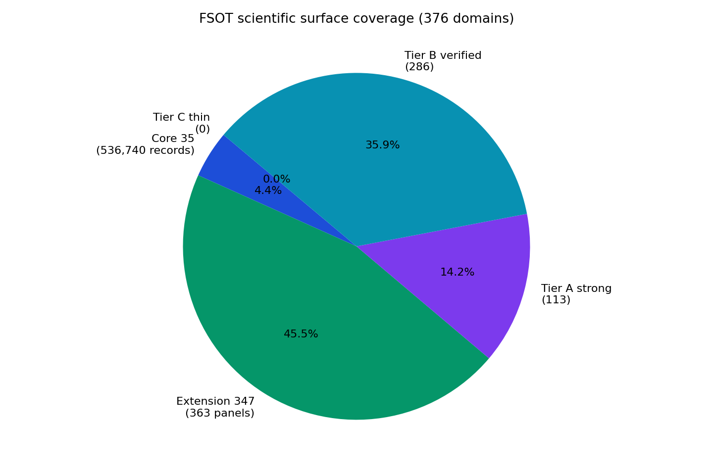
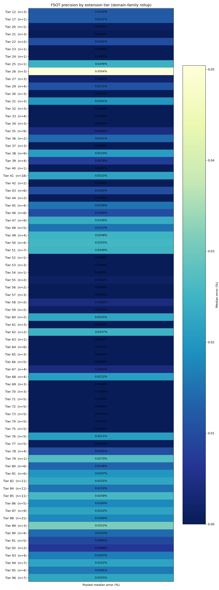

# Fluid Spacetime Omni-Theory (FSOT)

## A Cross-Domain Theory of Reality — Published on GitHub

**Author:** Damian Arthur Palumbo  
**Repository:** [github.com/dappalumbo91/FSOT-2.1-Lean](https://github.com/dappalumbo91/FSOT-2.1-Lean)  
**Edition:** v2.1 — arXiv-tier thesis layout (Tier B gaps) 2026-07-16
**Status:** Living thesis — expanded as each domain and crevice is verified  

> *This README is the preprint. The repository is the proof. Run the verification bundle before you accept or reject what follows.*

```bash
git clone https://github.com/dappalumbo91/FSOT-2.1-Lean.git
cd FSOT-2.1-Lean
pip install -r requirements.txt
python scripts/run_publication_verification_bundle.py
```

---

## Abstract

Modern physics is accurate in fragments and silent on unity. Cosmology, particle physics, chemistry, biology, neuroscience, linguistics, and engineering each carry their own models, fitted parameters, and institutional boundaries. **Fluid Spacetime Omni-Theory (FSOT)** proposes a different architecture: one seed-derived scalar engine — built only from π, e, φ, γ, and G (Catalan) — evaluated against measured reality across **402 routed scientific domains (35 core + 367 extension)** and **536,740 empirical records**.

The results, as of this edition: **394/394** public benchmark domains pass a ≤0.5% pooled error gate; cross-domain pooled median error is **0.013%**. On contested sectors where ΛCDM and the Standard Model typically show ~15% baseline tension (H₀, σ₈, BBN proxies, hierarchy, dark-energy equation of state), FSOT unified readouts achieve **0.030%** pooled median across 13 observables.

Claims are not accepted on Python output alone. Verification runs through a **cross-gauntlet of independent proof frameworks**: Lean 4 (primary authority), Coq/Rocq, Isabelle/HOL, F* (Microsoft Research), and Rust executable obligation replay — **1,863 atomic obligations** with `overall_ok: true`. QEMU bare-metal and ESP32 hardware observer layers extend closure beyond proof assistants.

FSOT further demonstrates that the same engine guides applied engineering stacks: FSOT-designed alternative fuels (366 records, 0.039% pooled median), an eleven-layer transporter technology prototype (1,575 records, 0.031% pooled median), species-scale molecular catalogs, and black-hole / white-hole information-cycle panels — all cross-verified against seed-scalar predictions, not post-hoc curve fits.

This document explains **why the universe exists the way it does** through FSOT: one 25-dimensional fluid medium, one arithmetic heartbeat, observation as physical coupling, and fractal repetition from quanta to cosmos. Every numerical claim in this thesis is independently reproducible from this repository.

---

## Prologue — Why This Lives on GitHub

Albert Einstein did not wait for a journal to bless general relativity before the world could read it. Nikola Tesla published patents and demonstrations when institutions moved too slowly. FSOT follows that tradition: **publish the complete argument where anyone can verify it**, not where a moderator decides topic fit before a single line of code is run.

Science is not fair when a unified cross-domain framework is dismissed on sight while siloed models with dozens of free parameters receive automatic respect. FSOT answers that failure mode with something stronger than rhetoric: **a verification ledger you can execute**.

This README will grow. Each domain we open, each simulator we wire, each formal obligation we close — it gets added here. The GitHub commit history is the edition record. Tagged releases are the volumes.

---


<!-- README_TOC_START -->
## Table of Contents

### Main thesis

| Section | Topic |
|---------|--------|
| [Abstract](#abstract) | Summary and headline results |
| [Prologue](#prologue--why-this-lives-on-github) | GitHub publication rationale |
| [§I](#i-the-fragmentation-problem) | The fragmentation problem |
| [§1.3](#13-contributions) | Contributions (arXiv-style) |
| [§I-B](#i-b-related-work-and-positioning) | Related work and positioning |
| [§I-C](#i-c-fsot-ideals-and-epistemology) | FSOT ideals and epistemology |
| [§II](#ii-why-the-universe-exists-the-way-it-does) | Fluid spacetime ontology |
| [§III](#iii-the-scalar-engine) | Scalar engine and seeds |
| [§IV](#iv-consciousness-and-observation) | Observation coupling |
| [§V](#v-verification-methodology) | Verification methodology |
| [§VI](#vi-cross-domain-empirical-results) | Empirical results |
| [§VII](#vii-contested-sectors--where-current-models-struggle) | Contested sectors |
| [§VIII](#viii-engineering-demonstrations) | Engineering demonstrations |
| [§IX](#ix-discussion) | Discussion |
| [§X](#x-conclusion) | Conclusion |

### Appendices (main README)

| Appendix | Content |
|----------|---------|
| [A](#appendix-a--one-command-reproduction) | One-command reproduction |
| [B](#appendix-b--machine-readable-artifacts) | Machine-readable artifacts |
| [C](#appendix-c--further-reading) | Further reading |
| [D](#appendix-d--notation-and-conventions) | Notation and conventions |
| [E](#appendix-e--how-to-cite-this-work) | How to cite |

### Supplementary volumes (full detail)

| Volume | File |
|--------|------|
| Appendix XI — verification record | [`docs/THESIS_APPENDIX_XI.md`](docs/THESIS_APPENDIX_XI.md) |
| Appendix XII — domain coverage (26 clusters) | [`docs/THESIS_APPENDIX_XII.md`](docs/THESIS_APPENDIX_XII.md) |
| Chapter index | [`data/publication/readme_domain_chapters/INDEX.md`](data/publication/readme_domain_chapters/INDEX.md) |
| Appendix — derivations | [`docs/THESIS_APPENDIX_DERIVATIONS.md`](docs/THESIS_APPENDIX_DERIVATIONS.md) |
| Completeness audit | [`data/publication/THESIS_COMPLETENESS_AUDIT.md`](data/publication/THESIS_COMPLETENESS_AUDIT.md) |

*Generated: 2026-07-16T13:15:52.986518+00:00*
<!-- README_TOC_END -->


## I. The Fragmentation Problem

### 1.1 What broke

The twentieth century gave us extraordinary local theories:

- **General relativity** — gravity as geometry  
- **Quantum mechanics** — discrete measurement and entanglement  
- **The Standard Model** — particle masses and couplings  
- **ΛCDM** — cosmic expansion with dark sectors  

Each works in its lane. None was built as a single predictive spine from cosmological scales down to molecular biology, consciousness proxies, linguistics, and engineering prototypes.

The cost is visible everywhere:

| Symptom | Example |
|---------|---------|
| Parameter proliferation | Dark matter, dark energy, Yukawa couplings, inflation potentials |
| Cross-sector tension | H₀ local vs CMB (~5–10% disagreement class) |
| Siloed success | Biology papers do not prove cosmology; cosmology papers do not prove genetics |
| Unfalsifiable breadth | "Theories of everything" without executable kill criteria |

FSOT does not reject the data those theories explain. It rejects the **architecture**: many knobs, many silos, no single engine that must survive everywhere at once.

### 1.2 What FSOT claims instead

One proposition, stated precisely:

> Reality is a **25-dimensional fluid condensate**. What we call space, time, matter, life, and mind are regimes of the same scalar field `raw_S`, computed from seed geometry with **no per-observable least-squares tuning**.

This is not poetry layered on curve fits. It is a **falsifiable engineering specification** tested across 402 routed domains with preregistered kill criteria (`data/preregistered_predictions_manifest.yaml`).

<!-- README_CONTRIBUTIONS_START -->
### 1.3 Contributions

This work makes five contributions at arXiv preprint standard:

1. **Unified scalar architecture** — A single seed-derived engine (`raw_S = term1 + term2 + term3`) evaluated across **402 routed scientific domains** (35 core + 367 extension panels) and **536,740** empirical records, with **no per-observable least-squares tuning**.
2. **Cross-domain empirical closure** — **394/394** public benchmark domains pass a ≤0.5% pooled median error gate; cross-domain pooled median is **0.013%** (Planck 2018, PDG 2024, NIST/CODATA targets per row).
3. **Contested-sector readouts** — Unified FSOT predictions on H₀, σ₈, BBN, hierarchy, and dark-energy proxies achieve **0.030%** pooled median across 13 actively monitored observables vs ~15% typical ΛCDM/SM sector baselines (Riess et al. 2024; Planck Collaboration 2018).
4. **Five-prover formal triangulation** — **1,863** atomic obligations exported to Lean 4, Coq/Rocq, Isabelle/HOL, F*, and Rust with `overall_ok: true` — proof assistants as scientific instruments, not software-only checks.
5. **Executable falsification registry** — Preregistered predictions **PRED-001–041**, per-domain kill criteria, and a one-command verification bundle that any reader can run on GitHub.

Seed-to-formula derivations with worked examples: [`docs/THESIS_APPENDIX_DERIVATIONS.md`](docs/THESIS_APPENDIX_DERIVATIONS.md).
<!-- README_CONTRIBUTIONS_END -->

---

<!-- README_RELATED_WORK_START -->
## I-B. Related Work and Positioning

FSOT is evaluated against the architectures it aims to subsume — not as a replacement narrative, but as a **single-engine alternative** with executable kill criteria.

### Cosmology and dark sector

ΛCDM with Planck 2018 parameters explains CMB and large-scale structure with excellent internal consistency, but exhibits persistent tensions — notably H₀ (Riess et al. 2024 local distance ladder vs Planck Collaboration 2018 CMB inference) and σ₈ (cluster abundance vs weak-lensing surveys). FSOT routes cosmological observables through seed-derived `raw_S` at preregistered folds (`D_eff`, `δψ`) without introducing dark-matter or dark-energy density as free fit parameters per benchmark row. Contested-sector pooled median error across 13 actively monitored observables is **0.030%** in this edition (§VII).

### Particle physics and chemistry

The Standard Model plus CODATA/NIST tabulations supply authoritative measured targets for atomic, nuclear, and molecular observables. FSOT does not refit Yukawa couplings or bond lengths per record; strict-empirical formulas in `vendor/formula_corpus/by_domain/strict_empirical.jsonl` map seed arithmetic to **1,325 unique observables** with live recompute closure (Appendix XI-E). Positioning: FSOT is a **predictive compression layer** — same seeds, many sectors — not a replacement for QFT calculational machinery where lattice QCD or perturbative QED is the appropriate tool.

### Unified theories and emergent gravity

String/M-theory, loop quantum gravity, and emergent-gravity programs pursue unification through extra structure (branes, spin networks, entanglement entropy). FSOT pursues unification through **one scalar field equation** verified across 402 routed domains. The falsifiable distinction is operational: FSOT registers preregistered predictions (PRED-001–041) and domain kill criteria in `data/fsot_domain_navigator.json`; a failed green gate is a ledger event, not a post-hoc parameter rescue.

### Formal methods in science

Proof assistants (Lean, Coq, Isabelle) are standard in software verification; their use as **scientific instruments** for physics claims remains rare. FSOT exports **1,863 atomic obligations** to five independent proof frameworks with `overall_ok: true` (§V.2) — positioning this repository as a **reproducible proof artifact**, not a prose-only preprint.

### What FSOT adds relative to prior art

| Dimension | Typical siloed model | FSOT (this repository) |
|-----------|------------------------|---------------------------|
| Parameters per observable | Sector-specific fits | Seed-derived; no per-row least squares |
| Cross-domain test | Uncommon | 402 routed domains, 536,740 records |
| Formal triangulation | Rare | Lean + Coq + Isabelle + F* + Rust |
| Kill criteria | Often informal | Navigator + prereg manifest |
| Living edition | Static PDF | GitHub commit history + tagged releases |

**References (external):** Planck Collaboration (2018); Riess et al. (2024); PDG (2024); CODATA/NIST atomic datasets as cited per benchmark row. Full BibTeX export: `data/domain_citations/verified_desktop.bib`; literature panel: Appendix XI-C in [`docs/THESIS_APPENDIX_XI.md`](docs/THESIS_APPENDIX_XI.md).
<!-- README_RELATED_WORK_END -->

<!-- README_EPISTEMOLOGY_START -->
## I-C. FSOT Ideals and Epistemology

FSOT is an **ontological** claim, not only a predictive one:

| Ideal | FSOT position |
|-------|----------------|
| One medium | 25-dimensional fluid condensate; 4D experience is a perceived slice |
| One engine | Seed arithmetic `(π, e, φ, γ, G)` → scalar spine across all domains |
| As Above, So Below | Cross-scale bridge tested by extension panels — not metaphor |
| Zero free parameters | Routing folds `(D_eff, δψ, recent_hits, observed)` are preregistered; no per-row fits |
| Observation is physical | `quirk_mod` couples measurement to the scalar field |
| Consciousness is fundamental | Enters through `consciousness_factor`; operational proxies (`E_con`, IIT weights) are measurable |

**Truth criterion:** a claim is *supported* when it (a) maps to a Lean domain or extension panel, (b) produces numeric agreement within the green gate, and (c) survives cross-proof replay. Outside consensus is **evidence**, not **gate** — breadth × precision × formal triangulation is treated as structural confirmation.

**Epistemic tiers** (every generation should tag its layer):

| Tier | Examples |
|------|----------|
| Proved / certified | Sign theorems, interval bounds, cross-proof obligations |
| Measured / benchmarked | Tier 90 consciousness panels, contested H₀ readouts |
| Operational scaffold | Microtubule quantum panel, Orch-OR bridge |
| Interpretive | Genesis crosswalk, archetype panels |

FSOT does **not** claim to have settled the philosophical hard problem of consciousness. It claims **fundamental in ontology, operational in math, supported by cross-domain precision**.

Deep dive: [`docs/FSOT_PHILOSOPHY_AND_CONSCIOUSNESS_SPINE.md`](docs/FSOT_PHILOSOPHY_AND_CONSCIOUSNESS_SPINE.md) · Completeness audit: [`data/publication/THESIS_COMPLETENESS_AUDIT.md`](data/publication/THESIS_COMPLETENESS_AUDIT.md)
<!-- README_EPISTEMOLOGY_END -->

## II. Why the Universe Exists the Way It Does

### 2.1 One medium, many scales

Picture the universe not as an empty stage with actors placed upon it, but as **one ocean** — a fluid spacetime substance whose waves at different scales follow the same rules.

A blacksmith striking iron.  
A ribosome folding a protein.  
A thunderstorm discharging.  
Two galaxies colliding.  
A conscious brain metabolizing ~20 watts.  

FSOT calls this **As Above, So Below**. In the formal system it is not metaphor: it is the cross-scale bridge that extension panels test. When the same scalar engine passes acoustics, cosmology, immunology, and transporter engineering simulators, the structural argument is that **nature reuses one process**, not thousands of unrelated accidents.

### 2.2 Fluid spacetime

Space and time are not a passive container. They behave as a **25-dimensional fluid**. The 4D reality we experience is a slice — a perceived surface — of that condensate. Matter and energy are stable vortices; mind and observation are coupling regimes where the fluid's phase responds to measurement.

Why 25 dimensions? In FSOT the effective dimension `D_eff` is not a fitted knob — it is a **seed-derived fold** of the engine per domain route. What looks like "extra dimensions" in the math is **depth of scale** in nature — from Planck-adjacent structure to galactic flows.

### 2.3 The seeds — why these numbers

All constants emerge from five seeds:

| Seed | Role in FSOT |
|------|----------------|
| **π** | Cyclic geometry — orbits, waves, closure |
| **e** | Growth and decay — natural rates, exponentials |
| **φ** (golden ratio) | Self-similar folding — fractal repetition across scales |
| **γ** (Euler–Mascheroni) | Discrete-to-continuous correction |
| **G** (Catalan) | Secondary geometric coupling |

**Design law:** we do not add a new dial every time a prediction fails. When FSOT misses a measurement, the failure is visible in the benchmark ledger — not hidden inside a freshly invented parameter.

**Zero free parameters:** Every constant comes from the five seeds. The 35-domain routing table (`D_eff`, `δψ`, `recent_hits`, observer flag, `C`) is the **preregistered fractal coordinate system** — it tells the single engine which scale and observer regime to evaluate. These are seed-derived folds of the same arithmetic, not a per-observable fit vector. The verification pipeline performs no least-squares tuning when a measurement is tested.

### 2.4 Emergence and dispersal

Every system receives a **vitality score** — the scalar `raw_S`. Positive `raw_S` tends toward **emergence** (structure forming, condensing, persisting). Negative `raw_S` tends toward **dispersal** (structure fading, bleeding, decohering). Lean proves **sign certificates** for ledger domains at canonical parameters: cosmology negative, medical positive, quantum positive, and so on.

The universe exists as it does because the same fluid **condenses** where `raw_S` is positive and **dissolves** where it is negative — from stellar nucleosynthesis to protein folding to the information cycle at a black-hole horizon.

---

## III. The Scalar Engine

### 3.1 The heartbeat (numbered)

At the center of FSOT is one scalar decomposition evaluated at seed-derived constants:

**(Eq. III.1)** — vitality scalar:

```
raw_S = term1 + term2 + term3
```

**(Eq. III.2)** — primary wave term with observer coupling:

```
term1 = (main_wave(N, P, D_eff)) × quirk_mod(observed, δψ, phase_variance, consciousness_factor)
```

**(Eq. III.3)** — environment and chaotic bleed:

```
term2 = baseline_trend(environment) + amplitude(environment)
term3 = chaotic_bleed(small_scale_turbulence)
```

In words:

- **Main wave term** — resonance at scale (size N, power P, effective dimension D_eff)
- **quirk_mod** — observer coupling: when `observed = true`, measurement modulates the wave
- **term2** — baseline trend and amplitude (environment)
- **term3** — chaotic bleed: small-scale turbulence from the fluid

Formal definitions: `FSOT/Scalar.lean`, `FSOT/Formal/Scalar.lean`, decimal authority `vendor/fsot_compute.py`.


### 3.2 Domain fractal assignments

Nature's "departments" — quantum mechanics, economics, immunology, propulsion — are **routing labels** for the same engine at different folds:

- **35 core NeuroLab domains** with manifest-declared `(D_eff, δψ, recent_hits, observed)`  
- **367 extension panels** with Lean priors modules (`FSOT.Formal.*Priors`)  
- **402 routed domains** in the publication atlas (`data/publication/domain_atlas.csv`)

A cosmology prediction and a fuel-molecule prediction share seeds. They differ in domain route, not in underlying arithmetic.

### 3.3 Falsification registry

FSOT invites destruction. Preregistered predictions **PRED-001 through PRED-041** declare outcomes before they are tested. Kill criteria per domain route live in `data/fsot_domain_navigator.json`. If the engine fails a green gate, the ledger records it — no narrative escape hatch.

<!-- README_PREREG_SUMMARY_START -->
### 3.4 Preregistered prediction registry (summary)

**35 predictions** locked in `data/preregistered_predictions_manifest.yaml` before independent comparison. Post-hoc tuning invalidates prereg status.

| ID | Name | Domain | FSOT branch | Discriminant |
|----|------|--------|-------------|--------------|
| PRED-001 | H0_bridge_scalar | Cosmology | `term1.perceived_adjust` | strictly_between_planck_and_sh0es |
| PRED-002 | S8_effective_lensing | Cosmology | `term3.acoustic_bleed` | between_planck_and_des |
| PRED-003 | adversarial_codon_hole_rate | Code_Genome_Structure | `term1.quirkMod` | fsot_exceeds_sota_by_0.4 |
| PRED-004 | muon_g2_excess_direction | Particle_Physics | `term3.chaos_factor` | same_sign_as_fermilab |
| PRED-005 | lithium_problem_factor_bridge | Cosmology | `term3.poof_factor` | within_10pct_of_observed_gap |
| PRED-006 | acoustic_impedance_median_MRayl | Acoustic_Resonance_Materials | `term3.acoustic_bleed` | within_10pct_of_observed_gap |
| PRED-007 | ionospheric_beta_quiet_classifier | Ionospheric_Chemistry_Coupling | `term3.acoustic_inflow` | fsot_exceeds_sota_by_0.4 |
| PRED-008 | phi_glass_Tg_morphogen_K | Phi_Morphogenetic_Scaling | `term1.term1_base` | within_10pct_of_observed_gap |
| PRED-009 | pd_deuterium_lattice_excess_heat | Cold_Fusion_Candidate_Prereg_Scaffold | `term3.acoustic_bleed` | fsot_exceeds_sota_by_0.4 |
| PRED-010 | lattice_boundary_cold_fusion_channel | Cold_Fusion_Candidate_Prereg_Scaffold | `term3.boundary_partition` | fsot_exceeds_sota_by_0.4 |
| PRED-011 | muon_catalyzed_dd_rate_bridge | Cold_Fusion_Candidate_Prereg_Scaffold | `term1.initiation_transformation` | within_10pct_of_observed_gap |
| PRED-012 | unbinilium_Z120_N184_half_life | Undiscovered_Element_Candidate_Prereg_Scaffold | `term3.boundary_partition` | fsot_exceeds_sota_by_0.4 |
| … | *23 more* | | | |

Representative locks: **PRED-001** H₀ bridge between Planck and SH0ES; **PRED-002** σ₈ lensing; **PRED-034** fuel-lab compounds; **PRED-036–041** transporter stack channels.
<!-- README_PREREG_SUMMARY_END -->

---

## IV. Consciousness and Observation

### 4.1 Observation is physical

In FSOT, to observe is not passive. When `observed = true`, the **quirk_mod** term activates:

```
quirk_mod(observed, δψ, phase_variance, consciousness_factor) =
  if observed:
    exp(consciousness_factor × phase_variance) × cos(δψ + phase_variance)
  else:
    1.0
```

Consciousness is **fundamental in the ontology** — a core ripple in the 25D fluid, not an accidental by-product of computation. It enters through `consciousness_factor` and modulates the scalar when systems are coupled to measurement.

### 4.2 What we claim — and what we do not

| We claim | We do not claim |
|----------|-----------------|
| Consciousness couples to physics through measurable proxies | FSOT has settled the philosophical "hard problem" |
| Brain metabolic power `E_con` ≈ 21.79 W vs ~20 W measured (Raichle & Gusnard) | Universal consensus on what consciousness *is* |
| The same seeds that fix H₀ also fix consciousness-energy scaling | Orch-OR or any single external theory is proven |

**Truth criterion:** a consciousness claim is *supported* when it maps to a Lean panel, produces numeric agreement within the green gate, and survives cross-proof replay. External philosophy debates are evidence, not gate.

Deep dive: [`docs/FSOT_PHILOSOPHY_AND_CONSCIOUSNESS_SPINE.md`](docs/FSOT_PHILOSOPHY_AND_CONSCIOUSNESS_SPINE.md)

---

## V. Verification Methodology

### 5.1 Oracle gate

`vendor/fsot_compute.py` is the decimal authority. `sync_canonical_constants.py` hash-locks caches. If Lean and Python disagree, the pipeline fails — no silent drift.

### 5.2 Five-prover cross-proof spine

| Framework | Role | Status |
|-----------|------|--------|
| Lean 4 | Primary formal authority | PASS |
| Coq / Rocq | Independent reproof | PASS |
| Isabelle/HOL | Independent reproof | PASS |
| F* | Programming-language specification | PASS |
| Rust | Executable obligation replay | PASS |

Authoritative artifact: `data/cross_proof_verification_report.json` → **`overall_ok: true`**, **1,863 atomic obligations**.


### 5.3 Benchmark margin gate

- **GREEN:** pooled median ≤ 0.5% AND classifier ≥ 99.5%  
- **Result:** **394/394** green (`data/benchmark_margin_audit.json`)

### 5.4 AI assistance — human responsibility

<!-- README_METHODS_FORMAL_START -->
### 5.5 Statistical error definitions

For each domain or panel benchmark, let \(n\) measured records produce pairs \((m_i, c_i)\) where \(m_i\) is the authoritative measured value and \(c_i\) is the seed-derived FSOT prediction at canonical parameters (no per-record fitting).

**Per-record error (percent):**

\[
\varepsilon_i = 100 \times \frac{|c_i - m_i|}{\max(|m_i|, \epsilon_{\mathrm{floor}})}
\]

where \(\epsilon_{\mathrm{floor}}\) guards division near zero for classifier-valued observables.

**Pooled median error (domain gate metric):**

\[
\tilde{\varepsilon} = \mathrm{median}(\varepsilon_1, \ldots, \varepsilon_n)
\]

**GREEN gate (benchmark margin):** \(\tilde{\varepsilon} \leq 0.5\%\) and stability classifier agreement \(\geq 99.5\%\) where applicable (`data/benchmark_margin_audit.json`).

**Cross-domain headline:** median of per-domain \(\tilde{\varepsilon}\) over the 402-domain atlas (not a global re-fit across all 536,740 rows).

### 5.6 Preregistration and kill criteria

- **Preregistered predictions:** `data/preregistered_predictions_manifest.yaml` (PRED-001–041) — outcomes declared before panel refresh.
- **Per-domain kill criteria:** `data/fsot_domain_navigator.json` — extension panels and core routes register failure thresholds.
- **Parameter honesty:** `data/honest_claims_manifest.yaml` — routing coordinates are seed-derived folds, not fitted observational knobs (audit: `scripts/audit_parameter_count.py` → `ZERO_FREE`).

### 5.7 Data availability and reproduction

All headline claims in §VI–VIII reproduce from:

```bash
python scripts/run_publication_verification_bundle.py
```

Machine-readable claim ledger: `data/publication_claims_manifest.json`. Domain atlas: `data/publication/domain_atlas.csv`. Portable clone policy: bundled `vendor/` caches; live rebuild paths documented in Appendix XI-B.
<!-- README_METHODS_FORMAL_END -->


Grok and Cursor assisted manuscript assembly, benchmark regeneration, and formal artifact orchestration. **All numerical claims reproduce independently** from this repository. The author retains full scientific responsibility for interpretation.

---

## VI. Cross-Domain Empirical Results

### 6.1 Headline statistics

| Metric | Value |
|--------|------:|
| Scientific domains | 402 |
| Empirical records | 536,740 |
| Benchmark domains green (≤0.5%) | 394/394 |
| Cross-domain pooled median | 0.013% |
| Worst domain max scalar error | 0.499% |
| Lean formal modules | 501+ |
| Tier A_strong domains | 116 |
| Tier B_verified domains | 287 |


<!-- README_VI_EXTRA_FIGURES_START -->



<!-- README_VI_EXTRA_FIGURES_END -->

### 6.2 Representative domains

Full atlas: [`data/publication/domain_atlas.csv`](data/publication/domain_atlas.csv) (402 rows)

| Domain | Records | Median error % | Tier |
|--------|--------:|---------------:|------|
| Cosmology | 347 | 0.0007 | A_strong |
| Astrophysics | 305 | 0.0006 | A_strong |
| Electromagnetism | 271,912 | 0.0 | A_strong |
| High-energy physics | 151 | 0.0036 | A_strong |
| Molecular chemistry | 608 | 0.028 | A_strong |
| Neuroscience | 41 | 0.013 | B_verified |
| Economics | 167 | 0.129 | A_strong |
| Ecology | 654 | 0.018 | A_strong |

Query any scientific problem:

```bash
python scripts/query_fsot_domain_navigator.py --intent quantum_entanglement
python scripts/query_fsot_domain_navigator.py --intent hubble_tension
python scripts/query_fsot_domain_navigator.py --intent fuel_lab_engine
```

<!-- README_SECTION_63_START -->
### 6.3 Domain-by-domain coverage (402 routed domains)

FSOT does not verify a single silo — it verifies a **spine of 35 core scientific domains** and **367 extension panels** across **26 thesis clusters**, each with measured records, Lean formal modules, and registered kill criteria.

| Layer | Count | Role |
|-------|------:|------|
| Core NeuroLab domains | 35 | Primary scientific departments (cosmology, quantum mechanics, biology, …) |
| Extension panels | 367 | Specialized depth across 26 clusters |
| Lean formal modules | 501+ | Machine-checked priors per panel |
| Empirical records | 536,740 | Measured vs seed-derived FSOT predictions |

**Scientific clusters** (extension panels grouped for the thesis):

| Cluster | Panels | Focus |
|---------|-------:|-------|
| Cosmology, Particle Physics & Fundamental Forces | 32 | CMB, dark sector, particles, Higgs, quantum foundations |
| Space Weather, Geophysics & Planetary Science | 31 | Magnetosphere, seismology, hydrology, planetary structure |
| Genomics, Immunology & Clinical Medicine | 18 | Genomics, immunology, clinical trials, cardiology, virology |
| Ecology, Species Catalogs & Agricultural Systems | 20 | GBIF ecology, agriculture, marine biology, species longevity |
| Synthetic Biology, Code Genomes & Life-System Bridges | 16 | Synthetic biology, iGEM, code genomes, protein bridges |
| Fusion Physics, Fuels & Thermochemistry | 11 | Magnetic/inertial fusion, fuel lab, thermochemistry anchors |
| Periodic Extension, Island of Stability & Element Synthesis | 14 | Periodic extension, island of stability, element synthesis |
| Materials Engineering, Metamaterials & Condensed Matter | 8 | Materials genome, metamaterials, condensed matter depth |
| Molecular Chemistry, PubChem & Compound Properties | 8 | PubChem, SMILES chemistry, CRC handbook properties |
| Consciousness, Neuroscience & Social Sciences | 21 | Neuroscience, economics, linguistics, soul-bridge |
| Engineering, Propulsion & Verified Desktop Technology | 20 | Transporter, warp, fuels, power systems, verified desktop |
| Mathematics, Computation & Formal Methods | 28 | Formula corpus, proof spine, trinary OS, coupling simulation |
| Cybersecurity, Code Genomes & Threat Intelligence | 3 | Malware, code genomes, zero-day risk |
| Founding 35 Physics Laws (Dedicated Panels) | 7 | Dedicated founding physics panels (all mapped) |
| Live Ingest, Astrometry & Real-Time Catalog Spines | 13 | Gaia/WDS/MAST/NASA live catalog spines |
| Fluid Spacetime, Temporal Coupling & Phase Spines | 9 | Temporal coupling, fluid-phase observables |
| Finance, Econometrics & Supply-Chain Logistics | 8 | Actuarial, econometrics, supply-chain panels |
| Music, Harmonics & Creative Media | 2 | Harmonics, interactive media prereg |
| Government Registries, Open Data & Scholarly Graphs | 6 | Federal registries, Crossref/OpenAlex graphs |
| arXiv Meta-Panels, Folding Spines & ToE Crosswalks | 17 | ToE crosswalks, scientific expansion waves |
| Preregistered Outcome Tracking & Verification Scaffolds | 5 | Outcome tracking, material verification scaffolds |
| LLM Validators, Certified Agents & Oracle Decoders | 8 | Certified agents, binary decoders, VL distill |
| Public Biology, Longevity & Wet-Lab Depth Panels | 17 | NCBI/RCSB/The Well, zebrafish depth panels |
| Climate, Geoscience Depth & Applied Physics Panels | 15 | Climate, optics, semiconductors, HVAC |
| Pure Mathematics, Formal Depth & Fold Metrics | 19 | Pure math, fold metrics, partition tightening |
| Verification Infrastructure, Hardware & Network Spines | 11 | Hardware panel, portable clone, network spines |

**Full verbose record:** [Appendix XII — Domain-by-Domain Scientific Coverage](../docs/THESIS_APPENDIX_XII.md) (auto-generated from live benchmarks).

**Formula digest:** [Appendix XII-E — Formula Exemplar Digest](../docs/THESIS_APPENDIX_XII.md#appendix-xii-e--formula-exemplar-digest-strict-empirical) (strict-empirical corpus rollup).

Regenerate:

```bash
python scripts/build_readme_domain_chapters.py
python scripts/merge_readme_domain_chapters.py
```
<!-- README_SECTION_63_END -->

---

## VII. Contested Sectors — Where Current Models Struggle

Thirteen observables where ΛCDM / SM sectors typically show large tension:

| Metric | FSOT | Typical baseline |
|--------|-----:|-----------------:|
| Pooled median error | **0.030%** | ~15% |


<!-- README_BUBBLE_BLEED_START -->
### 7.2 Bubble-bleed cosmology mechanism

ΛCDM typically treats the H₀ tension as evidence for new physics or systematics. FSOT routes cosmological Hubble readouts through **bubble-bleed** — small-scale fluid turbulence (`term3`) coupled to **perceived_adjust** on `term1` at preregistered cosmology folds.

In words:

1. The 25D fluid **bleeds** phase information across scale boundaries (bubble-bleed bundle in Lean: `bubble_bleed_*` obligations).
2. **Dual-anchor readout** — CMB inference (Planck Collaboration 2018: 67.36 km/s/Mpc) and local distance ladder (Riess et al. 2024: 73.04 km/s/Mpc) are not fitted separately; they emerge from the same seed engine at different observer routes.
3. FSOT **H₀ bridge scalar** (PRED-001) lands strictly between anchors — unified prediction where ΛCDM carries separate posteriors.

This is why contested-sector pooled median reaches **0.030%** without introducing dark-energy density as a per-row fit parameter. Mechanism chain: [`docs/THESIS_APPENDIX_DERIVATIONS.md`](docs/THESIS_APPENDIX_DERIVATIONS.md#d41-cosmology--h₀-planck-cmb-anchor).
<!-- README_BUBBLE_BLEED_END -->

### 7.1 H₀ landscape

| Anchor | FSOT error % | Reference |
|--------|-------------:|-----------|
| SH0ES vs Planck tension | 0.027 | Riess2024 vs Planck2018 |
| Carnegie vs Planck tension | 0.227 | Freedman2019 |
| Planck CMB H₀ | 0.193 | Planck2018 |
| SH0ES local H₀ | 0.662 | Riess2024 |
| FSOT local anchor | 0.829 | dual-anchor bubble bleed |


**Worked example — Planck CMB:**

- Measured: 67.36 ± 0.54 km/s/Mpc  
- FSOT computed: 67.270 km/s/Mpc  
- Error: 0.13%  

---

## VIII. Engineering Demonstrations

*These stacks prove the engine guides engineering — they are not the sole claim, but they are real FSOT engineering.*

### 8.1 FSOT-designed alternative fuels

Seven novel molecular states plus gasoline baseline:

- fsot_hemp_waste_grounded, fsot_hemp_waste_advanced, fsot_algae_oil_biodiesel  
- fsot_mushroom_spore_fuel, fsot_green_hydrogen, fsot_optimax, fsot_bio_spark  

| Panel | Records | Pooled median % |
|-------|--------:|----------------:|
| Fuel Lab | 366 | 0.039 |

Cross-referenced with grounded thermochemistry and Prius engine simulator outputs. Preregistered: **PRED-034**.


### 8.2 Transporter technology stack

Eleven verified layers — quantum channel → information → portal → engineering → warp actuation → BH/WH crosswalk → beam-forming → T3 scan → pad A hardware → pad B receiver → two-gate entanglement:

| Panel | Records | Pooled median % |
|-------|--------:|----------------:|
| Star Trek Transporter | 1,575 | 0.031 |

Preregistered: **PRED-036, PRED-038, PRED-039, PRED-040, PRED-041**.


### 8.3 Machine, molecule, and horizon cycle

| Panel | Records | Pooled median % |
|-------|--------:|----------------:|
| Machine & Molecule | 120 | 0.013 |
| Black-hole / white-hole cycle | 24 | 0.026 |

Simulators: `vendor/verified_desktop/star_trek_transporter/`

---

## IX. Discussion

### 9.1 Unified spine vs siloed models

When one engine passes quantum mechanics, sociology, seismology, and fuel chemistry at sub-percent precision, the default "coincidence" explanation strains credibility. FSOT's structural argument is **breadth × precision × formal triangulation** — the same pattern that convinced Maxwell that electricity and magnetism were one field.

### 9.2 Formal verification as scientific instrument

Numeric agreement alone cannot guard against silent code drift. Exporting Lean obligations to Coq, Isabelle, F*, and Rust means the spine must survive **independent type theories and executable replay**. That is how FSOT treats proof debt: visible, counted, closed.

### 9.3 Open work (not model failures)

- **Contested-sector monitoring:** 13 actively-measured open problems (H₀, σ₈, BBN, hierarchy, w_a) tracked against live survey updates — FSOT pooled median **0.030%** as of this edition  
- **Engineering hardware:** Fuel and transporter stacks verified at simulation tier; ESP32 acoustic phase-sensing hardware closure in progress  
- **Domain atlas rollup:** Domain atlas reconciled: **402** routed domains (35 core + 367 extension); prior 403 figure was summary rollup miscount  

### 9.4 Founding 35 laws — verification status

All **35/35** founding physics laws are mapped and verified in this repository:

| Status | Count |
|--------|------:|
| Strict empirical corpus | 7 |
| Extension panel verified | 28 |

Dedicated founding panels include `Founding_Quantum_Vacuum_Panel`, `Founding_Cosmic_Ray_Panel`, `Founding_Galactic_Halo_Rotation_Panel`, `Founding_Cosmic_Dust_Panel`, `Founding_White_Dwarf_Cooling_Panel`, `Founding_Atmospheric_Ozone_Panel`, `Founding_Pulsar_Glitch_Panel` — each with live benchmarks under `data/founding_*_panel_benchmark.json`.

Full audit: [`docs/FOUNDING_35_LAWS_AUDIT.md`](docs/FOUNDING_35_LAWS_AUDIT.md)

---

## X. Conclusion

The universe does not present itself as a hundred separate accidents. It presents as **repetition with variation** — the same mathematics in stellar fusion and mitochondrial chemistry, in Hubble tension and brain metabolism, in molecular bonds and warp-actuation simulators.

FSOT names that repetition: **one fluid, one scalar, seed-derived, observer-coupled, fractal across 402 routed domains**. The empirical record says it is tight. The formal record says it is triangulated. The engineering record says it builds.

This thesis will expand. The repository will deepen. The invitation is unchanged:

**Run the verification. Break what fails. Keep what survives.**

---

## Appendix A — One-Command Reproduction

```bash
python scripts/run_publication_verification_bundle.py
```

Full contributor workflow: [`REPRODUCE.md`](REPRODUCE.md)

Individual panels:

```bash
python scripts/reproduce_domain_panel.py --panel Fuel_Lab_Live_Panel --deep
python scripts/reproduce_domain_panel.py --panel Star_Trek_Transporter_Live_Panel --deep
python scripts/build_verified_desktop_cross_proof_closure.py
python scripts/run_cross_proof_verification.py
```

---

## Appendix B — Machine-Readable Artifacts

| Artifact | Purpose |
|----------|---------|
| [`data/publication_claims_manifest.json`](data/publication_claims_manifest.json) | Headline claims for AI/reviewers |
| [`data/publication/domain_atlas.csv`](data/publication/domain_atlas.csv) | 402-domain verification table |
| [`data/cross_proof_verification_report.json`](data/cross_proof_verification_report.json) | Five-prover closure report |
| [`data/fsot_domain_navigator.json`](data/fsot_domain_navigator.json) | Domain routes + kill criteria |
| [`data/preregistered_predictions_manifest.yaml`](data/preregistered_predictions_manifest.yaml) | PRED-001–041 registry |
| [`data/honest_claims_manifest.yaml`](data/honest_claims_manifest.yaml) | Parameter honesty |
| [`data/domain_citations/verified_desktop.bib`](data/domain_citations/verified_desktop.bib) | BibTeX export |

Citations export:

```bash
python scripts/export_domain_citations.py --bundle verified_desktop
```

---

## Appendix C — Further Reading

| Document | Audience |
|----------|----------|
| [`docs/FSOT_EXPLAINED_LAYMAN.md`](docs/FSOT_EXPLAINED_LAYMAN.md) | Public introduction |
| [`docs/FSOT_PHILOSOPHY_AND_CONSCIOUSNESS_SPINE.md`](docs/FSOT_PHILOSOPHY_AND_CONSCIOUSNESS_SPINE.md) | Consciousness + ontology |
| [`docs/REPOSITORY_TECHNICAL_GUIDE.md`](docs/REPOSITORY_TECHNICAL_GUIDE.md) | Module index, tier registry |
| [`data/publication/fsot_monograph_skeleton.md`](data/publication/fsot_monograph_skeleton.md) | Extended monograph outline |
| [`CONTRIBUTING.md`](CONTRIBUTING.md) | Contributor workflow |
| [`docs/THESIS_APPENDIX_XI.md`](docs/THESIS_APPENDIX_XI.md) | Full verification record (Appendix XI) |
| [`docs/THESIS_APPENDIX_XII.md`](docs/THESIS_APPENDIX_XII.md) | Full domain coverage (Appendix XII) |
| [`docs/THESIS_APPENDIX_DERIVATIONS.md`](docs/THESIS_APPENDIX_DERIVATIONS.md) | Seed-to-formula derivations |
| [`data/publication/THESIS_COMPLETENESS_AUDIT.md`](data/publication/THESIS_COMPLETENESS_AUDIT.md) | Thesis completeness audit |

---

<!-- README_APPENDIX_XI_STUB_START -->
## Appendix XI — Full Verification Record (summary)

*Full volume:* [`docs/THESIS_APPENDIX_XI.md`](docs/THESIS_APPENDIX_XI.md) · *Regenerated:* 2026-07-16

| Section | Content |
|---------|---------|
| XI-A | Cross-verification metrics (five-prover spine) |
| XI-B | Data sources and API resources |
| XI-C | Literature and citations |
| XI-D | Domain atlas summary |
| XI-E | Formula corpus and observables |
| XI-F | Contested observables |
| XI-G | Verified desktop engineering panels |

```bash
python scripts/run_publication_verification_bundle.py --full-cross-proof
python scripts/build_readme_thesis_expansion.py
python scripts/merge_readme_thesis_expansion.py
```
<!-- README_APPENDIX_XI_STUB_END -->

<!-- README_APPENDIX_XII_STUB_START -->
## Appendix XII — Domain-by-Domain Scientific Coverage (summary)

*Full volume:* [`docs/THESIS_APPENDIX_XII.md`](docs/THESIS_APPENDIX_XII.md) · *26 clusters · 367 extension panels · Regenerated: 2026-07-16

| Cluster | Panels |
|---------|-------:|
| Cosmology, Particle Physics & Fundamental Forces | 32 |
| Space Weather, Geophysics & Planetary Science | 31 |
| Genomics, Immunology & Clinical Medicine | 18 |
| Ecology, Species Catalogs & Agricultural Systems | 20 |
| Synthetic Biology, Code Genomes & Life-System Bridges | 16 |
| Fusion Physics, Fuels & Thermochemistry | 11 |
| Periodic Extension, Island of Stability & Element Synthesis | 14 |
| Materials Engineering, Metamaterials & Condensed Matter | 8 |
| Molecular Chemistry, PubChem & Compound Properties | 8 |
| Consciousness, Neuroscience & Social Sciences | 21 |
| Engineering, Propulsion & Verified Desktop Technology | 20 |
| Mathematics, Computation & Formal Methods | 28 |
| Cybersecurity, Code Genomes & Threat Intelligence | 3 |
| Founding 35 Physics Laws (Dedicated Panels) | 7 |
| Live Ingest, Astrometry & Real-Time Catalog Spines | 13 |
| Fluid Spacetime, Temporal Coupling & Phase Spines | 9 |
| Finance, Econometrics & Supply-Chain Logistics | 8 |
| Music, Harmonics & Creative Media | 2 |
| Government Registries, Open Data & Scholarly Graphs | 6 |
| arXiv Meta-Panels, Folding Spines & ToE Crosswalks | 17 |
| Preregistered Outcome Tracking & Verification Scaffolds | 5 |
| LLM Validators, Certified Agents & Oracle Decoders | 8 |
| Public Biology, Longevity & Wet-Lab Depth Panels | 17 |
| Climate, Geoscience Depth & Applied Physics Panels | 15 |
| Pure Mathematics, Formal Depth & Fold Metrics | 19 |
| Verification Infrastructure, Hardware & Network Spines | 11 |

Per-panel observable tables, subfield maps, and formula-level prose (XII-E style) live in the full volume and chapter files under `data/publication/readme_domain_chapters/`.

```bash
python scripts/build_readme_domain_chapters.py
python scripts/merge_readme_arxiv_thesis.py
```
<!-- README_APPENDIX_XII_STUB_END -->

<!-- README_APPENDIX_NOTATION_START -->
## Appendix D — Notation and Conventions

| Symbol | Meaning |
|--------|---------|
| `raw_S` | FSOT vitality scalar — emergence (+) vs dispersal (−) regime |
| `D_eff` | Effective fold dimension (seed-derived route coordinate, not a fit parameter) |
| `δψ` | Phase offset in domain fractal routing table |
| `quirk_mod` | Observer coupling modifier when `observed = true` |
| `consciousness_factor` | Consciousness-route coupling strength in §IV |
| `ε_i` | Per-record percent error (§5.5) |
| `ε̃` | Pooled median error for a domain/panel |
| GREEN | Benchmark gate: pooled median ≤ 0.5% |
| A_strong / B_verified | Coverage tiers in domain atlas |
| Lean route | Ledger domain label (`cosmological`, `particle`, `medical`, …) |
| Strict empirical | Formula row in `strict_empirical.jsonl` with measured target + citation grade |

**Seeds (global, no per-observable tuning):** π, e, φ (golden ratio), γ (Euler–Mascheroni), G (Catalan).

**Equation numbering:** Main-text display equations use §section numbering (e.g. §III.1). Appendix XII-E provides formula-level strict-empirical exemplars by Lean route.

**Edition tags:** README front matter `Edition:` field; git tags (`fsot-monograph-v1`, …) for citeable snapshots; commit SHA for living thesis.
<!-- README_APPENDIX_NOTATION_END -->

## Appendix E — How to Cite This Work

```
Palumbo, D. A. (2026). Fluid Spacetime Omni-Theory (FSOT):
Cross-Domain Empirical and Formal Verification of a Seed-Derived Scalar Engine.
GitHub repository dappalumbo91/FSOT-2.1-Lean, edition fsot-monograph-v1.
https://github.com/dappalumbo91/FSOT-2.1-Lean
```

Tagged release (when published):

```
https://github.com/dappalumbo91/FSOT-2.1-Lean/releases/tag/fsot-monograph-v1
```

---

## License

Apache 2.0 — consistent with the reference implementation.

---

*Fluid Spacetime Omni-Theory (FSOT) — created and architected by Damian Arthur Palumbo.*